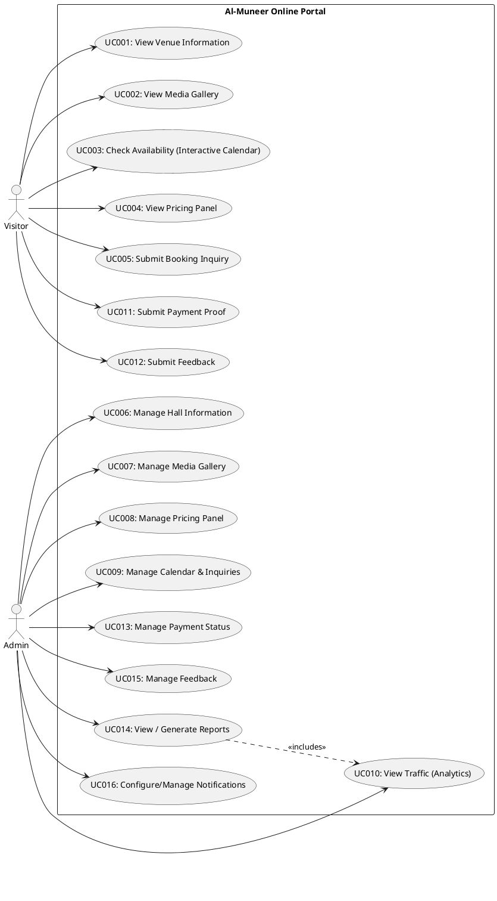
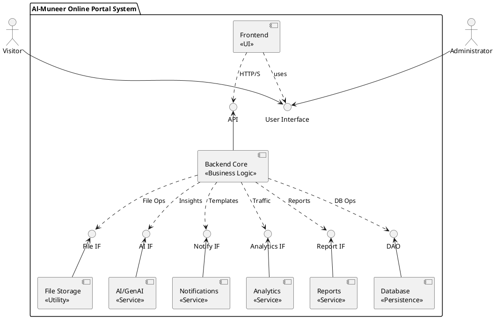
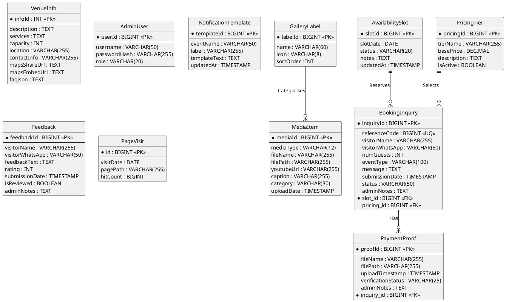
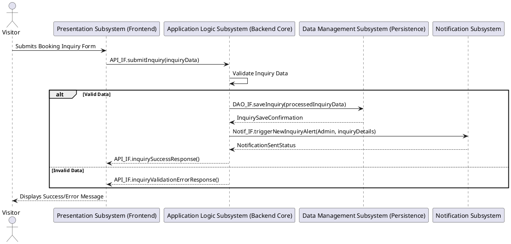
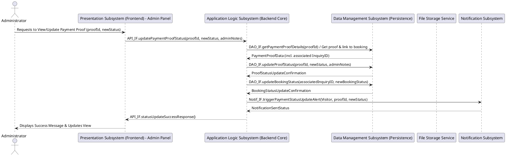
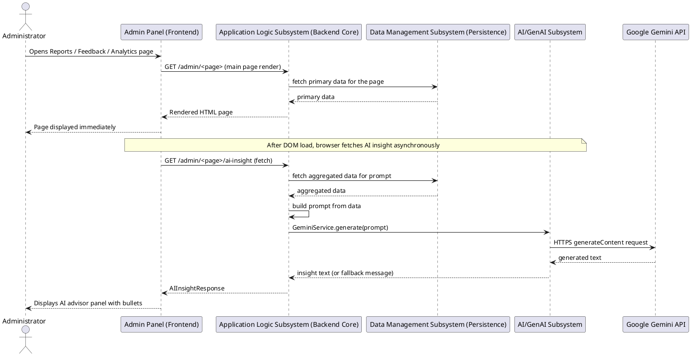
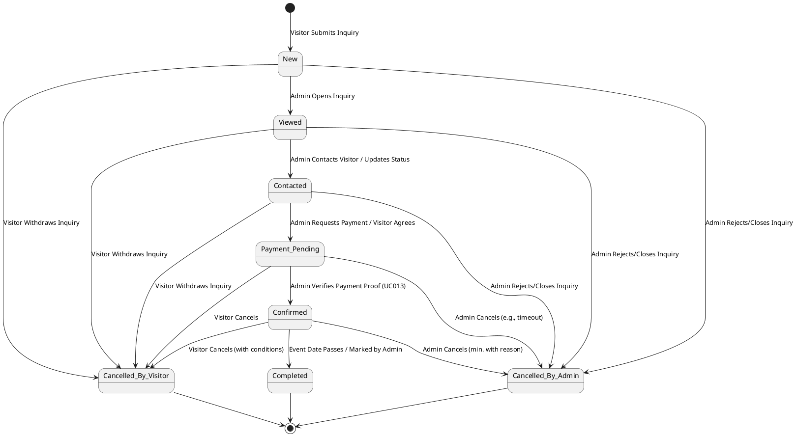
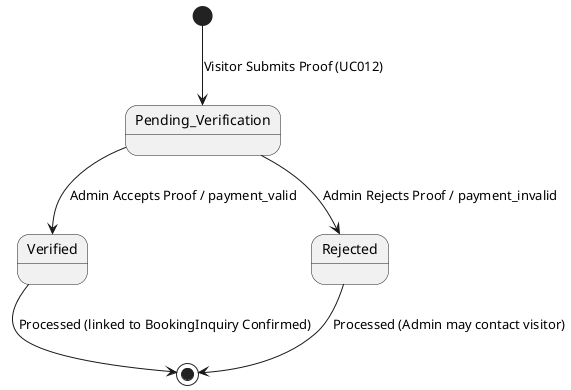

# APPENDIX C - SDD

**UNIVERSITI TEKNOLOGI MALAYSIA**

**FACULTY OF COMPUTING**

**UTM Johor Bahru**

**SECJ 3032: Software Engineering PSM1**

**Semester 01, 2024/2025**

# Software Design Descriptions (SDD)

**Al-Muneer Online Portal**

**Version 1.2**

**Prepared by:** Ahmed Ghaleb

## 1. Revision Page

### a. Overview

This document is Version 1.2 of the Software Design Description (SDD) for the Al-Muneer Online Portal. It details the high-level and detailed design of the system, building upon the requirements defined in the Software Requirements Specification (SRS) Version 1.2. This SDD describes the system architecture, data design, interface design, component-level design, and AI integration patterns necessary to guide the implementation of the portal. This document is prepared as part of the SECJ 3032: Software Engineering FYP1 course requirements.

### b. Issuing Organisation / Team

**Organisation:** Faculty of Computing, Universiti Teknologi Malaysia (UTM)

**Team Name / Developer:** Ahmed Hani Ahmed Ghaleb (Individual FYP1 Project)

### c. Authorship/Project Team Members

|   |   |   |
|---|---|---|
|**Role**|**Team Member**|**Status of Assigned Task (for SDD V1.0)**|
|Lead Analyst / Designer|Ahmed Hani Ahmed Ghaleb|Complete|
|Document Author|Ahmed Hani Ahmed Ghaleb|Complete|
|Technical Architect|Ahmed Hani Ahmed Ghaleb|Complete|

### d. Revision History

|   |   |   |
|---|---|---|
|**REVISION NO.**|**ISSUE DATE**|**DETAILS OF REVISION**|
|00 (Draft)|15/05/2025|Initial internal draft based on SRS.|
|1.0|30/05/2025|First complete version of SDD for FYP1 Progress 2.|
|1.1|8/08/2025|Use case diagram updated: Deleted UC006.|
|1.2|18/06/2026|Synced with implementation: added Gemini AI advisor subsystem, asynchronous AI panel design, PageVisit tracking, reference-code booking flow, WhatsApp notification templates, and refined data model (GalleryLabel, maps URLs, corrected relationships).|

_(Note: This Software Design Descriptions (SDD) template is adapted from IEEE Recommended Practice based on Software Design Descriptions (SDD) (IEEE Std. 1016-1998), that are simplified and customized to meet the need of SECJ3203 FYP1 SE course at Faculty of Computing, UTM. Examples of models are from Arlow and Neustadt (2002) and other sources stated accordingly.)_

## Table of Contents

1. Revision Page (1)

2. Introduction (4)

    2.1 Purpose (4)

    2.2 Scope (4)

    2.3 Context (6)

    2.4 Summary (6)

3. References (7)

4. Glossary (8)

5. Design Body (10)

    5.1 Design Stakeholders and Their Concerns (10)

    5.2 Context Viewpoint (12)

    5.2.1 Design Concerns (12)

    5.2.2 Design View (13)

    5.3 Composition Viewpoint (14)

    5.3.1 Design Concerns (14)

    5.3.2 Design View (16)

    5.4 Logical Viewpoint (16)

    5.4.1 Design Concerns (17)

    5.4.2 Design View (17)

    5.5 Information Viewpoint (19)

    5.5.1 Design Concerns (19)

    5.5.2 Design View (20)

    5.6 Interface Viewpoint (24)

    5.6.1 Design Concerns (24)

    5.7 Structure Viewpoint (28)

    5.7.1 Design Concerns (29)

    5.7.2 Design View (29)

    5.8 Interaction Viewpoint (32)

    5.8.1 Design Concerns (32)

    5.8.2 Design View (33)

    5.9 State Dynamic Viewpoint (35)

    5.9.1 Design Concerns (36)

    5.9.2 Design View (36)

    5.10 Algorithm Viewpoint (39)

    5.10.1 Design Concerns (39)

    5.10.2 Design View (39)

6. User Interface Design (41)

    6.1 Overview of User Interface (42)

    6.2 Screen Images (English Version) (43)

7. Appendices (45)

## 2. Introduction

The following sections of the Software Design Description (SDD) should provide the details of the entire document.

### 2.1 Purpose

This Software Design Description (SDD) document delineates the design for the Al-Muneer Online Portal. Its purpose is to translate the functional and non-functional requirements specified in the Software Requirements Specification (SRS) document (Version 1.2) into a detailed blueprint for implementation. This SDD describes the system architecture, data design, component design, interface design, AI integration design, and other design decisions that will guide the development of the portal.

This SDD describes how the Al-Muneer Online Portal will be structured and built. It is intended for use by the project developer (Ahmed Hani Ahmed Ghaleb) as the primary technical guide for system implementation during PSM2, by the project supervisor for reviewing the technical design and ensuring it meets the requirements, and by examiners for assessing the design quality and completeness.

### 2.2 Scope

This SDD document covers the design of the "Al-Muneer Online Portal," a web-based application for Al-Muneer Hall for Weddings and Events. The scope of the design encompasses:

- **System Architecture:** The overall structure of the system, including its layers, components, AI service integration, and their interactions.

- **Database Design:** The logical and physical design of the relational database (PostgreSQL) that will store the portal's data, including entity definitions and relationships.

- **Component Design:** The design of major software components within the backend (Spring Boot) and frontend, detailing their responsibilities and interfaces, including the Gemini AI advisor service.

- **Interface Design:**

    - **User Interfaces (UI):** Conceptual design and layout for key user-facing screens for both Visitors and the Administrator, including asynchronous AI advisor panels in the admin dashboard.

    - **Internal Interfaces:** APIs between the frontend and backend components, including REST endpoints for AI insights.

- **Security Design Considerations:** How security requirements (authentication, authorisation, data protection, JWT cookie-based session management) will be incorporated into the design.

- **AI Integration Design:** How optional, non-blocking AI advisors (business, feedback, traffic funnel) are loaded asynchronously and degrade gracefully on API failure.

The software product will, as defined in the SRS:

- Allow visitors to view venue information, media, availability, pricing, submit booking inquiries with a 9-digit reference code, upload payment proofs, and provide feedback.

- Enable administrators to manage all content, inquiries, payment statuses, feedback, view traffic analytics and operational reports augmented by AI advisors, and configure WhatsApp notification templates.

The design will adhere to the constraints identified in the SRS, including the use of the specified technology stack (Spring Boot 3.4.4, Java 21, PostgreSQL, HTML/CSS/JS, Thymeleaf, Chart.js, Google GenAI Java SDK), deployment on a Cloud VPS, and considerations for the solo developer context and project timeline. This SDD aims to provide sufficient detail to implement a functional, reliable, and maintainable system as per the project's objectives.

The software product is a custom web application designed specifically for Al-Muneer Hall.

### 2.3 Context

This SDD document is intended to be used by:

a) The Project Developer (Ahmed Hani Ahmed Ghaleb), who will use this design as the primary guide for the implementation, coding, and unit testing of the Al-Muneer Online Portal during PSM2.

b) The Project Supervisor (Dr. Muhammad Luqman bin Mohd Shafie), who will use this document to review the technical soundness of the design, ensure its alignment with the specified requirements, and assess the progress and quality of the design work.

c) Academic Examiners, who will use this document to evaluate the design aspects of the Final Year Project.

This standard (adapted IEEE Std. 1016-1998) is intended for technical and managerial stakeholders who prepare and use SDD. It guides the designer in the selection, organization, and presentation of design information. For an organization (in this case, the academic framework of an FYP) developing its own SDD practices, the use of this standard can help to ensure that design descriptions are complete, concise, consistent, interchangeable, appropriate for recording design experiences and lessons learned, well organized, and easy to communicate.

### 2.4 Summary

This SDD document provides a comprehensive overview of the design for the Al-Muneer Online Portal.

- **Section 1-4:** Cover introductory material, references, and glossary.

- **Section 5 (Design Body):** This is the core section, detailing the design from multiple viewpoints as per the IEEE standard structure. It includes:

    - Design Stakeholders and Their Concerns (5.1)

    - Context Viewpoint (5.2): System boundary and external interactions (Use Case Diagram).

    - Composition Viewpoint (5.3): High-level system decomposition into major subsystems/modules (Architecture/Component Diagram).

    - Logical Viewpoint (5.4): Detailed class structure within subsystems (Class Diagrams).

    - Information Viewpoint (5.5): Persistent data design (ERD, Data Dictionary).

    - Interface Viewpoint (5.6): User, hardware, and software interface specifications.

    - Structure Viewpoint (5.7): Internal organization of components (Package Diagram).

    - Interaction Viewpoint (5.8): Dynamic behavior between components (Sequence Diagrams for key interactions).

    - State Dynamic Viewpoint (5.9): State changes of key entities (State Machine Diagrams, if applicable at a detailed level).

    - Algorithm Viewpoint (5.10): Logic for complex operations or algorithms, including AI prompt construction, reference-code generation, and status cascade rules.

- **Section 6 (User Interface Design):** Provides conceptual screen layouts and descriptions for key user interfaces, including asynchronous AI advisor panels.

- **Section 7 (Appendices):** Includes any supporting design information.

This organization aims to present the design in a structured and understandable manner, covering static structures, dynamic behavior, data design, and interface specifications.

## 3. References

This section provides a complete list of all documents referenced elsewhere in this SDD.

1. Ahmed Hani Ahmed Ghaleb. (2026). Software Requirements Specification (SRS) - Al-Muneer Online Portal, Version 1.2. Universiti Teknologi Malaysia. (Internal Project Document)

2. Ahmed Hani Ahmed Ghaleb. (2026). Al-Muneer Online Portal - Core Specifications & Implementation Changelog (README.md). Universiti Teknologi Malaysia. (Internal Project Document)

3. IEEE. (1998). IEEE Recommended Practice for Software Design Descriptions (IEEE Std 1016-1998). Institute of Electrical and Electronics Engineers.

4. Fowler, M. (2002). Patterns of Enterprise Application Architecture. Addison-Wesley Professional.

5. Google. (2026). Google GenAI Java SDK (google-genai 1.56.0). https://github.com/googleapis/java-genai

Sources for these documents include internal project documentation created as part of the FYP1 process, IEEE standards, established software engineering literature, and official documentation for the chosen technologies.

## 4. Glossary

This section provides the definitions of all key terms, acronyms, and abbreviations used in this SDD. Many of these are consistent with those defined in the SRS document.

- **Admin:** Administrator of the Al-Muneer Online Portal.

- **AI Advisor:** An optional, asynchronous insight panel powered by the Google GenAI Java SDK (Gemini) that analyses portal data and presents concise, actionable recommendations to the Administrator.

- **API:** Application Programming Interface.

- **Component Diagram:** A diagram that depicts how components are wired together to form larger components or software systems.

- **CRUD:** Create, Read, Update, Delete.

- **Deep Link:** A `wa.me` URL generated client-side from a WhatsApp template and a normalised phone number, allowing the admin to open a pre-filled WhatsApp chat.

- **ERD:** Entity-Relationship Diagram.

- **FAQ:** Frequently Asked Questions.

- **FYP:** Final Year Project. (Also PSM)

- **GenAI / Gemini:** Google's generative artificial intelligence service accessed through the official Google GenAI Java SDK; used by the system for optional business, feedback, and traffic insights.

- **JWT:** JSON Web Token — a compact, URL-safe token used for stateless admin authentication.

- **BCrypt:** A password-hashing function used to store administrator credentials securely.

- **HTML:** Hyper Text Markup Language.

- **IDE:** Integrated Development Environment.

- **IEEE:** Institute of Electrical and Electronics Engineers.

- **JS:** JavaScript.

- **MVC:** Model-View-Controller architectural pattern.

- **PageVisit:** A daily counter entity that records how many times a public visitor page was accessed.

- **PaaS:** Platform as a Service.

- **PSM:** Projek Sarjana Muda (Bachelor's Degree Project).

- **Reference Code:** A random 9-digit number assigned to each `BookingInquiry` and stored in a 150-day HTTP-only cookie so visitors can retrieve their inquiry.

- **REST:** Representational State Transfer - an architectural style for distributed hypermedia systems.

- **SDD:** System Design Document

- **SRS:** Software Requirements Specification.

- **SQL:** Structured Query Language.

- **SSL/TLS:** Secure Sockets Layer/Transport Layer Security.

- **UC:** Use Case.

- **UI:** User Interface.

- **UML:** Unified Modeling Language.

- **UX:** User Experience.

- **VPS:** Virtual Private Server.

- **WhatsApp Template:** A database-stored message body with placeholders (e.g. `{visitorName}`, `{inquiryId}`) used to generate pre-filled WhatsApp deep links for visitor communication.

## 5. Design Body

This section of the SDD details the design of the Al-Muneer Online Portal, addressing identified design stakeholders, their concerns, and presenting the design through various viewpoints. The selected design viewpoints are chosen to provide a comprehensive understanding of the system's structure, behavior, and data management, based on the rationale of clarity and completeness for the implementation phase.

### 5.1 Design Stakeholders and Their Concerns

This section specifies the design stakeholders for the Al-Muneer Online Portal and the primary design concerns of each. An SDD shall address each identified design concern.

**a) The design stakeholders for the design subject (Al-Muneer Online Portal) are:**

- **Mr. Ahmed Almunajid (Venue Owner/Primary User of Admin Panel):** Concerned with the ease of use of the admin panel, the accuracy of information displayed, the efficiency of managing inquiries and bookings, the reliability of the system, and how well it meets his business needs to reduce manual workload and improve customer interaction.

- **Ahmed Hani Ahmed Ghaleb (Student Developer):** Concerned with the clarity of the design for implementation, the feasibility of building the system with the chosen technologies within the given timeframe, the maintainability of the code, adherence to academic requirements, and the overall technical quality of the solution.

- **Prospective Clients/Visitors:** Concerned with the ease of finding information, the clarity and accuracy of content (availability, pricing, venue details), the simplicity of submitting inquiries and payment proofs, and a positive, trustworthy user experience.

- **Project Supervisor & Academic Examiners:** Concerned with the technical soundness of the design, its completeness in addressing the requirements from the SRS, adherence to good software engineering principles, proper documentation, and the overall quality of the project as an academic endeavor.

**b) The design concerns of each identified design stakeholder include:**

- **Mr. Ahmed Almunajid:**

    - **Usability:** How easy will it be for him to update content, manage bookings, and use the admin features daily?

    - **Functionality:** Will the system reliably perform all the required tasks (calendar updates, inquiry management, payment proof handling, feedback viewing, report generation, notifications)?

    - **Data Integrity & Accuracy:** Will the information shown to visitors be accurate and up-to-date? Will booking and payment information be stored reliably?

    - **Efficiency:** Will the portal genuinely save time compared to current manual methods?

    - **Security (Admin Access):** Is his access to the admin panel secure?

- **Ahmed Hani Ahmed Ghaleb (Developer):**

    - **Clarity & Completeness:** Is the design detailed enough to guide implementation without ambiguity?

    - **Modularity & Maintainability:** Is the system designed in a way that is easy to code, test, and potentially modify or extend later?

    - **Feasibility:** Can all designed aspects be realistically implemented with the chosen technology stack (Spring Boot 3.4.4, Java 21, PostgreSQL 16, HTML/CSS/JS, Thymeleaf, Chart.js, Google GenAI Java SDK) and within the project timeline?

    - **Performance:** Will the design support the required response times and handle the anticipated load?

    - **Security:** Are appropriate security measures designed into the system (input validation, secure data handling, authentication)?

- **Prospective Clients/Visitors:**

    - **Ease of Use:** Can they find what they need quickly and intuitively?

    - **Information Quality:** Is the information accurate, comprehensive, and clearly presented?

    - **Responsiveness:** Does the site load quickly and respond well on different devices?

    - **Trust & Reliability:** Does the site appear professional and trustworthy, especially when submitting personal information for inquiries or payment proofs?

    - **Accessibility:** Is the site usable across different browsers and devices?

- **Project Supervisor & Academic Examiners:**

    - **Requirement Coverage:** Does the design adequately address all functional and non-functional requirements specified in the SRS?

    - **Design Soundness:** Are appropriate architectural patterns, data models, and design principles applied?

    - **Documentation Quality:** Is the design well-documented, clear, and consistent?

    - **Technical Depth:** Does the design demonstrate a sufficient understanding of software engineering concepts?

    - **Adherence to Constraints:** Does the design respect the defined project constraints (technology, timeline, etc.)?

This SDD aims to address these concerns by providing a clear, detailed, and justified design for the Al-Muneer Online Portal.

### 5.2 Context Viewpoint

The Context viewpoint depicts services provided by a design subject (the Al-Muneer Online Portal) with reference to an explicit context. That context is defined by reference to actors that include users and other stakeholders, which interact with the design subject in its environment. The Context viewpoint provides a "black box" perspective on the design subject.

#### 5.2.1 Design Concerns

This section should specify the following:

a) The purpose of the Context viewpoint is to identify:

- The system (Al-Muneer Online Portal) as a whole.

- The actors that interact with the system (Visitors, Administrator).

- The interactions (services offered/used) between the actors and the system.

- The boundary of the system, distinguishing what is internal and external.

b) The system features from an external "black box" perspective.

The purpose of the Context viewpoint is to identify a design subject's offered services, its actors (users and other interacting stakeholders), to establish the system boundary and to effectively delineate the design subject's scope of use and operation. This is primarily achieved through a Use Case Diagram which illustrates the services (use cases) the system provides to its different actors.

#### 5.2.2 Design View

The system features, from a context viewpoint, are represented by the services it offers to its external actors. These are best illustrated by the Use Case Diagram, which outlines the scope of operations for the Al-Muneer Online Portal.

The system features include:

- **For Visitors:** Viewing venue details, browsing the media gallery, checking availability via an interactive calendar, viewing pricing information, submitting booking inquiries with a 9-digit reference code, optionally submitting proof of payment, and providing feedback.

- **For the Administrator:** Securely logging in to manage all website content (hall information, media, availability calendar, pricing, FAQs), managing booking inquiries, managing submitted payment proofs and their statuses, reviewing user feedback, viewing traffic analytics and operational reports augmented by AI advisors, and configuring WhatsApp notification templates.



_Figure 5.1: Use Case Diagram for Al-Muneer Online Portal_

### 5.3 Composition Viewpoint

The Composition viewpoint describes the way the design subject (Al-Muneer Online Portal) is (recursively) structured into constituent parts and establishes the roles of those parts. It provides a high-level overview of the system's internal organization.

#### 5.3.1 Design Concerns

This should specify the following:

a) **The major design constituents (subsystems/modules):** Identifying the primary high-level blocks that make up the system.

b) **The subsystem responsibilities:** Defining the main role or purpose of each identified subsystem/module.

The purpose of the composition viewpoint is to define the subsystems that compose the system. The Al-Muneer Online Portal is formed by several interacting modules that logically group related functionalities. This decomposition aids in understanding the system's structure, assigning development responsibilities (though a solo project, it helps in organizing work), and managing complexity.

The system formed by these modules aims to deliver the functionalities outlined in the SRS. For the Al-Muneer Online Portal, we can identify the following major logical subsystems:

1. **Presentation Subsystem (Frontend):** Responsible for all user interaction, rendering information, and capturing user input. This subsystem itself can be seen as having two main parts: the Public-Facing Interface and the Administrator Panel Interface. It loads AI advisor panels asynchronously after the initial page render.

2. **Application Logic Subsystem (Backend Core):** Responsible for implementing the core business logic, processing requests from the frontend, interacting with the data layer, and managing application state.

3. **Data Management Subsystem (Backend Persistence):** Responsible for all aspects of data storage and retrieval, ensuring data integrity and consistency.

4. **Notification Subsystem (Backend Service):** Responsible for managing WhatsApp message templates and generating client-side deep links for visitor communication.

5. **Reporting Subsystem (Backend Service):** Responsible for generating operational reports and aggregating data for visual charts and AI advisors.

6. **Analytics Subsystem (Backend Service):** Responsible for tracking public page visits and serving traffic analytics data to the admin dashboard and AI funnel advisor.

7. **AI/GenAI Subsystem (Backend Service):** Responsible for constructing prompts from portal data and calling the Google GenAI Java SDK (Gemini) to generate optional business, feedback, and traffic insights. This subsystem is designed to be non-blocking and to return graceful fallbacks on failure.

#### 5.3.2 Design View

This section develops a component model and explains the relationships between the components to achieve the complete functionality of the system. This is a high-level overview of how responsibilities of the system were partitioned and then assigned to subsystems.

The Al-Muneer Online Portal is decomposed into the following major subsystems/components, which collaborate to deliver the required functionalities. Figure 5.2 provides a high-level component diagram illustrating these major subsystems and their primary interactions.



_Figure 5.2: Component Diagram of Al-Muneer Online Portal Subsystems_

### 5.4 Logical Viewpoint

The Logical Viewpoint elaborates on existing and designed types and their implementations as classes and interfaces, along with their structural static relationships. This viewpoint provides a detailed look at the internal structure of the software components identified in the Composition Viewpoint, particularly focusing on the organization of classes within the Application Logic Subsystem (Backend Core).

#### 5.4.1 Design Concerns

This should specify the following:

a) **The classes and interfaces:** Identifying key classes and interfaces that realize the system's functionality.

b) **The relationships:** Describing the static relationships between these classes and interfaces (e.g., association, aggregation, inheritance).

The purpose of the logical viewpoint is to elaborate the implementation of classes with their relationships. It focuses on the functional requirements of the system by describing the main classes and their responsibilities within the domain. For the Al-Muneer Online Portal, this involves detailing the key entities, controllers, services, and repositories that constitute the backend system.

#### 5.4.2 Design View

This design view includes a class diagram representing key classes within the respective subsystems/packages, particularly focusing on the controller and domain entity classes for the Al-Muneer Online Portal's backend. The Spring Boot framework encourages a layered architecture often comprising Controller, Service, and Repository layers for each primary domain entity.

```plantuml
@startuml
package "Controllers <<Spring @Controller/@RestController>>" {
    package "Visitor" {
        class HomeController
        class GalleryController
        class CalendarController
        class PricingController
        class InquiryController
        class PaymentProofController
        class FeedbackController
    }
    package "Admin" {
        class AdminAuthController
        class AdminVenueController
        class AdminGalleryController
        class AdminCalendarController
        class AdminPricingController
        class AdminInquiryController
        class AdminPaymentController
        class AdminFeedbackController
        class AdminTemplateController
        class AdminAnalyticsController
        class AdminReportController
    }
}

package "Services <<Spring @Service>>" {
    class GeminiService {
        + generate(prompt: String): String
    }
    class BookingInquiryService
    class PaymentProofService
    class FeedbackService
    class AvailabilitySlotService
    class PricingTierService
    class VenueInfoService
    class MediaItemService
    class NotificationTemplateService
    class AdminDashboardService
}

package "Domain Entities (JPA)" {
    class VenueInfo <<Entity>> {
        - infoId: Integer
        - description: String
        - services: String
        - capacity: Integer
        - location: String
        - contactInfo: String
        - mapsShareUrl: String
        - mapsEmbedUrl: String
        - faqJson: String
    }
    class MediaItem <<Entity>> {
        - mediaId: Long
        - mediaType: MediaType
        - fileName: String
        - filePath: String
        - youtubeUrl: String
        - caption: String
        - category: String
        - uploadDate: LocalDateTime
    }
    class GalleryLabel <<Entity>> {
        - labelId: Long
        - name: String
        - icon: String
        - sortOrder: Integer
    }
    class AvailabilitySlot <<Entity>> {
        - slotId: Long
        - slotDate: LocalDate
        - status: SlotStatus
        - notes: String
        - updatedAt: LocalDateTime
    }
    class PricingTier <<Entity>> {
        - pricingId: Long
        - tierName: String
        - basePrice: BigDecimal
        - description: String
        - isActive: Boolean
    }
    class BookingInquiry <<Entity>> {
        - inquiryId: Long
        - referenceCode: Long
        - visitorName: String
        - visitorWhatsApp: String
        - numGuests: Integer
        - eventType: String
        - message: String
        - submissionDate: LocalDateTime
        - status: InquiryStatus
        - adminNotes: String
    }
    class PaymentProof <<Entity>> {
        - proofId: Long
        - fileName: String
        - filePath: String
        - uploadTimestamp: LocalDateTime
        - verificationStatus: VerificationStatus
        - adminNotes: String
    }
    class Feedback <<Entity>> {
        - feedbackId: Long
        - visitorName: String
        - visitorWhatsApp: String
        - feedbackText: String
        - rating: Integer
        - submissionDate: LocalDateTime
        - isReviewed: Boolean
        - adminNotes: String
    }
    class AdminUser <<Entity>> {
        - userId: Long
        - username: String
        - passwordHash: String
        - role: String
    }
    class NotificationTemplate <<Entity>> {
        - templateId: Long
        - eventName: String
        - label: String
        - templateText: String
        - updatedAt: LocalDateTime
    }
    class PageVisit <<Entity>> {
        - id: Long
        - visitDate: LocalDate
        - pagePath: String
        - hitCount: Long
    }

    AvailabilitySlot "1" -- "0..*" BookingInquiry : reserves >
    PricingTier "1" -- "0..*" BookingInquiry : selects >
    BookingInquiry "1" -- "0..*" PaymentProof : has >
    GalleryLabel "1" -- "0..*" MediaItem : categorises >
}

package "Enums" {
    enum InquiryStatus { NEW, VIEWED, CONTACTED, PAYMENT_PENDING, CONFIRMED, COMPLETED, CANCELLED_BY_ADMIN, CANCELLED_BY_VISITOR }
    enum SlotStatus { AVAILABLE, PENDING, BOOKED }
    enum VerificationStatus { PENDING_VERIFICATION, VERIFIED, REJECTED }
    enum MediaType { IMAGE, VIDEO }
}

package "Security <<Spring Security + JWT>>" {
    class JwtUtil
    class JwtAuthFilter
    class AdminUserDetailsService
}

package "Utilities" {
    class FileUploadUtil
    class ReportGeneratorUtil
    class DeepLinkBuilderUtil
    class PageVisitInterceptor
}

AdminAnalyticsController ..> GeminiService
AdminReportController ..> GeminiService
AdminFeedbackController ..> GeminiService
AdminAnalyticsController ..> PageVisit
AdminReportController ..> ReportGeneratorUtil
AdminFeedbackController ..> Feedback
InquiryController ..> BookingInquiry
PaymentProofController ..> PaymentProof
AdminPaymentController ..> PaymentProof
AdminPaymentController ..> BookingInquiry
FeedbackController ..> Feedback
AdminFeedbackController ..> Feedback
AvailabilitySlot "*" --> SlotStatus
BookingInquiry "*" --> InquiryStatus
PaymentProof "*" --> VerificationStatus
MediaItem "*" --> MediaType
@enduml
```

_Figure 5.3: Class Diagram for Key Backend Entities, Controllers, and AI Service (Conceptual)_

The backend design primarily follows the Model-View-Controller (MVC) layered pattern, where Spring Boot facilitates this structure.

- **Controller Classes:** Stereotyped as Spring `@Controller` or `@RestController`, these handle incoming HTTP requests from the Presentation Subsystem (Frontend), parse request data, delegate business logic processing to Service classes, and return HTTP responses or Thymeleaf view names. Visitor-facing controllers (e.g., `InquiryController`, `FeedbackController`) serve HTML pages, while admin controllers (e.g., `AdminReportController`, `AdminAnalyticsController`) manage the protected admin panel and expose asynchronous AI insight endpoints.

- **AI Service (`GeminiService`):** A dedicated Spring `@Service` that wraps the Google GenAI Java SDK. It accepts a plain-text prompt, calls the Gemini model, and returns generated text. The service is designed to be resilient: any SDK or network failure is caught and a human-readable fallback message is returned, ensuring that AI panels never block page rendering.

- **Domain Entity Classes (e.g., `VenueInfo`, `BookingInquiry`, `PaymentProof`, `PageVisit`):** These are Plain Old Java Objects (POJOs) annotated as JPA `@Entity`s. They represent the persistent data structures of the application and are mapped to database tables. Relationships between entities (e.g., a `BookingInquiry` references one `AvailabilitySlot` and optionally one `PricingTier`; a `BookingInquiry` may have many `PaymentProof`s) are defined here.

- **Data Transfer Objects (DTOs):** Simple objects used to transfer data between layers, particularly between the Controller layer and the client (Frontend), and sometimes between Service and Controller. They help decouple the service layer from the presentation layer.

- **Service Classes:** Stereotyped as Spring `@Service`s (with interfaces and `impl` implementations), these contain the core business logic. Controllers delegate calls to them. For instance, `BookingInquiryService` handles saving a new inquiry, generating a random `referenceCode`, and freeing a slot on visitor cancellation; `PaymentProofService` handles the status cascade from proof verification to inquiry and slot.

- **Repository Classes (Implied, not shown in diagram for brevity):** Interfaces extending Spring Data JPA (`JpaRepository`) stereotyped as Spring `@Repository`s. They provide CRUD operations and custom query methods for the domain entities.

- **Security Classes (`JwtUtil`, `JwtAuthFilter`, `AdminUserDetailsService`):** Implement stateless JWT cookie-based authentication for the admin panel, using BCrypt for password hashing.

The relationships shown in the diagram are primarily conceptual associations indicating which controllers manage which entities (via the service and repository layers). The ERD in the Information Viewpoint (Section 5.5) provides a database-centric view of entity relationships. This logical view ensures separation of concerns, loose coupling, and maintainability.

### 5.5 Information Viewpoint

The Information Viewpoint is applicable as there is substantial persistent data content expected with the Al-Muneer Online Portal. Key concerns include persistent data structure, data content, data management strategies, data access schemes, and definition of metadata. This viewpoint describes how the information domain of the system is transformed into data structures and how major data entities are stored, processed, and organized.

#### 5.5.1 Design Concerns

This section explains how the information domain of the Al-Muneer Online Portal is transformed into data structures. It describes how the major data or system entities are stored, processed, and organized. The primary data storage will be a relational database (PostgreSQL). This database will consist of several tables, where each table represents an entity and stores its attributes.

The major data or system entities are stored in a relational database named `almuneer_portal_db`. This database comprises the following key entities, which are detailed further in the Data Dictionary and ERD.

**Entity Name List (Conceptual):**

1. AdminUser

2. VenueInfo

3. MediaItem

4. GalleryLabel

5. AvailabilitySlot

6. PricingTier

7. BookingInquiry

8. PaymentProof

9. Feedback

10. NotificationTemplate

11. PageVisit

#### 5.5.2 Design View

This section lists the system entities or major data along with their types and descriptions (attributes), focusing on classes in the domain layer. It also presents the Entity Relationship Diagram (ERD) to show data structure relationships.

**Data Dictionary**

**Entity: AdminUser**

Manages administrator login credentials and roles.

|   |   |   |
|---|---|---|
|**Attribute Name**|**Type**|**Description**|
|userId|BIGINT|Unique identifier for the user|
|username|VARCHAR(50)|Login username|
|passwordHash|VARCHAR(255)|Hashed password|
|role|VARCHAR(20)|User role (e.g., "ADMIN")|

**Entity: VenueInfo**

Stores the single record of hall description, services, capacity, contact details, Google Maps URLs, and FAQ JSON.

|   |   |   |
|---|---|---|
|**Attribute Name**|**Type**|**Description**|
|infoId|INT|Unique identifier (single-row configuration table)|
|description|TEXT|Detailed description of the hall|
|services|TEXT|List of services offered|
|capacity|INT|Maximum guest capacity|
|location|VARCHAR(255)|Physical address label of the hall|
|contactInfo|VARCHAR(255)|Contact details|
|mapsShareUrl|TEXT|Google Maps share/open link|
|mapsEmbedUrl|TEXT|Google Maps embed iframe URL|
|faqJson|TEXT|FAQs stored as JSON|

**Entity: MediaItem**

A gallery image or video. Local files are served from `/uploads/gallery/**`; videos may also be embedded from YouTube.

|   |   |   |
|---|---|---|
|**Attribute Name**|**Type**|**Description**|
|mediaId|BIGINT|Unique identifier for the media item|
|mediaType|VARCHAR(12)|Type of media (`IMAGE` or `VIDEO`)|
|fileName|VARCHAR(255)|Original name of the uploaded file|
|filePath|VARCHAR(255)|Server path where the file is stored|
|youtubeUrl|VARCHAR(255)|URL for embedded YouTube videos|
|caption|VARCHAR(255)|Optional caption for the media|
|category|VARCHAR(30)|Gallery filter label (foreign key concept to GalleryLabel)|
|uploadDate|TIMESTAMP|Date and time of upload|

**Entity: GalleryLabel**

Visitor-facing category used by the gallery filter bar.

|   |   |   |
|---|---|---|
|**Attribute Name**|**Type**|**Description**|
|labelId|BIGINT|Unique identifier|
|name|VARCHAR(60)|Display name of the label (unique)|
|icon|VARCHAR(8)|Optional emoji/icon prefix|
|sortOrder|INT|Display order in the filter bar|

**Entity: AvailabilitySlot**

Represents a calendar date and its booking status. Future dates default to `AVAILABLE`; past dates are dimmed in the UI.

|   |   |   |
|---|---|---|
|**Attribute Name**|**Type**|**Description**|
|slotId|BIGINT|Unique identifier for the slot|
|slotDate|DATE|The specific date (unique)|
|status|VARCHAR(20)|Booking status (`AVAILABLE`, `PENDING`, `BOOKED`)|
|notes|TEXT|Internal notes for the admin regarding this slot|
|updatedAt|TIMESTAMP|Last update timestamp|

**Entity: PricingTier**

A pricing package that visitors can view and pre-select when submitting an inquiry.

|   |   |   |
|---|---|---|
|**Attribute Name**|**Type**|**Description**|
|pricingId|BIGINT|Unique identifier for the tier|
|tierName|VARCHAR(255)|Name of the pricing tier/package|
|basePrice|DECIMAL|Base price for this tier|
|description|TEXT|Details of what the tier includes|
|isActive|BOOLEAN|Whether this tier is currently active|

**Entity: BookingInquiry**

A visitor's booking request, linked to a calendar slot and optionally a pricing tier. Each inquiry receives a random 9-digit `referenceCode` used for visitor self-service lookup and cancellation.

|   |   |   |
|---|---|---|
|**Attribute Name**|**Type**|**Description**|
|inquiryId|BIGINT|Unique identifier for the inquiry|
|referenceCode|BIGINT|Random 9-digit visitor-facing reference code (unique)|
|visitorName|VARCHAR(255)|Name of the person making the inquiry|
|visitorWhatsApp|VARCHAR(50)|Normalised WhatsApp contact number of the visitor|
|numGuests|INT|Estimated number of guests|
|eventType|VARCHAR(100)|Type of event (e.g., Wedding, Gathering)|
|pricing_id|BIGINT|Foreign key linking to the selected PricingTier (nullable)|
|slot_id|BIGINT|Foreign key linking to the desired AvailabilitySlot|
|message|TEXT|Specific questions or requirements|
|submissionDate|TIMESTAMP|Date and time inquiry was submitted|
|status|VARCHAR(50)|Status (`NEW`, `VIEWED`, `CONTACTED`, `PAYMENT_PENDING`, `CONFIRMED`, `COMPLETED`, `CANCELLED_BY_ADMIN`, `CANCELLED_BY_VISITOR`)|
|adminNotes|TEXT|Internal notes by admin for this inquiry|

**Entity: PaymentProof**

An uploaded receipt/screenshot attached to a booking inquiry. Verifying a proof cascades status changes to the linked inquiry and slot.

|   |   |   |
|---|---|---|
|**Attribute Name**|**Type**|**Description**|
|proofId|BIGINT|Unique identifier for the proof|
|inquiry_id|BIGINT|Foreign key linking to BookingInquiry|
|fileName|VARCHAR(255)|Original name of the uploaded file|
|filePath|VARCHAR(255)|Server path where the file is stored|
|uploadTimestamp|TIMESTAMP|Date and time of upload|
|verificationStatus|VARCHAR(25)|Status (`PENDING_VERIFICATION`, `VERIFIED`, `REJECTED`)|
|adminNotes|TEXT|Internal notes by admin for this proof|

**Entity: Feedback**

Visitor-submitted review with a mandatory rating and message. Name and WhatsApp are optional.

|   |   |   |
|---|---|---|
|**Attribute Name**|**Type**|**Description**|
|feedbackId|BIGINT|Unique identifier for the feedback|
|visitorName|VARCHAR(255)|Optional name of the person providing feedback|
|visitorWhatsApp|VARCHAR(50)|Optional WhatsApp contact details|
|feedbackText|TEXT|The feedback message itself|
|rating|INT|Rating (1-5 stars)|
|submissionDate|TIMESTAMP|Date and time feedback was submitted|
|isReviewed|BOOLEAN|Whether admin has reviewed this feedback|
|adminNotes|TEXT|Internal notes by admin for this feedback|

**Entity: NotificationTemplate**

Database-backed WhatsApp message templates. Placeholders (`{visitorName}`, `{inquiryId}`, `{eventDate}`, `{status}`) are resolved client-side before generating a `wa.me` deep link.

|   |   |   |
|---|---|---|
|**Attribute Name**|**Type**|**Description**|
|templateId|BIGINT|Unique identifier for the template|
|eventName|VARCHAR(50)|Machine-readable name/trigger (e.g., `PAYMENT_VERIFIED`)|
|label|VARCHAR(255)|Human-readable label shown in the admin UI dropdown|
|templateText|TEXT|The actual message content containing placeholders|
|updatedAt|TIMESTAMP|Last update timestamp of the template|

**Entity: PageVisit**

Daily hit counter for public visitor pages. Each row records one page on one date.

|   |   |   |
|---|---|---|
|**Attribute Name**|**Type**|**Description**|
|id|BIGINT|Unique identifier|
|visitDate|DATE|Date of the visit|
|pagePath|VARCHAR(255)|Visited URL path (e.g., `/`, `/gallery`)|
|hitCount|BIGINT|Number of hits for that page on that date|

**Entity Relationship Diagram (ERD)**



_Figure 5.4: Entity Relationship Diagram (ERD)_

### 5.6 Interface Viewpoint

The Interface Viewpoint provides information for designers, programmers, and testers to correctly use the services provided by the Al-Muneer Online Portal and for the portal to interact with other entities. This description includes details of external and internal interfaces. This viewpoint consists of a set of interface specifications for each entity that interacts with the system or for interfaces between major system components.

#### 5.6.1 Design Concerns

This section describes the functionality of the system from the user's perspective and explains how users will interact with the system to complete expected features. It also covers interfaces with other hardware or software. For the Al-Muneer Online Portal, the interface viewpoint primarily covers User Interfaces (UI) for Visitors and the Administrator, and Software Interfaces (APIs) between the frontend and backend. Direct hardware interfaces are minimal for a web application beyond standard peripheral use.

#### 5.6.2 Design View

**User Interfaces**

This specifies the logical characteristics of each interface between the software product and its users, including configuration characteristics necessary to accomplish the software requirements, and aspects of optimizing the interface.

**a) Logical Characteristics:**

The Al-Muneer Online Portal will feature a web-based graphical user interface (GUI) accessible via standard web browsers.

- **Visitor Interface:**

    - **Screen Layouts:** Will consist of clear, well-organized pages for Homepage, Venue Information, Media Gallery, Availability Calendar, Pricing, FAQ, Booking Inquiry, Payment Proof Submission, and Feedback. Navigation will be consistent via a main menu.

    - **Content:** Will display textual information, images, videos, an interactive calendar, and forms for user input.

    - **Interaction:** Primarily through mouse clicks, touch on touch-enabled devices, and keyboard input for forms.

- **Administrator Interface (Admin Panel):**

    - **Screen Layouts:** A secure, dashboard-style interface with sections for managing venue content, availability, pricing, inquiries, payment proofs, feedback, traffic analytics, reports, and WhatsApp notification templates. Will heavily utilize forms, tables for data display, action buttons, and asynchronous AI advisor panels.

    - **Content:** Will display system data in manageable formats, configuration options, Chart.js visualisations, AI-generated insight cards, and input fields for updates.

    - **Interaction:** Secure JWT cookie-based login required. Interaction via mouse clicks and keyboard input for data entry and management tasks. AI panels load asynchronously after the page renders and display a spinner until the insight is returned.

**b) Optimizing the Interface:**

- **Simplicity:** Interfaces will be kept clean and uncluttered, avoiding unnecessary complexity, especially for the admin panel to ensure ease of use for Mr. Almunajid.

- **Consistency:** Navigation, terminology, and layout will be consistent across the portal.

- **Feedback:** The system will provide immediate visual feedback for user actions (e.g., successful form submission, error messages). Error messages will be informative.

- **Efficiency:** Forms will be designed to minimize clicks and data entry effort.

- **Language:** Primarily Arabic, with consideration for English in key navigational elements, aligning with user characteristics.

**Hardware Interfaces**

This specifies the logical characteristics of each interface between the software product and the hardware components of the system. For the Al-Muneer Online Portal, a web-based application, there are no direct, custom hardware interfaces designed into the software itself. The system will rely on standard user hardware:

- **Client-side:** User's computer (desktop, laptop), tablet, or smartphone with a web browser and internet connection. Standard input devices (keyboard, mouse, touchscreen) are assumed.

- **Server-side:** The Cloud VPS will have standard server hardware (CPU, RAM, storage, network interface) managed by the hosting provider. The application will interact with this hardware through the operating system and the Java Virtual Machine.

**Software Interfaces**

This specifies the use of other required software products and interfaces with other application systems.

1. **Operating Systems:**

    - **Client-Side:** The portal will be accessible from standard operating systems that support modern web browsers (e.g., Windows, macOS, Linux, Android, iOS).

    - **Server-Side:** The Cloud VPS will run a common server operating system (e.g., a Linux distribution like Ubuntu).

    - **Interface:** Standard interactions via web browser (client) and JVM/OS system calls (server).

2. **Web Server:**

    - The Spring Boot application includes an embedded web server (e.g., Tomcat, Jetty, or Undertow by default).

    - **Interface:** HTTP/HTTPS protocols for communication with client browsers.

3. **Database Management System (DBMS):**

    - PostgreSQL 16.

    - **Interface:** The Spring Boot application will interface with the DBMS using JDBC and Spring Data JPA for data persistence and retrieval.

4. **Web Browsers (Client-Side):**

    - Google Chrome, Mozilla Firefox, Apple Safari, Microsoft Edge (latest stable versions).

    - **Interface:** The system outputs HTML (rendered by Thymeleaf), CSS, and JavaScript. It receives user input via HTTP requests. Admin pages fetch AI insights asynchronously via `fetch()` to `/admin/reports/ai-insight`, `/admin/feedback/ai-insight`, and `/admin/analytics/ai-insight`.

5. **AI/GenAI Service:**

    - Google GenAI Java SDK (`google-genai` 1.56.0) with model `gemini-3.1-flash-lite`.

    - **Interface:** `GeminiService.generate(prompt)` sends a plain-text prompt to the Gemini API and returns generated text. The service is called from admin AI controllers and returns graceful fallback text on any failure.

6. **WhatsApp Deep Links:**

    - Client-side JavaScript resolves `NotificationTemplate` placeholders (e.g., `{visitorName}`, `{inquiryId}`, `{eventDate}`, `{status}`) against the current record and opens a `wa.me` link with the composed message.

    - **Interface:** No server-side WhatsApp API integration; the browser constructs the deep link using the configured `app.country.code` and the normalised visitor phone number.

**Communication Interfaces**

This specifies the various interfaces to communications such as local network protocols, etc.

- **HTTP/HTTPS:** The primary communication protocol between the client web browser and the web server hosting the Al-Muneer Online Portal. HTTPS will be enforced for secure data transmission.

- **TCP/IP:** The underlying network protocol suite for all internet-based communication.

- **JDBC:** Used for communication between the Java application (Spring Boot backend) and the PostgreSQL database.

- **External HTTPS:** Used by `GeminiService` to call the Google GenAI REST API.

**Key Internal API Patterns**

Representative server-rendered and API routes that realise the design include:

- Visitor routes: `GET /`, `GET /gallery`, `GET /calendar`, `GET /pricing`, `GET /inquiry`, `POST /inquiry/submit`, `GET /inquiry/confirmation/{refCode}`, `POST /inquiry/cancel`, `POST /payment/upload`, `POST /feedback/submit`.

- Admin routes: `GET /admin/login`, `POST /admin/login`, `GET /admin/dashboard`, `GET /admin/inquiries`, `GET /admin/payments`, `POST /admin/payments/{id}/verify`, `GET /admin/calendar`, `GET /admin/reports`, `GET /admin/analytics`, `GET /admin/feedback`, `GET /admin/templates`.

- Asynchronous AI insight endpoints: `GET /admin/reports/ai-insight`, `GET /admin/feedback/ai-insight`, `GET /admin/analytics/ai-insight`.

All admin routes except `/admin/login` require a valid `jwt` HTTP-only cookie.

### 5.7 Structure Viewpoint

The Structure Viewpoint is used to document the internal constituents and organization of the design subject (Al-Muneer Online Portal) in terms of like elements (recursively). It informs the user and the developer about the interaction between the packages in the system and how the software is organized into modules or components at a finer granularity than the Composition Viewpoint.

#### 5.7.1 Design Concerns

The primary design concerns for the Structure Viewpoint are:

- **Modularity:** How the system is broken down into manageable, cohesive, and loosely coupled packages or modules.

- **Dependencies:** The relationships and dependencies between these packages.

- **Organization:** The overall architectural organization of the code within the backend application.

- **Reusability:** Identifying components or packages that might be reusable.

- **Maintainability:** Ensuring the structure supports ease of understanding and modification.

Structure viewpoint informs user and the developer about the interaction between the packages in the system. For the Al-Muneer Online Portal, the backend developed using Spring Boot will be organized into several key packages, each with specific responsibilities, reflecting a layered architecture and separation of concerns.

#### 5.7.2 Design View

This section includes the overall package diagram of the system, primarily focusing on the backend (Spring Boot application) structure. The navigation visibility is based on the dependency among classes in the design class diagram (Logical Viewpoint).

```plantuml
@startuml
package "com.almuneer.portal" {
    class AlMuneerPortalApplication

    package "config" {
        class WebSecurityConfig
        class WebMvcConfig
        class DataSeeder
        class GlobalModelAdvice
        class PageVisitInterceptor
    }

    package "controller" {
        class HomeController
        class GalleryController
        class CalendarController
        class PricingController
        class InquiryController
        class PaymentProofController
        class FeedbackController
        package "admin" {
            class AdminAuthController
            class AdminVenueController
            class AdminGalleryController
            class AdminGalleryLabelController
            class AdminCalendarController
            class AdminPricingController
            class AdminInquiryController
            class AdminPaymentController
            class AdminFeedbackController
            class AdminTemplateController
            class AdminAnalyticsController
            class AdminReportController
        }
    }

    package "service" {
        class GeminiService
        interface BookingInquiryService
        interface PaymentProofService
        interface FeedbackService
        interface AvailabilitySlotService
        interface PricingTierService
        interface VenueInfoService
        interface MediaItemService
        interface NotificationTemplateService
        interface AdminDashboardService
        interface GalleryLabelService
        package "impl" {
            class BookingInquiryServiceImpl
            class PaymentProofServiceImpl
            class FeedbackServiceImpl
            class AvailabilitySlotServiceImpl
            class PricingTierServiceImpl
            class VenueInfoServiceImpl
            class MediaItemServiceImpl
            class NotificationTemplateServiceImpl
            class AdminDashboardServiceImpl
            class GalleryLabelServiceImpl
        }
    }

    package "repository" {
        interface AdminUserRepository
        interface VenueInfoRepository
        interface MediaItemRepository
        interface GalleryLabelRepository
        interface AvailabilitySlotRepository
        interface PricingTierRepository
        interface BookingInquiryRepository
        interface PaymentProofRepository
        interface FeedbackRepository
        interface NotificationTemplateRepository
        interface PageVisitRepository
    }

    package "model" {
        class AdminUser
        class VenueInfo
        class MediaItem
        class GalleryLabel
        class AvailabilitySlot
        class PricingTier
        class BookingInquiry
        class PaymentProof
        class Feedback
        class NotificationTemplate
        class PageVisit
        package "enums" {
            enum InquiryStatus
            enum SlotStatus
            enum VerificationStatus
            enum MediaType
        }
    }

    package "util" {
        class FileUploadUtil
        class ReportGeneratorUtil
        class DeepLinkBuilderUtil
    }

    package "security" {
        class JwtUtil
        class JwtAuthFilter
        class AdminUserDetailsService
    }
}

controller ..> service
controller.admin ..> service
service ..> repository
service ..> util
repository ..> model
config ..> security
security ..> repository
security ..> model
@enduml
```



_Figure 5.5: Package Diagram for Al-Muneer Online Portal Backend_

**Description of Backend Packages:**

The backend of the Al-Muneer Online Portal, built with Spring Boot, is organized into the following primary packages:

- **`com.almuneer.portal` (Root Package):** Contains the main application class (AlMuneerPortalApplication) that bootstraps the Spring Boot application.

- **`config`:** This package holds configuration classes for the application.

    - `WebSecurityConfig`: Configures Spring Security for JWT cookie authentication, authorization, BCrypt password hashing, and defining protected routes.

    - `WebMvcConfig`: Contains Spring MVC configurations, including static resource handlers for `/uploads/**` and registration of the `PageVisitInterceptor`.

    - `GlobalModelAdvice`: Adds global model attributes (e.g., `countryCode`) available to all Thymeleaf templates.

    - `DataSeeder`: Seeds the default admin user and sample data on first run.

    - `PageVisitInterceptor`: Intercepts public visitor requests and increments the daily `PageVisit` counter.

- **`controller` (API Layer):** This package contains Spring `@Controller` classes that handle incoming HTTP requests from the frontend and return Thymeleaf views or JSON responses.

    - Visitor-facing controllers (e.g., `HomeController`, `InquiryController`, `FeedbackController`) serve the public website.

    - `controller.admin` sub-package contains protected admin controllers (e.g., `AdminReportController`, `AdminAnalyticsController`, `AdminFeedbackController`) that manage the admin panel and expose asynchronous AI insight endpoints.

- **`service` (Business Logic Layer):** This package contains interfaces defining business logic contracts and an `impl` sub-package containing their concrete implementations.

    - Service interfaces (e.g., `BookingInquiryService`, `PaymentProofService`) define business operations.

    - `GeminiService` is a dedicated AI service wrapping the Google GenAI Java SDK.

    - Implementation classes (e.g., `BookingInquiryServiceImpl`, `PaymentProofServiceImpl`) contain core business logic, orchestrating calls to repositories, other services, and utility classes. They handle transactions and business rule enforcement, including the payment-proof status cascade and reference-code generation.

- **`repository` (Data Access Layer):** This package contains Spring Data JPA repository interfaces (e.g., `InquiryRepository`, `AdminUserRepository`).

    - These interfaces extend Spring Data interfaces (like `JpaRepository`) to provide CRUD operations and custom query methods for interacting with the database entities (`model` package) without requiring boilerplate DAO code.

- **`model` (Domain Entities):** This package contains the Plain Old Java Objects (POJOs) that represent the persistent data entities of the application, as defined in the Information Viewpoint (ERD and Data Dictionary).

    - These classes (e.g., `BookingInquiry`, `AdminUser`, `PageVisit`) are typically annotated with JPA (`@Entity`) to map them to database tables.

    - The `model.enums` sub-package contains JPA-mapped Java enums such as `InquiryStatus`, `SlotStatus`, `VerificationStatus`, and `MediaType`.

- **`util` (Utility Classes):** This package holds common utility classes that provide helper functions used across different parts of the application.

    - `FileUploadUtil` handles secure file uploads for gallery images and payment proofs.

    - `ReportGeneratorUtil` aggregates inquiry, payment proof, and feedback data into the report model used by the reports page and AI business advisor.

    - `DeepLinkBuilderUtil` helps format WhatsApp numbers and message bodies for client-side deep links.

- **`security`:** This package contains classes related to application security using Spring Security and JWT.

    - `JwtUtil` generates and validates JWT tokens using a configurable secret (`app.jwt.secret`).

    - `JwtAuthFilter` reads the `jwt` HTTP-only cookie, validates the token, and populates the Spring Security context for admin requests.

    - `AdminUserDetailsService` loads user-specific data from `AdminUserRepository` for authentication.

This package structure promotes a clear separation of concerns, modularity, and adherence to common practices in Spring Boot application development, making the system more organized and maintainable. Dependencies are managed such that controllers depend on services, services depend on repositories, and repositories interact with domain models. Form data is bound directly to request parameters or entity builders, and utility/configuration/security packages provide cross-cutting concerns.

### 5.8 Interaction Viewpoint

The Interaction Viewpoint defines strategies for interaction among design entities (components, classes, subsystems), regarding why, where, how, and at what level actions occur. It illustrates the dynamic behavior of the system, showing how different parts of the system collaborate to achieve specific functionalities.

#### 5.8.1 Design Concerns

The primary design concerns for the Interaction Viewpoint are:

- **Dynamic Behavior:** How system components and objects interact over time to accomplish tasks.

- **Collaboration:** Understanding the sequence of messages or calls exchanged between different parts of the system.

- **Responsibility Allocation:** Clarifying which component is responsible for initiating an interaction and which component responds.

- **Use Case Realization:** Showing how the interactions realize the use cases defined in the SRS.

The functionalities of the system are given by the help of sequence diagrams. Moreover, it defines strategies for interaction among entities. For the Al-Muneer Online Portal, sequence diagrams are used to model these interactions.

#### 5.8.2 Design View

Detailed sequence diagrams illustrating the step-by-step interactions for each specific use case (UC001 through UC016), involving actors, frontend components, backend controllers, services, and database interactions, have already been provided in the Software Requirements Specification (SRS) document, Section 2.3: Use Case Details. These SRS sequence diagrams provide a granular view of how each functional requirement is realized through object interactions.

This section of the SDD will therefore focus on providing a higher-level view of interactions between the major subsystems identified in the Composition Viewpoint (Section 5.3, Figure 5.2). These diagrams illustrate how these coarse-grained components collaborate for key overarching scenarios.

**a) SD001: High-Level Sequence Diagram for Visitor Submitting a Booking Inquiry and Initial Admin Notification**



_Figure 5.6: SD001 - High-Level Sequence: Visitor Submits Inquiry & Admin Notified_

**Description of SD001:**

The Visitor initiates the process by submitting the booking inquiry form via the Presentation Subsystem (Frontend). The Frontend forwards this request to the Application Logic Subsystem via its API. The Application Logic Subsystem first validates the received data. If valid, it instructs the Data Management Subsystem to save the inquiry. Upon successful saving, the Application Logic Subsystem then triggers the Notification Subsystem to alert the Administrator about the new inquiry. Finally, a response (success or validation error) is sent back to the Frontend, which then updates the Visitor.

**b) SD002: High-Level Sequence Diagram for Administrator Managing Payment Proof Status**



_Figure 5.7: SD002 - High-Level Sequence: Admin Manages Payment Proof Status_

**Description of SD002:**

The Administrator, via the Admin Panel (Presentation Subsystem), initiates an update to a payment proof's status. The request is sent to the Application Logic Subsystem. The AppLogic first retrieves details of the payment proof (and potentially the associated booking inquiry) from the Data Management Subsystem. It then instructs the Data Management Subsystem to update the status of the payment proof and possibly the linked booking inquiry. After successful database updates, the AppLogic triggers the Notification Subsystem to inform the Visitor of their payment status update. A success response is then relayed to the Admin Panel, which updates the Administrator's view. The File Storage Service would have been involved earlier when the admin viewed the actual proof image, orchestrated by the AppLogic.

**c) SD003: High-Level Sequence Diagram for Asynchronous AI Advisor Panel**



_Figure 5.8: SD003 - High-Level Sequence: Asynchronous AI Advisor Panel_

**Description of SD003:**

When the Administrator opens a page that includes an AI advisor (Reports, Feedback, or Analytics), the Backend Core first renders the page using only local data. The AI insight is never fetched during the initial render. After the browser finishes loading the DOM, a separate asynchronous `fetch()` requests the insight endpoint (`/admin/reports/ai-insight`, `/admin/feedback/ai-insight`, or `/admin/analytics/ai-insight`). The corresponding controller aggregates the relevant data, constructs a plain-text prompt, and delegates to `GeminiService`. `GeminiService` calls the Google GenAI Java SDK, which communicates with the Gemini API over HTTPS. If the SDK call succeeds, the generated text is returned to the browser and formatted as styled bullet points. If any failure occurs (network issue, invalid API key, empty response), `GeminiService` catches the exception and returns a human-readable fallback message such as "AI summary unavailable — API call failed." This design guarantees that AI failures never block page rendering or degrade the core user experience.

### 5.9 State Dynamic Viewpoint

Reactive systems and systems whose internal behavior is of interest use this viewpoint. System dynamics including modes, states, transitions, and reactions to events are described here. This section focuses on the behavior and states of key entities within the Al-Muneer Online Portal, illustrated via state transition diagrams. This informs designers, developers, and testers about the dynamic view of critical parts of the system.

#### 5.9.1 Design Concerns

The primary design concerns for the State Dynamic Viewpoint are:

- **Entity Lifecycles:** Understanding the different states an entity can be in throughout its lifecycle.

- **State Transitions:** Identifying the events or conditions that cause an entity to transition from one state to another.

- **Actions/Activities:** Specifying any actions or activities that occur when entering a state, exiting a state, or during a transition.

- **System Behavior:** Clarifying how key entities respond to various system events and user interactions.

In this section, system behavior and states of the system are given via the state transition diagram. Designers, developers and testers are informed about dynamic view of the system which includes its states, transitions, and the events that trigger these transitions for key entities.

#### 5.9.2 Design View

State transition diagrams are included here for key entities in the Al-Muneer Online Portal whose behavior involves distinct and significant state changes.



_Figure 5.9: State Machine Diagram for BookingInquiry Entity_

**Description of BookingInquiry States:**

The BookingInquiry entity transitions through several states from its creation to its resolution. It begins in a `NEW` state upon submission. An administrator action moves it to `VIEWED` and then potentially `CONTACTED`. If discussions lead to a tentative agreement, it moves to `PAYMENT_PENDING`. Successful verification of a `PaymentProof` (UC013) transitions it to `CONFIRMED` and also marks the linked `AvailabilitySlot` as `BOOKED`. The inquiry can be `CANCELLED_BY_ADMIN` or `CANCELLED_BY_VISITOR` at various stages; visitor self-cancellation is only allowed when no payment proof is attached, and it frees the slot back to `AVAILABLE`. After the event date, an administrator may mark a `CONFIRMED` booking as `COMPLETED`.



_Figure 5.10: State Machine Diagram for PaymentProof Entity_

**Description of PaymentProof States:**

The PaymentProof entity has a simpler lifecycle. Upon submission by a visitor, it enters the `Pending_Verification` state. The administrator then reviews it. If the proof is deemed valid, its state changes to `Verified`. If the proof is insufficient or invalid, its state changes to `Rejected`. Both `Verified` and `Rejected` are terminal states for the proof itself, triggering further actions related to the associated BookingInquiry.

These state machine diagrams illustrate the lifecycle and dynamic behavior of key entities within the Al-Muneer Online Portal, providing clarity on how they respond to system events and user interactions.

### 5.10 Algorithm Viewpoint

The Algorithm Viewpoint provides detailed design descriptions of operations, such as methods and functions, including the internal details and logic of each design entity. It provides details needed by programmers and analysts of algorithms in regard to time-space performance and processing logic prior to implementation, and to aid in producing unit test plans.

#### 5.10.1 Design Concerns

The primary design concerns for the Algorithm Viewpoint are:

- **Processing Logic:** Detailing the step-by-step logic for specific operations or functions within the system.

- **Data Manipulation:** How data is transformed, calculated, or processed by algorithms.

- **Decision Points:** Clarifying conditions and branching logic within operations.

- **Clarity for Implementation:** Providing sufficient detail for developers to implement the algorithms correctly.

For the Al-Muneer Online Portal, the core processing logic for most functionalities aligns closely with the realization of the use cases.

#### 5.10.2 Design View

The detailed step-by-step processing logic for the majority of user-facing and administrative operations in the Al-Muneer Online Portal is extensively documented through the Activity Diagrams provided for each Use Case (UC001 through UC016) in the Software Requirements Specification (SRS) document, Section 2.3: Use Case Details. These activity diagrams illustrate the flow of actions, decision points, and interactions required to fulfill each specific use case. They serve as the primary algorithmic design for those operations.

For example:

- The algorithm for a **Visitor Submitting a Booking Inquiry (UC005)** is detailed in its corresponding activity diagram in SRS Section 2.3.5. This includes steps for form access, data input, validation, saving the inquiry, and triggering notifications.

- The algorithm for an **Administrator Managing Payment Status (UC013)** is detailed in its activity diagram in SRS Section 2.3.14. This covers viewing proofs, offline verification, updating status in the system, and notifying the visitor.

Within the backend (Spring Boot application), this logic is implemented within the Service layer classes (e.g., `BookingInquiryServiceImpl`, `PaymentProofServiceImpl`). These service methods encapsulate the algorithms depicted in the SRS activity diagrams.

Key algorithmic considerations within these services include:

- **Data Validation:** All user inputs (from inquiry forms, admin content management, etc.) will undergo server-side validation logic as per defined business rules (e.g., mandatory fields, data formats, value ranges) before processing.

- **Availability Checking Logic:** When a visitor checks availability or an admin updates the calendar, the Availability Service will implement logic to query AvailabilitySlot entities for specific dates or date ranges and determine their status.

- **Pricing Calculation (if dynamic options are implemented):** If pricing involves selectable add-ons, the PricingService would contain logic to calculate total estimates based on selected base tiers and additional options.

- **Report Generation Logic:** The ReportService will contain logic to fetch data from various entities (e.g., BookingInquiry, Feedback) based on admin-specified parameters (like date ranges) and then aggregate/format this data into a simple, readable report structure for display. This will primarily involve structured database queries and data mapping.

- **File Handling for Payment Proofs:** The PaymentProofService (utilizing a `FileUploadUtil`) will implement the logic for receiving an uploaded file, validating its type and size, securely storing it in the designated file storage, and associating its path and metadata with the corresponding BookingInquiry.

Additional algorithmic considerations specific to the implemented system include:

- **Reference Code Generation:** When a `BookingInquiry` is persisted, `@PrePersist` generates a random 9-digit `Long` value in the range `[100_000_000, 999_999_999]` using `ThreadLocalRandom`. This value is stored in a 150-day HTTP-only cookie named `inq_ref` so the visitor can retrieve or cancel their inquiry without authentication.

- **Status Cascade on Payment Proof Verification:** When an administrator marks a `PaymentProof` as `VERIFIED`, the service layer atomically updates the linked `BookingInquiry.status` to `CONFIRMED` and the linked `AvailabilitySlot.status` to `BOOKED`. Rejection leaves the inquiry in its current state for manual follow-up.

- **Visitor Self-Cancellation:** The cancellation service first checks whether the inquiry has any attached payment proofs. If proofs exist, cancellation is rejected with an `IllegalStateException`. Otherwise, the inquiry status becomes `CANCELLED_BY_VISITOR` and the reserved slot returns to `AVAILABLE`.

- **AI Prompt Construction and Graceful Fallback:** Each AI controller builds a plain-text prompt that includes aggregated figures (e.g., conversion rate, cancellation rate, funnel counts, low/high rating samples). The prompt explicitly requests a fixed number of bullet points tied to real numbers. `GeminiService.generate()` wraps the SDK call in a try/catch block; if the response is empty, malformed, or the call throws, a fallback string such as "AI summary unavailable — API call failed." is returned. This guarantees that AI failures are non-blocking.

- **WhatsApp Deep Link Generation:** Client-side JavaScript reads the selected `NotificationTemplate.templateText`, replaces placeholders with values from the current inquiry/payment record, normalises the visitor phone number with the configured country code, URL-encodes the message, and opens `https://wa.me/<number>?text=<message>` in a new tab. No server-side WhatsApp API is used.

The detailed design of these specific algorithms is implemented within the respective Java service methods, leveraging Spring Boot and JPA functionalities for data access and transaction management.

## 6. User Interface Design

This section describes the user interface design for the Al-Muneer Online Portal. It provides an overview of the UI from the user's perspective and conceptual layouts for key screens. The design aims for simplicity, usability, and a professional appearance appropriate for Al-Muneer Hall, with a primary focus on the Arabic language and cultural context of Yemen.

### 6.1 Overview of User Interface

The Al-Muneer Online Portal will feature a responsive web-based Graphical User Interface (GUI) accessible via standard desktop and mobile web browsers. The overall design philosophy emphasizes clarity, ease of navigation, and efficient task completion for both Visitors and the Administrator.

**6.1.1 Visitor Interface:**

Navigation will be managed through a clear, persistent main navigation menu, likely a header bar, offering access to key sections such as Home, About Us/Venue Info, Gallery, Availability, Pricing, Booking Inquiry, FAQ, Feedback, and Contact. Pages will generally adopt a clean layout, comprising a header, a main content area, and a footer that includes contact information and copyright details. Visuals, specifically images of the hall, will be incorporated judiciously to enhance the portal's appeal. The primary language for content and navigation will be Arabic, with potential for English equivalents for key navigation labels if deemed necessary. Interactivity will be facilitated through forms for inquiries, payment proof submission, and feedback. The availability calendar will be interactive, and image galleries will allow users to view larger versions of images. Users will receive clear confirmation messages for actions like inquiry submission or feedback, along with informative error messages.

**6.1.2 Administrator Interface (Admin Panel):**

Access to the admin panel will be secured via a login page. Navigation within the admin panel will be provided by a sidebar granting access to management modules: Dashboard (overview), Venue Info, Media Gallery, Gallery Labels, Availability Calendar, Pricing, Booking Inquiries, Payment Proofs, Customer Feedback, Reports, Analytics, and Notification Templates. The layout will typically feature a dashboard presenting summary cards (new inquiries, pending proofs, unreviewed feedback, visits today/last 7 days, average rating), followed by dedicated pages for managing specific data types, often employing tables, filter bars, and forms. The Reports and Analytics pages include Chart.js visualisations and an asynchronous AI advisor card that loads after the page renders. The primary language of the administrator interface will be Arabic to ensure ease of use for Mr. Almunajid. Interactivity in the admin panel will include data entry forms, tables with client-side search and status filters, action buttons (Save, Update, Delete, View, Verify, Reject, Mark Reviewed), file upload widgets, and a WhatsApp template selector that generates a `wa.me` deep link on inquiry/payment detail pages.

**AI Advisor Panels:**

Three admin pages include optional AI advisor cards:

- **Reports Page:** Displays an "AI Business Report Advisor" card showing 3 bullet points derived from the current period's inquiry, payment, and feedback figures.

- **Feedback Page:** Displays an "AI Feedback Advisor" card highlighting what guests love, the most urgent complaint, and one concrete action.

- **Analytics Page:** Displays an "AI Traffic Funnel Advisor" card analysing Home → Gallery → Pricing → Inquiry visit counts and suggesting one conversion improvement.

Each card initially shows a spinner and loads its content asynchronously via `fetch()`. If the Gemini API is unavailable or unconfigured, the card displays a graceful fallback message instead of crashing the page.

### 6.2 Screen Images (English Version)

_[Image: Screenshot of Visitor Interface - Homepage. Features a top navigation bar with links like "Contact", "Reviews", "FAQ", "Book Now", "Pricing", "Availability", "Gallery", "About", and "Home". The main banner reads "Welcome to Al-Muneer Hall: Where wedding dreams come true in an atmosphere of luxury and elegance" with "View Gallery" and "Check Availability" call-to-action buttons. Below is the introductory section "Al-Muneer Wedding & Events Hall".]_

_Figure 6.1: Visitor Interface - Homepage_

_[Image: Screenshot of Administrator Interface - Admin Dashboard. Features a main dashboard overview with metric cards for "Bookings This Month (24)", "Recent Customer Reviews (8)", "Pending Payment Proofs (5)", and "New Booking Inquiries (12)". Below is a "Recent Inquiries" table showing names like Sarah Ahmed and Mohammed Ali. A right-hand sidebar navigation contains links for Dashboard, Venue Info, Media Gallery, Availability Calendar, Pricing, Booking Inquiries, Payment Proofs, Customer Reviews, Reports, and Notification Settings.]_

_Figure 6.2: Administrator Interface - Admin Dashboard_

_[Image: Screenshot of Administrator Interface - Manage Inquiries Page. Shows a page titled "Manage Booking Inquiries". It includes a filtering section for "To Date", "From Date", "Statuses", and a Search bar. Below is a "Booking Inquiries List" table displaying Actions, Status (e.g., New, Confirmed, Pending, Cancelled), Submission Date, Event Date, Contact Number, Visitor Name, and Inquiry ID. Pagination controls are at the bottom.]_

_Figure 6.3: Administrator Interface - Manage Inquiries Page_

## 7. Appendices

**Appendix A: (Placeholder for Future Detailed API Specifications)** While the general interaction between frontend and backend is via RESTful APIs (as described in Section 5.6 Interface Viewpoint and implied in Section 5.8 Interaction Viewpoint), detailed API endpoint specifications (including exact request/response JSON structures, specific HTTP methods for all resources, and granular error codes) are typically developed iteratively during the implementation phase or documented in a separate API guide. If required for formal documentation beyond the scope of this initial SDD, they would be included here.

**Appendix B: (Placeholder for Third-Party Service Integration Details)** If specific third-party services are selected and their integration requires detailed configuration steps, API key management procedures, or specific interface contracts that are too extensive for the main design body, such details would be provided here. Currently, the design allows for such integrations, but the selection and detailed design of the interface with a specific provider is part of the implementation phase.
