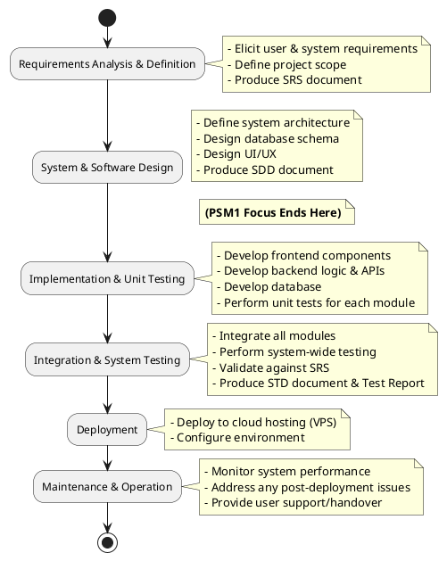
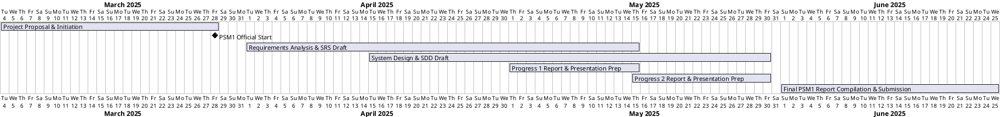
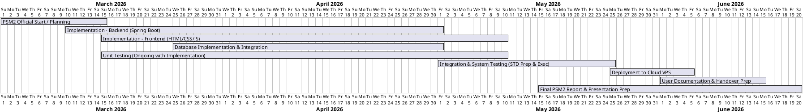
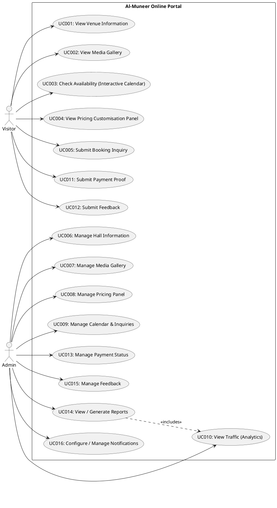
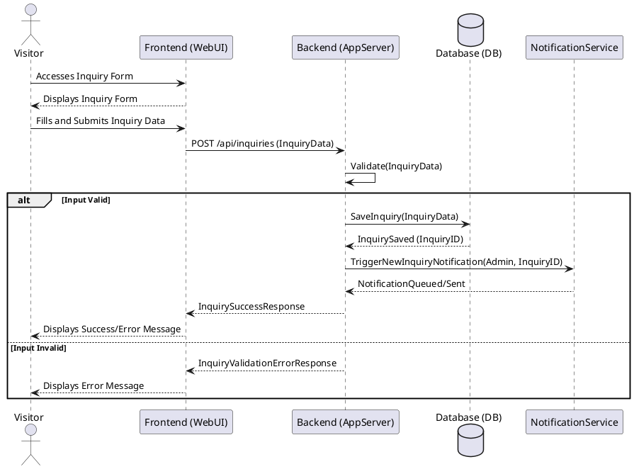
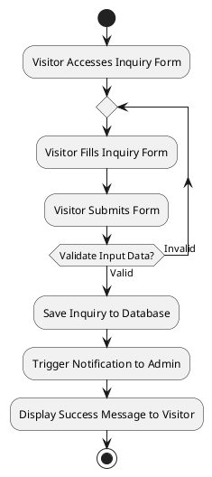
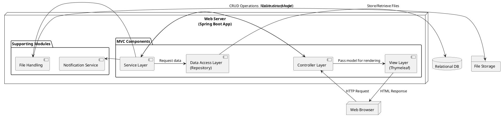
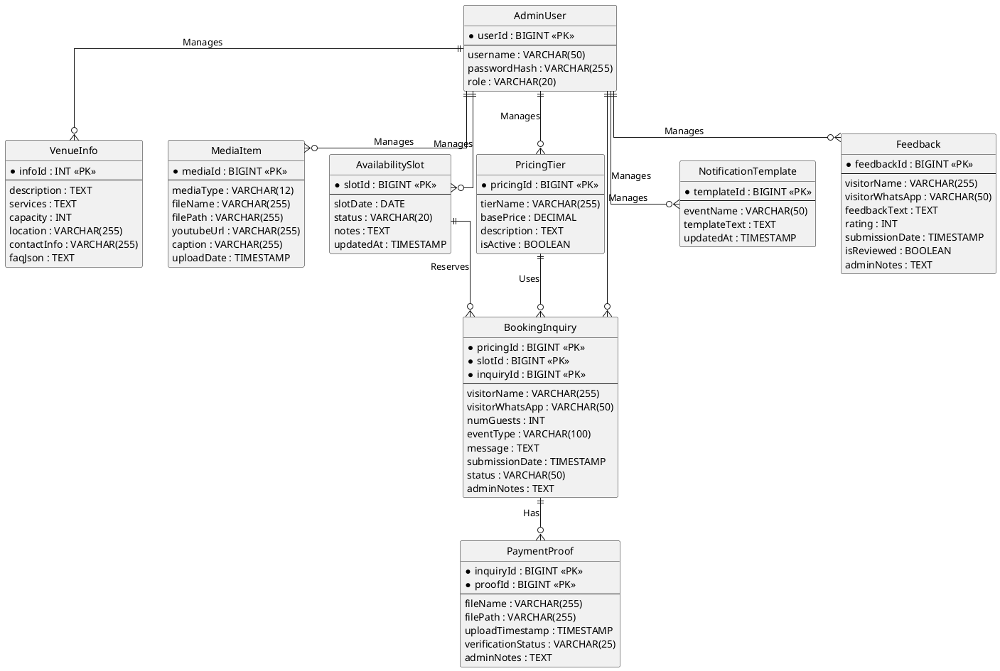

# Al-Muneer Online Portal

**Event Venue Management Systems - Web**

**AHMED HANI GHALEB** **UNIVERSITI TEKNOLOGI MALAYSIA**

## DECLARATION OF THESIS / UNDERGRADUATE PROJECT REPORT AND COPYRIGHT

**Author’s full name:** Ahmed Hani Ahmed Ghaleb **Date of Birth:** 2001/04/19 **Title:** Al-Muneer Hall Reservations **Academic Session:** 24/25 2

**Signature:** **Name of Supervisor:** DR. MUHAMMAD LUQMAN BIN MOHD SHAFIE **Date:** 17 APRIL 2025

## DECLARATION

I declare that this thesis entitled "Al-Muneer Hall Reservations" is the result of my own research except as cited in the references. The thesis has not been accepted for any degree and is not concurrently submitted in candidature of any other degree.

**Signature:** **Name:** AHMED HANI GHALEB **Date:** 17 APRIL 2025

## ABSTRACT

Al-Muneer Hall for Weddings and Events, situated in Ibb, Yemen, currently handles bookings and inquiries mainly through manual phone calls and direct messages. This conventional method results in a considerable time commitment from the owner in responding to repetitive inquiries and managing processes by hand, which often overwhelms the staff and may lead to delays or inaccuracies for clients. Additionally, prospective customers, especially female stakeholders who adhere to local cultural norms and may prefer remote assessments, do not have access to a centralized, visually engaging platform to thoroughly explore the venue and manage their interactions effectively. The Al-Muneer Online Portal tackles this issue by offering a dedicated, all-encompassing web-based platform that consolidates all vital information and key interaction processes into an easily accessible, user-friendly interface. Built using contemporary web development techniques, the portal will include an interactive availability calendar, comprehensive pricing details, an extensive FAQ section, and a high-quality visual gallery. Importantly, it will also feature capabilities for users to submit booking inquiries, optionally upload proof of payment (such as transfer screenshots) to validate bookings, and share feedback regarding their experience. For the administrator, the system will provide a secure panel to oversee all content, manage availability and pricing, review submitted payment proofs, handle feedback, and manage notifications by generating pre-filled WhatsApp messages to facilitate direct communication with clients. This strategy is designed to create a centralized, dependable source of information and interaction, available around the clock, thus significantly alleviating the burden of manual inquiries and processes, enhancing the hall's marketing visibility, streamlining operations, and improving the overall customer experience with cultural awareness.

## ABSTRAK

Dewan Al-Muneer untuk Perkahwinan dan Acara, yang terletak di Ibb, Yaman, pada masa ini menguruskan tempahan dan pertanyaan terutamanya melalui panggilan telefon manual dan mesej langsung. Pendekatan tradisional ini menyebabkan pemilik perlu meluangkan masa yang signifikan untuk menjawab soalan berulang dan menguruskan proses secara manual, yang sering membebankan staf dan berpotensi menyebabkan kelewatan atau ketidaktepatan maklumat kepada pelanggan. Tambahan pula, bakal pelanggan, terutamanya pihak berkepentingan wanita yang mengikut norma budaya tempatan dan mungkin lebih suka membuat penilaian dari jauh, kekurangan platform berpusat yang kaya dengan visual untuk meneroka dewan secara menyeluruh dan menguruskan interaksi mereka dengan cekap. Portal Dalam Talian Al-Muneer menangani cabaran ini dengan menyediakan platform berasaskan web yang khusus dan komprehensif, menyatukan semua maklumat penting dan proses interaksi utama ke dalam antara muka yang mudah diakses dan mesra pengguna. Dengan memanfaatkan amalan pembangunan web moden, portal ini akan menampilkan kalendar ketersediaan interaktif, maklumat harga terperinci, Soalan Lazim (FAQ) yang komprehensif, serta galeri visual berkualiti tinggi. Yang penting, ia juga akan menggabungkan fungsi untuk pengguna menghantar pertanyaan tempahan, secara pilihan memuat naik bukti pembayaran (cth., tangkapan skrin pindahan) untuk mengesahkan tempahan, dan memberikan maklum balas mengenai pengalaman mereka. Bagi pentadbir, sistem ini akan menawarkan panel selamat untuk mengurus semua kandungan, ketersediaan, harga, melihat bukti pembayaran yang dihantar, mengurus maklum balas, dan mengurus pemberitahuan dengan menjana mesej WhatsApp pra-isi bagi memudahkan komunikasi langsung dengan pelanggan. Pendekatan ini bertujuan untuk menyediakan sumber maklumat dan interaksi berpusat yang boleh dipercayai, boleh diakses 24/7, sekali gus mengurangkan beban pertanyaan dan proses manual secara signifikan, meningkatkan kehadiran pemasaran dewan, melancarkan operasi, dan menambah baik pengalaman pelanggan secara keseluruhan dengan kepekaan budaya.

## TABLE OF CONTENTS

|   |   |
|---|---|
|**TITLE**|**PAGE**|
|**CHAPTER 1 INTRODUCTION**|**1**|
|1.1 Introduction|1|
|1.2 Problem Background|2|
|1.3 Project Aim|2|
|1.4 Project Objectives|3|
|1.5 Project Scope|5|
|1.6 Project Importance|6|
|1.7 Report Organization|7|
|**CHAPTER 2 LITERATURE REVIEW**|**8**|
|2.1 Introduction|8|
|2.2 Project Domain|8|
|2.3 Literature Review of Technology Used|16|
|2.4 Chapter Summary|18|
|**CHAPTER 3 SYSTEM DEVELOPMENT METHODOLOGY**|**19**|
|3.1 Introduction|19|
|3.2 Methodology Choice and Justification|19|
|3.3 Phases of the Chosen Methodology|22|
|3.4 System Requirements Analysis: Hardware and Software|25|
|3.5 Technology Used Description|26|
|3.6 Chapter Summary|28|
|**CHAPTER 4 REQUIREMENT ANALYSIS AND DESIGN**|**29**|
|4.1 Introduction|29|
|4.2 Requirement Analysis|29|
|4.2.1 Functional Requirements|30|
|4.2.2 Non-Functional Requirements|32|
|4.2.3 Use Case Table and Diagram|33|
|4.2.3.1 Selected Use Case: Submit Booking Inquiry (UC005)|33|
|4.2.3.2 Sequence Diagram (Submit Booking Inquiry - UC005)|35|
|4.2.3.3 Activity Diagram (Submit Booking Inquiry - UC005)|36|
|4.3 Project Design|36|
|4.3.1 System Architecture Diagram|37|
|4.3.2 Database Design|37|
|4.4 Interface Design (Low-Fidelity)|39|
|**CHAPTER 5 RESULTS, TESTING AND DISCUSSION**|**42**|
|5.1 Introduction|42|
|5.2 Coding of System's Main Functions|42|
|5.3 Essential Interfaces Showing System's Results and Achievements|45|
|5.4 Testing|49|
|5.4.1 Black Box Testing|49|
|5.4.2 White Box Testing|51|
|5.4.3 User Testing|52|
|5.5 Chapter Summary|53|
|**CHAPTER 6 CONCLUSION**|**54**|
|6.1 Introduction|54|
|6.2 Achievement of Project Objectives|54|
|6.3 Future Improvements|55|
|**REFERENCES**|**57**|
|**Appendix A - List of Prompts**|**59**|

## LIST OF APPENDICES

|   |   |   |
|---|---|---|
|**APPENDIX**|**TITLE**|**PAGE**|
|Appendix A|List of Prompts|59|
|Appendix B|Software Requirements Specification (SRS)|64|
|Appendix C|Software Design Description (SDD)|122|
|Appendix D|Software Test Documentation (STD)|179|

## LIST OF FIGURES

|   |   |   |
|---|---|---|
|**FIGURE**|**TITLE**|**PAGE**|
|Figure 3.1|Waterfall Model Workflow for the Al-Muneer Online Portal|21|
|Figure 3.2|Gantt Chart for PSM1 Activities|24|
|Figure 3.3|Proposed Gantt Chart for PSM2 Activities|25|
|Figure 4.1|Use Case Diagram for the Al-Muneer Online Portal|33|
|Figure 4.2|Sequence Diagram for 'Submit Booking Inquiry' (UC005)|35|
|Figure 4.3|Activity Diagram for 'Submit Booking Inquiry' (UC005)|36|
|Figure 4.4|System Architecture Diagram (MVC)|37|
|Figure 4.5|Conceptual Entity-Relationship Diagram (ERD)|38|
|Figure 4.6|Low-Fidelity Wireframe: Homepage|39|
|Figure 4.7|Low-Fidelity Wireframe: Gallery Page|40|
|Figure 4.8|Low-Fidelity Wireframe: Availability Calendar Page|41|
|Figure 4.9|Low-Fidelity Wireframe: Pricing Page|42|
|Figure 4.10|Low-Fidelity Wireframe: Inquiry Form Page|43|
|Figure 5.1|Code Snippet: Booking Inquiry Submission Flow|43|
|Figure 5.2|Visitor Home Page with Single-Page Scroll Layout|45|
|Figure 5.3|Visitor Availability Calendar and Inquiry CTA|46|
|Figure 5.4|Inquiry Form with Pre-filled Date and Package|47|
|Figure 5.5|Administrator Dashboard Overview|48|
|Figure 5.6|Administrator Inquiry Management Panel|49|
|Figure 5.7|Reports Page with Visual Charts|50|
|Figure 5.8|Analytics Dashboard with Chart.js Visualizations|51|

## LIST OF TABLES

|   |   |   |
|---|---|---|
|**TABLE**|**TITLE**|**PAGE**|
|Table 2.1|Comparative Analysis of Existing Systems and the Proposed Portal|13|
|Table 2.2|Technology Stack Selection and Justification|16|
|Table 4.1|Use Case Description for 'Submit Booking Inquiry' (UC005)|33|

# CHAPTER 1 - INTRODUCTION

## 1.1 Introduction

Al-Muneer Hall for Weddings and Events "قاعة المنير للأفراح والمناسبات" located in Ibb, Yemen, serves as a venue primarily for weddings and other important social events, deeply rooted in the local cultural landscape. At present, the hall's operations are largely dependent on traditional communication methods, mainly phone calls and direct messaging, to handle customer inquiries, bookings, and follow-up confirmations. Although this approach is functional, it introduces considerable inefficiencies for both the business owner and prospective clients who are seeking information or aiming to finalize their booking process seamlessly. This project suggests the creation of the "Al-Muneer Online Portal," a specialized web-based platform intended to modernize the hall's client interactions and operational management. The portal is designed to function as a comprehensive, user-friendly, and visually appealing information center, incorporating essential features such as inquiry submission, easy payment proof uploads, feedback collection, owner-side reporting, and client notifications, thus streamlining operations and improving the overall customer experience.

## 1.2 Problem Background

The existing operational framework of Al-Muneer Hall encounters numerous challenges due to its dependence on manual communication and processes. The owner dedicates an excessive amount of time to addressing repetitive inquiries concerning essential details such as venue availability, pricing, amenities, and visual representations. In addition to initial inquiries, the management of booking confirmations often requiring verbal agreements or manual tracking of offline payments—systematic collection of customer feedback, and the generation of insights into business performance are also manual and labor-intensive tasks. This continuous stream of basic questions and administrative burdens consumes precious time. Moreover, this dependence on direct communication can result in inconsistencies, restrict accessibility for clients, and lacks a systematic approach to gather feedback for service enhancement or to provide timely updates and confirmations to clients.

A crucial aspect of this issue is rooted in the socio-cultural context of Ibb, Yemen. Potential clients, especially female stakeholders, do not have a convenient means to assess the venue and manage interactions. The lack of a centralized online platform for information, straightforward booking confirmation processes (such as uploading a payment transfer screenshot, which is common in a cash-dominant economy where formal banking is less widespread), and organized feedback mechanisms creates obstacles to informed decision-making and efficient service. This disorganized and manual method is ineffective, less professional, and fails to utilize digital tools for effective marketing, customer service, or basic operational management.

## 1.3 Project Aim

The primary objective of this project is to design, develop, and assess the Al-Muneer Online Portal, a web-based system aimed at functioning as the main digital interface and operational support tool for Al-Muneer Hall for Weddings and Events. The intention is to consolidate venue information, simplify the inquiry and booking confirmation process, establish feedback collection and basic reporting for the owner, facilitate timely notifications for clients, lessen the owner's burden concerning repetitive tasks, and offer an improved, accessible, and culturally sensitive experience for prospective clients.

## 1.4 Project Objectives

To achieve the project aim, the following objectives have been defined:

1. **Requirements Elicitation and Analysis:** To thoroughly gather, document, and analyze the functional and non-functional requirements and expectations of the Al-Muneer Hall owner and potential clients, covering features such as availability calendar, pricing, FAQ, media gallery, inquiry submission, payment proof upload, feedback, basic reporting, and notification management via pre-filled WhatsApp messaging.

2. **System Architecture and Design:** To design the comprehensive system architecture, including the database schema (ERD), user interface/user experience (UI/UX) mockups, and detailed module specifications for both client and administrator interfaces, ensuring all gathered requirements are effectively translated into a robust, intuitive, and culturally sensitive design.

3. **Software Development and Implementation:** To construct a functional, monolithic web application using the Spring Boot (Java) framework and Model-View-Controller (MVC) design pattern, meticulously implementing all specified features for both client-side interactions and secure administrative controls (content management, inquiry handling, payment proof verification, feedback management, report generation, and notification configuration).

4. **Comprehensive System Testing and Validation:** To conduct thorough functional, usability, performance, and basic security testing on the developed Al-Muneer Online Portal, ensuring all modules operate reliably, efficiently, and according to specifications, with a particular focus on the accuracy of reports, the workflow for payment proofs, the submission and management of feedback, and the delivery of notifications.

5. **System Deployment and Configuration:** To successfully deploy the developed Al-Muneer Online Portal to a production environment, ensuring proper configuration, accessibility via standard web browsers with responsive design, and operational readiness for both clients and administrators.

6. **Documentation and Handover for Future Maintenance:** To prepare comprehensive system documentation, including user manuals and technical guides for the administrator, and to establish a framework for post-deployment monitoring and initial evaluation, thereby ensuring the portal's stability and readiness for future enhancements or necessary maintenance activities.

## 1.5 Project Scope

The Al-Muneer Online Portal project encompasses the following scope:

**Platform:** A web-based application accessible via standard web browsers, featuring a responsive design for mobile-friendly viewing. No native mobile application.

**Users:**

- **Visitors:** Can browse venue information, view media gallery, check availability, view pricing, consult FAQ, submit booking inquiries, optionally upload payment proof (e.g., transfer screenshot), and submit feedback.

- **Admin (Owner):** Can securely log in to manage hall information, media gallery, availability calendar, pricing, FAQ, view inquiries, view/manage submitted payment proofs (update status), manage feedback, view basic operational reports, and configure/manage notifications.

**Core Functionalities:** Content display, interactive calendar, dynamic pricing display, FAQ, inquiry submission, simple payment proof upload and admin verification, feedback submission and admin review, basic reporting dashboard for admin, and admin-configurable notifications via pre-filled WhatsApp messages.

**Limitations:**

- Simple payment proof upload only (e.g., screenshot of local transfer receipt). No direct online payment processing or integration with banks/payment gateways.

- No integration with external calendar systems.

- No integrated live chat feature. Standard contact information (Hotline/WhatsApp number) will be clearly displayed.

- No advanced event management or Customer Relationship Management (CRM) features.

- Analytics will be basic (e.g., visitor counts, inquiry logs contributing to reports).

- Owner provides initial content.

- Website anticipates moderate traffic.

- Reporting will be basic (e.g., summaries of inquiries, bookings based on payment status, feedback overview).

- Manual Notification Triggering: Notifications are not automated via API gateways; instead, they are managed through admin-initiated, pre-filled WhatsApp messages to accommodate local preferences and budget constraints. Email notifications will be minimal or optional.

## 1.6 Project Importance

The establishment of the Al-Muneer Online Portal is of considerable significance. To begin with, it tackles operational inefficiencies by automating the distribution of information and optimizing processes such as booking confirmations and the collection of feedback. Furthermore, it improves the customer experience by offering round-the-clock access to detailed information and clear guidance on inquiries and bookings. Importantly, in the context of Yemeni culture, the portal serves as an essential instrument for promoting inclusivity and facilitating effective communication. It enables remote assessments and simplifies the booking confirmation process through payment proof methods that are familiar to the local population. The integration of feedback mechanisms empowers the owner to enhance services continuously based on customer feedback. Basic reporting features furnish the owner with crucial insights into operational patterns without the need for complicated tools. Prompt notifications enhance communication and elevate client satisfaction. This portal signifies a crucial advancement in the digitization of business operations, aligning with modern expectations and enhancing overall service delivery.

## 1.7 Report Organization

This report is organized into six distinct chapters. Chapter 1 offers an introduction to the project, detailing the background of the problem, the project's aim, objectives, scope, and its significance. Chapter 2 provides a literature review that encompasses the pertinent field of online reservation systems and event venue management platforms, highlighting features such as payment processing, feedback systems, reporting, notification mechanisms, principles of user interface design, and the technologies intended for implementation. Chapter 3 elaborates on the methodology employed throughout the system development lifecycle. Chapter 4 examines the system analysis and design, which includes requirements specification, architectural design, database design, and UI/UX design. Chapter 5 presents the implementation results, key system interfaces, and testing activities carried out during PSM2. Lastly, Chapter 6 wraps up the report by summarizing the project work, discussing the findings, and proposing possible areas for future improvement.

# CHAPTER 2 - LITERATURE REVIEW

## 2.1 Introduction

This chapter investigates the current literature and technological underpinnings pertinent to the creation of the Al-Muneer Online Portal. It examines the field of online event venue management systems, highlighting the transition from conventional manual operations to digital platforms that provide improved functionality. The discourse encompasses essential features anticipated in contemporary venue portals, such as systems for managing inquiries, straightforward booking confirmation processes (including the submission of payment proof), collection of feedback, basic reporting dashboards, and client notification systems. Additionally, this chapter introduces a case study of Al-Muneer Hall to contextualize the system's development. It evaluates the shortcomings of existing manual processes and contrasts the proposed system with current solutions or alternative methods. Moreover, this chapter surveys the literature related to the specific technologies chosen for the portal's development, substantiating their appropriateness for the implementation of these comprehensive features (O'Brien & Marakas, 2011).

## 2.2 Project Domain

The Al-Muneer Online Portal is categorized as a specialized web-based platform that provides information, manages inquiries, and supports operations within the event management and hospitality sectors. These systems are designed to close the communication divide between venue providers and prospective clients, delivering greater efficiency, accessibility, enhanced transactional features, and superior post-interaction engagement when contrasted with conventional approaches (Sigala et al., 2012; Buhalis & Law, 2008).

### 2.2.1 Key Features and Information Architecture for Event Venue Portals

Modern event venue websites have evolved beyond simple static brochures to become interactive platforms. Literature highlights several critical components for success, including high-quality visual content, transparent pricing, and clear calls-to-action to facilitate lead generation (Nielsen, 2000). For instant information, interactive availability calendars are a core expectation. In economic contexts where online payment gateways are less common, a practical feature is allowing users to submit proof of offline payment, adapting to local payment ecosystems (Kshetri, 2013). Furthermore, incorporating feedback mechanisms is vital for continuous improvement and demonstrating customer centricity.

### 2.2.2 Manual Operation Analysis

The current manual system at Al-Muneer Hall is common among SMEs but suffers from inefficiencies:

- **Time Consumption:** Staff spend time on repetitive queries and manual tracking of bookings, payments, and feedback (Laudon & Laudon, 2016).

- **Limited Availability:** Information and process progression are tied to staff hours.

- **Inconsistency:** Information can vary; tracking booking confirmations and feedback lacks standardization.

- **Lack of Scalability:** Handling increased volume becomes difficult.

- **Poor User Experience:** Customers expect streamlined online interactions, including clear confirmation steps and ways to voice opinions (Sigala et al., 2012).

- **Documentation and Oversight Challenges:** Manual tracking makes it hard to generate operational insights or reliably follow up on client interactions.

### 2.2.3 Current System Analysis - Comparison of Existing Systems/Approaches

Before making a direct comparison, it is essential to outline the categories of existing systems or methodologies that establishments like Al-Muneer Hall may currently utilize or contemplate. The existing manual process, as practiced at Al-Muneer Hall and common among many small to medium-sized enterprises (SMEs), relies significantly on direct human interaction for all customer engagement and booking management. Communication primarily takes place through phone calls, in-person meetings, and informal messaging platforms such as WhatsApp. Although this method provides a high degree of personalization, it is labor-intensive, has limited scalability, and poses risks of inconsistencies in information dissemination and record-keeping (Harrigan et al., 2012). Bookings, payment confirmations, and feedback are generally managed in an unstructured manner, lacking a cohesive or centralized system.

Another category encompasses generic online booking platforms, such as Eventbrite or Cvent. These third-party services offer a wide range of features for event listing, ticketing, and occasionally comprehensive event management. They typically provide a standardized interface for users to discover and reserve events or services. Despite their capabilities, they may impose their own branding, fee structures, and workflows that may not correspond with the specific needs or cultural context of an independent venue (Gazzaroli et al., 2019). Their primary emphasis is often on ticketed events, which contrasts with tailored venue rental requests.

Moreover, user-friendly website builders such as Wix, Squarespace, and GoDaddy Website Builder allow individuals and small enterprises to construct websites with relative simplicity by utilizing pre-designed templates and drag-and-drop functionalities (Odoom et al., 2017). These platforms serve as excellent tools for establishing a fundamental online presence and showcasing information. Nevertheless, their built-in capabilities for dynamic processes, including custom availability calendars, tailored pricing for intricate services, integrated payment proof workflows, or backend reporting, are frequently restricted unless enhanced by third-party plugins, which may add further complexity or expenses.

In addition, within numerous local business contexts, it is typical to find standard static competitor websites. These sites predominantly operate as online brochures, offering contact details, a gallery, and possibly a list of services. They usually lack interactive elements for checking availability, acquiring dynamic pricing, submitting structured inquiries, or managing other transactional functions online. Their main purpose is informational, still requiring users to reach out via phone or email for most significant interactions.

A comparative analysis helps to position the proposed Al-Muneer Online Portal:

**Table 2.1: Comparative Analysis of Existing Systems and the Proposed Portal**

|   |   |   |   |   |   |
|---|---|---|---|---|---|
|**Feature**|**Al-Muneer Online Portal (Proposed)**|**Manual (Phone/WhatsApp)**|**Generic Booking Platforms**|**Simple Website Builders**|**Static Competitor Website**|
|**Venue-Specific Info**|Tailored Structure|(Manual)|Generic Setup|(Manual Plugin)|Basic|
|**Interactive Calendar**|Yes|No|Often (Complex Setup)|Limited / Dependent|Often No|
|**Dynamic Pricing Display**|Yes (Admin Managed)|(Verbal/Manual)|Sometimes (Complex)|Usually No|Often No|
|**Admin Panel**|Custom Built|N/A|Yes (Platform Specific)|(General CMS)|N/A|
|**Payment Proof Upload**|Yes (Simple)|(Manual Exchange)|Often Not Direct|No|No|
|**Feedback System**|Yes|(Ad-hoc)|Sometimes (Platform)|Usually No|No|
|**Basic Reporting**|Yes|No|Limited (Platform)|No|No|
|**Notifications**|Manual (prefilled messages)|(Manual)|Email Often Primary|No|No|
|**Cultural Context Adapt**|High (Custom Design)|High (Direct Interaction)|Low (Standardized)|Medium (Template Dependent)|Medium|

**Analysis of Existing Systems/Approaches:** The manual process is characterized by significant inefficiencies and is devoid of structured mechanisms for confirmation, feedback, or oversight. While generic booking platforms may present some advanced features, they frequently fall short in providing the tailored simplicity that is essential, particularly regarding payment processes in specific economic contexts. Additionally, these platforms may not cater to local communication preferences, such as WhatsApp for notifications (Buhalis & Law, 2008). Furthermore, simple website builders typically do not incorporate integrated backend functionalities necessary for managing payment proofs, systematically collecting feedback, or generating specific operational reports. In response to these challenges, the proposed Al-Muneer Online Portal aims to deliver a comprehensive, customized solution that effectively addresses the unique operational flow of the venue, encompassing everything from initial inquiry to straightforward booking confirmation and feedback. This entire process is managed through a bespoke admin panel that provides relevant insights and communication tools tailored to the local environment (Laudon & Laudon, 2016).

### 2.2.4 Case Study: Al-Muneer Hall for Weddings and Events

In order to anchor the project within a practical framework, this section provides an overview of Al-Muneer Hall, the establishment for which the proposed system is being designed. Al-Muneer Hall ("قاعة المنير للأفراح والمناسبات") serves as an event venue situated in Ibb, Yemen. Its main function is to host weddings, thereby serving the local community and preserving the traditional Yemeni cultural customs linked to such celebrations. Additionally, the hall is equipped to host various social events, including condolence gatherings and special celebrations, thus providing a flexible venue for a range of activities. The business operates from a singular physical site. Regarding its organizational structure, Al-Muneer Hall is classified as an owner-operated enterprise. The principal stakeholder is Mr. Ahmed Almunajid, who is the owner of this business, plays an active role in the daily operations and client relations. Although there may be additional personnel for event preparation, cleaning, and assistance during events, the essential tasks related to administration, booking, and client communication are primarily managed or directly supervised by Mr. Almunajid or his manager. This centralized approach to management highlights the necessity for tools that can improve efficiency and alleviate the owner's direct involvement in operational tasks.

The primary method of engagement for this project involved direct interaction with the owner, Mr. Ahmed Almunajid. Initial discussions were conducted via a scheduled video conference (Google Meet) on April 4, 2025, to understand the business, its current processes, challenges, and his vision for an online portal. This was followed by ongoing asynchronous communication via WhatsApp for clarifications and to gather specific details, as evidenced by communication logs and the NABC proposal document (see Appendix B for examples). Key findings from this engagement, effectively forming the basis of a user interview and requirements gathering phase, revealed a significant portion of Mr. Almunajid's time is spent answering repetitive phone calls regarding availability, pricing, venue capacity, and visual details. There was a clear desire for a professional online presence to accurately showcase the hall. Specific feature requests included an interactive calendar, a clear way to display pricing, a media gallery, and an FAQ section. The current booking process involves phone or in-person arrangements, with payment typically in cash, although local bank transfers with screenshot proof are emerging. There is no formal system for tracking these proofs or managing feedback. Communication preferences lean heavily towards WhatsApp and direct calls over email, reflecting local business practices. A core need identified was for a system that is easy for Mr. Almunajid to manage and for his clients to use. Following discussions about the initial proposal feedback, Mr. Almunajid expressed openness to incorporating a simple mechanism for clients to upload payment proof, a feature for clients to submit feedback, basic reports on inquiries and booking statuses, and prefilled notifications, preferably via WhatsApp. These interactions confirmed the problem statement and helped refine the scope and objectives of the Al-Muneer Online Portal project, ensuring its alignment with the stakeholder's genuine needs.

## 2.3 Literature Review of Technology Used

The selection of technologies for the Al-Muneer Online Portal is based on their suitability for developing a robust, scalable, and maintainable web application that meets the defined requirements, including the newly added functionalities. For each core technology, alternatives were considered.

**Table 2.2: Technology Stack Selection and Justification**

|   |   |   |   |
|---|---|---|---|
|**Technology**|**Purpose**|**Alternatives Considered**|**Why Chosen/ Developer Justification**|
|**Spring Boot (Java)/MVC**|Backend framework|Python (Django/Flask), Node.js (Express.js), PHP (Laravel)|Spring Boot provides a solid out-of-the-box MVC implementation, which makes it a good choice for a rapid start.|
|**MySQL/ PostgreSQL**|Relational database|NoSQL (MongoDB, Cassandra), SQLite, MS SQL Server|There is no need for NoSQL database for this project because we're not dealing with unstructured type of data. Postgres sounds a good solid choice. Everyone loves it. It does the job perfectly and it's open source.|
|**HTML5, CSS3, JS (Responsive)**|Frontend development|JavaScript Frameworks (React, Angular, Vue.js)|"An idiot admires complexity, a genius admires simplicity" - Terry Davis, Creator of TempleOS.|
|**Waterfall Model methodology**|SDLC|Agile (Scrum, Kanban), Spiral Model|Sounds solid when having clear requirements of a moderate software that does not seem to be needing frequent and high-maintenance in post development.|
|**Cloud Hosting (VPS)**|Deployment environment|AWS, serverless|VPS is the safest option against DDoS attacks that could cause massive cloud computing bills.|
|**Admin Auth (Hashed Pass.)**|Secure admin login|Plain text storage (highly insecure), Reversible encryption|The encryption standard in web development.|
|**Notification Mechanisms (e.g., WhatsApp Deep-linking, Email libraries, Manual WhatsApp Messaging)**|Manual WhatsApp message pre-filling.|In-app notifications (via web dashboard), Full WhatsApp Business API|The chosen notification method utilizing pre-filled WhatsApp deep links is simple to implement yet highly effective. This approach meets the stakeholder's primary communication needs without the unnecessary overhead and financial costs associated with complex API integrations, such as the Full WhatsApp Business API, which would offer diminishing returns for a business of this scale.|

The Model-View-Controller (MVC) architecture, enabled by Spring Boot, guarantees a clear separation of concerns, thereby simplifying the management and scalability of the application (Fowler, 2002). Relational database systems such as MySQL or PostgreSQL ensure data integrity, which is essential for the effective management of bookings and venue details (Garcia-Molina et al., 2008). Implementing responsive design through HTML5, CSS3, and JavaScript is imperative for contemporary web applications to accommodate a variety of user devices (W3C, 2018). Although Agile methodologies are widely embraced, the structured approach of the Waterfall model can be beneficial for projects with well-defined initial requirements, as described in the proposal phase (Royce, 1970). Ensuring security through HTTPS and appropriate password hashing is critical for maintaining user trust and safeguarding data (Rescorla, 2001; Schneier, 1996). Cloud hosting provides both flexibility and reliability for application deployment (Armbrust et al., 2010).

## 2.4 Chapter Summary

This chapter provided an extensive examination of the literature pertinent to the Al-Muneer Online Portal. It defined the scope of the project within the realm of online event venue management systems, emphasizing key features recognized in prior research, including rich visual displays, interactive availability calendars, clear pricing information, user feedback mechanisms, straightforward booking confirmation processes, basic reporting, and client notification systems. The shortcomings of conventional manual operations, as illustrated by the current practices at Al-Muneer Hall, were scrutinized, highlighting the urgent need for a digital transformation. A case study focusing on Al-Muneer Hall offered specific context, outlining stakeholder engagement and the resulting business requirements. Various existing system categories, such as generic booking platforms and basic website builders, were described and contrasted with the proposed custom portal, thereby validating the tailored approach. In conclusion, the chapter assessed the selected technology stack, exploring alternatives and justifying the choice of Spring Boot, a relational database, standard frontend technologies, and the Waterfall methodology, with references to established principles and industry best practices.

# CHAPTER 3 - SYSTEM DEVELOPMENT METHODOLOGY

## 3.1 Introduction

Development of the Al-Muneer Online Portal, with a defined set of requirements and scope identified, must be a systematic and structured process to ensure all objectives are fulfilled efficiently and effectively. From the very first concept and moving through the plan and design stages relevant to this PSM1 phase, the methodology taken must lead the project through all the way to its entire lifecycle before moving on to development and deployment within PSM2. The system development methodology taken for the Al-Muneer Online Portal, its stages, and how the methodology will be executed to deliver the goals of the project are described within this chapter. For a project of this type, with requirements well understood at the outset and where a structured approach is preferred, the Waterfall model has been recognized as the most appropriate guiding methodology. It offers a linear and structured methodology that is most relevant.

## 3.2 Methodology Choice and Justification

Because of the sequential and linear nature of software development along the Waterfall model, the model was selected for the Al-Muneer Online Portal project development. The model dictates segmentation of the project life cycle into phases, which should be finished before the commencement of the next phase. After initial coordination with stakeholders and proposal clarification, the Al-Muneer Online Portal project is in an ideal position to harness the advantages of such a stringent methodology, which is best suited for projects whose requirements are clearly defined and documented in the initial stage of the project. The clear-cut scope for functionalities like the interactive calendar, display of prices, upload of payment proof, feedback system, easy reporting, and notification makes the Waterfall model a fitting selection.

Waterfall-style life cycles would normally be preferred in those projects where predictability and documentation detail matter most. The visibility of the phases of the Waterfall model provides established markers for measuring progress and outputs, i.e., System Design Document (SDD) and Software Requirements Specification (SRS), in the context of an FYP student project with distinct academic milestones (Progress 1, Progress 2, Final Report). Although Agile methodologies provide adaptability for projects with changing requirements, the Al-Muneer Online Portal is more advantageous under the Waterfall model's focus on preliminary planning and design, which reduces uncertainty as the project moves from the planning and design phases in PSM1 to development in PSM2. This strategy guarantees that the development work in PSM2 can advance based on a stable and mutually agreed foundation, which is vital for controlling the project scope within the academic timeline. The sequential structure also facilitates project management for an individual developer.

### 3.2.1 Waterfall Model Process Diagram

_Figure 3.1: Waterfall Model Workflow for the Al-Muneer Online Portal_

## 3.3 Phases of the Chosen Methodology

The development lifecycle for the Al-Muneer Online Portal, following the Waterfall model, is composed of distinct phases. Each phase has specific objectives and deliverables, ensuring a systematic progression towards the final product.

1. **Requirements Analysis and Definition** This initial phase is essential for comprehending and documenting the specific requirements of the Al-Muneer Online Portal. It entails comprehensive discussions with the stakeholder (Mr. Almunajid) to extract all functional and non-functional requirements. Activities encompass identifying user roles (Visitor, Admin), defining features such as the display of venue information, media gallery, interactive availability calendar, pricing customization panel, submission of booking inquiries, simple payment proof uploads, feedback submissions, admin management of content, updates on payment status, review of feedback, basic report generation, and configuration of notifications. The primary output of this phase is the Software Requirements Specification (SRS) document, which acts as a foundational agreement regarding the functionalities of the system. This phase constituted a significant aspect of the early PSM1 activities.

2. **System and Software Design** Following the clear definition and documentation of requirements in the SRS, the design phase commences. During this phase, the overall system architecture for the Al-Muneer Online Portal is formulated. This includes the design of the database schema (for MySQL/PostgreSQL), detailing the backend structure (Spring Boot services and APIs), and crafting the user interface (UI) and user experience (UX) for both the visitor-facing front-end and the administrator panel. Decisions regarding module breakdown, data flow, and security considerations are made at this stage. The principal deliverable for this phase is the System Design Document (SDD), which serves as a blueprint for the development team (the student developer). This phase is a fundamental element of PSM1, particularly in preparation for Progress 2.

3. **Implementation and Unit Testing** This stage signifies the initiation of actual coding and development, which will predominantly take place during PSM2. In accordance with the SDD, the Al-Muneer Online Portal will be constructed. The web application will be developed as a cohesive, singular project. The backend logic will be managed by Spring Boot (Java), which will also provide the user interface. The View layer will be created utilizing a server-side templating engine (such as Thymeleaf) along with HTML, CSS, and JavaScript. The database will be established and filled with initial structures. As each module or component is crafted, it will undergo unit testing to confirm that it operates correctly in isolation, adhering to its design Description.

4. **Integration and System Testing** Once individual units have been developed and tested, they are combined into a comprehensive system. This integrated system subsequently undergoes thorough system testing to verify that all components function together seamlessly and that the system as a whole fulfills the requirements outlined in the SRS. This encompasses functional testing, usability testing, basic performance testing, and security testing. A Software Test Document (STD) will direct this process, and a test report will encapsulate the findings. This phase is also scheduled for PSM2.

5. **Deployment** Al-Muneer Online Portal will be migrated into a production-like environment after system testing is successfully done and has been certified to be stable and in compliance with all requirements. Deployment onto a Cloud VPS is expected to be for this project. This stage includes putting the hosting environment in place, deploying application code and database, and performing final testing to ensure the portal is live and user-accessible. This is expected to be finished towards the end of PSM2.

6. **Maintenance and Operation** Subsequent to deployment, the maintenance phase commences. This phase entails the continuous monitoring of the Al-Muneer Online Portal for any potential issues, bugs, or necessary updates. Within the context of the FYP, this phase may involve a period of observation, rectifying any immediate post-deployment issues, and preparing documentation for the transition of the system to the stakeholder. Although extensive long-term maintenance falls outside the scope of an FYP, it is essential to ensure that the system is stable and functional upon delivery.

### 3.3.1 Gantt Chart for PSM1

_Figure 3.2: Gantt Chart for PSM1 Activities_

### 3.3.2 Gantt Chart for PSM2

_Figure 3.3: Proposed Gantt Chart for PSM2 Activities_

## 3.4 System Requirements Analysis: Hardware and Software

The effective creation and implementation of the Al-Muneer Online Portal will rely on particular hardware and software resources. For the development environment, the essential hardware requirement is a relatively modern personal computer or laptop. This device should have adequate processing power (for instance, an Intel Core i5 or AMD Ryzen 5 equivalent, or superior), a minimum of 8GB of RAM (with 16GB recommended for enhanced multitasking with development tools), and sufficient storage capacity (such as a 256GB SSD or larger) to support the operating system, development tools, project files, and local database instances. The software prerequisites for development encompass a compatible operating system (Windows, macOS, or Linux), a Java Development Kit (JDK) version that aligns with Spring Boot (for example, JDK 11, 17, or 21), an Integrated Development Environment (IDE) like IntelliJ IDEA, Eclipse, or VS Code equipped with Java extensions, a build tool such as Maven or Gradle (usually managed by Spring Initializr), a relational database management system (MySQL Community Server or PostgreSQL installed locally for development and testing), a web browser for testing purposes (for example, Chrome or Firefox), and version control software (Git).

For the deployment environment, a Cloud Virtual Private Server (VPS) will be utilized as the hardware. This VPS must possess specifications that include a minimum of 1-2 vCPUs, 2GB-4GB of RAM, and adequate SSD storage (for instance, 20GB-50GB) to accommodate the application, database, and any uploaded files such as payment proofs. The operating system of the server will generally be a Linux distribution (for example, Ubuntu or CentOS). The software stack on the deployment server will consist of the Java Runtime Environment (JRE) that is compatible with the developed application, the selected relational database server (either MySQL or PostgreSQL), a web server or application server if an embedded server from Spring Boot is not being utilized (although Spring Boot typically employs an embedded Tomcat, Jetty, or Undertow), along with any essential utilities for server management, monitoring, and security (such as firewall and SSH). Furthermore, an SSL/TLS certificate will be necessary to enable HTTPS.

## 3.5 Technology Used Description

The creation of the Al-Muneer Online Portal, utilizing the Waterfall methodology, systematically incorporates several essential technologies throughout its various phases. In the System and Software Design phase (PSM1), the architecture delineates the interactions among these technologies. The backend, developed with Spring Boot (Java) following an MVC pattern, will contain the fundamental business logic. This encompasses modules for overseeing venue information, managing booking inquiries, processing payment confirmations, handling feedback, generating reports, and initiating notifications. Spring Security will play a crucial role in safeguarding the admin panel.

The MySQL/PostgreSQL relational database, which is designed during this phase, will retain all persistent data, including hashed user credentials, hall specifications, availability, pricing structures, inquiry logs, payment proof details, and feedback entries. Its organized structure will directly facilitate the data retrieval necessary for the reporting functionalities required by the admin.

The user interface is set to be developed as the View component within the MVC architecture. It will utilize HTML5, CSS3, and JavaScript, with rendering occurring on the server-side through a templating engine (for instance, Thymeleaf) that is managed by Spring Boot. This methodology fosters a closely integrated application where the backend has direct control over the UI, which aligns perfectly with the objectives of this project.

Notification mechanisms will be crafted with a focus on WhatsApp channels, utilizing admin-triggered pre-filled messages to ensure a seamless flow of communication between the administrator and clients. This approach leverages WhatsApp deep-linking to facilitate quick manual alerts for booking confirmations and updates, aligning with local communication preferences while maintaining cost-efficiency. Additionally, email libraries available within Spring Boot may facilitate minimal email confirmations if deemed necessary.

The deployment phase will leverage a Cloud VPS, where the packaged Spring Boot application alongside the database will be hosted. Secure communication will be mandated via HTTPS (SSL/TLS) to safeguard all data transmitted between client browsers and the server. The Waterfall model guarantees that each of these technological components is designed, implemented, and subsequently tested in a systematic and orderly fashion.

## 3.6 Chapter Summary

This chapter gives a comprehensive overview of the System Development Methodology used in the Al-Muneer Online Portal, with special focus on the Waterfall model as its bedrock. The reason for using this methodology is that it is a structured, step-by-step approach that is better suited when the project has clearly defined requirements and educational deliverables. We went through the different phases of the Waterfall model as used in this project, beginning with Requirements Analysis and Definition through Deployment and Maintenance, with specific tasking assigned to PSM1 and PSM2. Visual Gantt charts provided timeframes for these phases. The chapter also outlined the software and hardware requirements for the development and deployment environments of the portal. It further detailed how the technologies used, like Spring Boot, a relational database, and traditional web frontend technologies, would be used and combined perfectly in the development process per the Waterfall methodology, so that there was a sequential and systematic approach towards the achievement of the project objectives.

# CHAPTER 4 - REQUIREMENT ANALYSIS AND DESIGN

## 4.1 Introduction

This chapter delineates the functional and non-functional requirements for the Al-Muneer Online Portal. It also elaborates on the system architecture, database schema, user interface design principles, and essential process flows. The main objective of this phase, carried out within PSM1, is to convert the stakeholder requirements and project goals identified in previous phases into a detailed blueprint for the system's development in PSM2. The design focuses on delivering an intuitive and effective experience for both potential clients (Visitors) seeking information about Al-Muneer Hall and the administrator (Owner) overseeing the portal's content and operations. The requirements and design components recorded in this document will serve as the foundation for the Software Requirements Specification (SRS) and System Design Document (SDD).

## 4.2 Requirement Analysis

Requirement analysis involves delineating the users' expectations and the system's characteristics. In the case of the Al-Muneer Online Portal, the requirements were primarily collected through direct engagement with the stakeholder (Mr. Almunajid, the proprietor of Al-Muneer Hall), as elaborated in the Case Study (Chapter 2.2.4). Additionally, an examination of standard functionalities anticipated from comparable online venue management systems was conducted, specifically adapted to the local context of Yemen.

### 4.2.1 Functional Requirements

Functional requirements describe what the system should do. For the Al-Muneer Online Portal, these are categorized by user roles and key system operations:

**FR1: Visitor Functionalities**

- **FR1.1 View Venue Information:** The system shall display comprehensive information about Al-Muneer Hall, including descriptions, capacity, services offered, and location details.

- **FR1.2 View Media Gallery:** The system shall allow visitors to browse a gallery of images and potentially videos showcasing the hall.

- **FR1.3 Check Availability:** The system shall provide an interactive calendar allowing visitors to view dates that are already booked and those that are available.

- **FR1.4 View Pricing Information:** The system shall display pricing information. This may include base rates and options for customizable packages or services that affect the price.

- **FR1.5 View FAQ:** The system shall display a list of frequently asked questions and their answers.

- **FR1.6 Submit Booking Inquiry:** The system shall provide a form for visitors to submit a booking inquiry, including their name, contact details, desired date(s), and any specific requests.

- **FR1.7 Submit Payment Proof (Optional):** The system shall allow visitors, after submitting an inquiry or upon instruction from the admin, to optionally upload an image file (e.g., screenshot of a local transfer receipt) as proof of payment. The system shall only accept common image formats (e.g., JPG, PNG) and enforce a reasonable file size limit.

- **FR1.8 Submit Feedback:** The system shall provide a form for visitors to submit feedback about the venue or their experience with the portal.

**FR2: Administrator Functionalities**

- **FR2.1 Secure Admin Login:** The system shall require administrators to log in using unique, authenticated credentials (username and hashed password). The system shall display an error message if authentication fails.

- **FR2.2 Manage Venue Information:** The system shall allow the administrator to create, update, and delete textual information about the hall (descriptions, services, FAQs).

- **FR2.3 Manage Media Gallery:** The system shall allow the administrator to upload new images/videos to the gallery and delete existing ones.

- **FR2.4 Manage Availability Calendar:** The system shall allow the administrator to mark dates as booked or available on the interactive calendar.

- **FR2.5 Manage Pricing:** The system shall allow the administrator to set and update base pricing and any customizable pricing options.

- **FR2.6 Manage Booking Inquiries:** The system shall allow the administrator to view submitted booking inquiries.

- **FR2.7 Manage Payment Proofs:** The system shall allow the administrator to view uploaded payment proofs and update the status of a booking (e.g., "Payment Verified", "Pending Confirmation").

- **FR2.8 Manage Feedback:** The system shall allow the administrator to view submitted user feedback.

- **FR2.9 Generate Basic Reports:** The system shall allow the administrator to view basic reports, such as a list of inquiries within a date range, a summary of booking statuses, or an overview of feedback received.

- **FR2.10 Manage Notifications:** The system shall allow the administrator to manage pre-defined message templates for notifications (e.g., inquiry received, payment proof acknowledged) and initiate communication via preferred channels—specifically WhatsApp through deep-link triggers, with email as a secondary option.

**FR3: General System Functionalities**

- **FR3.1 Responsive Design:** The system shall be responsive and accessible on common web browsers across various devices (desktops, tablets, smartphones).

- **FR3.2 Secure Data Handling:** The system shall securely handle all user-submitted data, including personal information in inquiries, uploaded payment proofs, and feedback.

- **FR3.3 Notification Generation:** Based on admin configuration and specific system events (e.g., new inquiry, payment proof submission), the system shall generate notifications to be sent to relevant parties (client and/or admin).

### 4.2.2 Non-Functional Requirements

Non-functional requirements define the quality attributes of the system.

- **NFR1 Performance:** The system should load pages within an acceptable time frame (e.g., 3-5 seconds on a typical internet connection). The interactive calendar should respond promptly to user interactions.

- **NFR2 Usability:** The portal should be intuitive and easy to navigate for both visitors and the administrator. The language used will be primarily Arabic, with an option for English if deemed feasible within the project scope. UI elements should be clear and user-friendly, considering local cultural norms for design.

- **NFR3 Security:**

    - **NFR3.1 Admin Authentication:** The admin login shall be protected against common vulnerabilities. Passwords must be hashed.

    - **NFR3.2 Data Protection:** User-submitted data and uploaded files (payment proofs) must be protected from unauthorized access.

    - **NFR3.3 SSL/TLS:** All communication between the client and server shall be encrypted using HTTPS.

- **NFR4 Reliability:** The system should be available for use with minimal downtime. Database backups should be considered as part of operational reliability.

- **NFR5 Maintainability:** The code should be well-structured, commented, and follow the chosen MVC pattern to facilitate future updates or modifications (relevant for PSM2 and beyond).

- **NFR6 Scalability (Basic):** While not expecting massive concurrent users initially, the system architecture (Spring Boot, chosen database) should be capable of handling a moderate increase in traffic (up to 10,000 monthly visitors as per initial scope) without significant performance degradation.

### 4.2.3 Use Case Table and Diagram

_Figure 4.1: Use Case Diagram for the Al-Muneer Online Portal_

#### 4.2.3.1 Selected Use Case: Submit Booking Inquiry (UC005)

**Table 4.1: Use Case Description for 'Submit Booking Inquiry' (UC005)**

|   |   |
|---|---|
|**Attribute**|**Description**|
|**Use Case ID**|UC005|
|**Use Case Name**|Submit Booking Inquiry|
|**Actor(s)**|Visitor|
|**Pre-condition(s)**|Visitor is on the Al-Muneer Online Portal and has navigated to the inquiry section/form.|
|**Normal Flow**|1. Visitor accesses the booking inquiry form.  2. Visitor fills in required fields (e.g., name, contact, desired date, event type, number of guests, specific requests).  3. Visitor submits the form.  4. System validates the input data.  5. System saves the inquiry details to the database.  6. System displays a success message to the Visitor.  7. System triggers a notification to the Administrator about the new inquiry.|
|**Alternative Flow**|**4a. Invalid Input Data:**  4a1. System displays an error message indicating the fields with invalid data.  4a2. Visitor corrects the data and re-submits (back to step 3).  **7a. Notification Failure:**  7a1. System logs the notification failure but still saves the inquiry and shows success to the visitor. Admin will see the inquiry upon login.|
|**Post-condition(s)**|Booking inquiry is successfully recorded in the system. Administrator is notified of the new inquiry. Visitor receives confirmation that their inquiry has been submitted.|

#### 4.2.3.2 Sequence Diagram (Submit Booking Inquiry - UC005)

_Figure 4.2: Sequence Diagram for 'Submit Booking Inquiry' (UC005)_

#### 4.2.3.3 Activity Diagram (Submit Booking Inquiry - UC005)

_Figure 4.3: Activity Diagram for 'Submit Booking Inquiry' (UC005)_

## 4.3 Project Design

The Al-Muneer Online Portal utilizes a Model-View-Controller (MVC) architectural framework within a singular, monolithic application. This structure guarantees a clear delineation of responsibilities: the Model (which encompasses data and business logic), the View (representing the user interface), and the Controller (which manages user input and the flow of the application). This cohesive strategy is exceptionally well-suited to the project's needs, facilitating both development and deployment.

### 4.3.1 System Architecture Diagram

The diagram presented below depicts the overarching Model-View-Controller (MVC) architecture utilized by the Al-Muneer Online Portal. Within this unified framework, the Spring Boot application is responsible for managing both the business logic and the rendering of the user interface, thereby establishing a coherent and sustainable system.

_Figure 4.4: System Architecture Diagram (MVC)_

### 4.3.2 Database Design

A relational database model is selected because of the organized characteristics of the data. The subsequent illustration is a basic conceptual Entity-Relationship Diagram (ERD). Primary Keys (PK) and Foreign Keys (FK) will be specified in a comprehensive design.

_Figure 4.5: Conceptual Entity-Relationship Diagram (ERD)_

**Data Components:**

- **AdminUser:** Stores admin credentials and roles.

- **VenueInfo:** General descriptive information about the hall.

- **MediaItem:** Details about uploaded images and videos for the gallery.

- **AvailabilitySlot:** Represents specific dates and their booking status.

- **PricingTier:** Information about different pricing packages or rates.

- **BookingInquiry:** Details of inquiries submitted by visitors.

- **PaymentProof:** Metadata for uploaded payment proof files, linked to inquiries.

- **Feedback:** Stores feedback submitted by users.

- **Notification Template:** Stores message templates for pre-filled admin-triggered WhatsApp notifications.

## 4.4 Interface Design (Low-Fidelity)

### 4.4.1 Home Page

_[Image: Low-Fidelity Wireframe: Homepage. Displays a Logo/Site Name top left, Navigation links in the center, and a CTA button top right. Below is a Main Heading with a tagline and primary CTA over a background image placeholder. Underneath is a Section Title with an introductory paragraph, followed by a Features Section containing three distinct feature boxes with placeholders for images, descriptions, and link texts.]_ _Figure 4.6: Low-Fidelity Wireframe: Homepage_

### 4.4.2 Photo Gallery

_[Image: Low-Fidelity Wireframe: Gallery Page. Displays "Photo Gallery" at the top with a tabbed navigation menu below it containing options like "Weddings", "Hall Setup", "Decorations", and "Exterior". The main body consists of an 8-image grid layout acting as placeholders for gallery images.]_ _Figure 4.7: Low-Fidelity Wireframe: Gallery Page_

### 4.4.3 Availability calendar

_[Image: Low-Fidelity Wireframe: Availability Calendar Page. Shows "Check Availability" title. A monthly calendar view for "May 2025" with navigation arrows. The calendar grid uses distinct colors/shading to represent "Available", "Pending", and "Booked" statuses with a corresponding legend below it. A "Make an Inquiry" button sits at the very bottom.]_ _Figure 4.8: Low-Fidelity Wireframe: Availability Calendar Page_

### 4.4.4 Pricing Page

_[Image: Low-Fidelity Wireframe: Pricing Page. Displays the Page Title and an introductory text block. Shows three distinct pricing package cards side-by-side, each featuring a Package Name, Price, a checklist of features, and a CTA button. Below this is a section listing individual "Service Name" and "Price Info" in a 2-column layout, followed by a primary CTA button at the bottom.]_ _Figure 4.9: Low-Fidelity Wireframe: Pricing Page_

### 4.4.5 Inquiry Form Page

_[Image: Low-Fidelity Wireframe: Inquiry Form Page. A standard form interface featuring a Page Title at the top. On the left is the form itself, containing various input fields with labels (text inputs, dropdowns, date selectors, and a text area for comments) ending with a Submit Button. On the right is a Sidebar Title section providing Contact Method details (phone/email) and an Info block.]_ _Figure 4.10: Low-Fidelity Wireframe: Inquiry Form Page_

# CHAPTER 5 - RESULTS, TESTING AND DISCUSSION

## 5.1 Introduction

This chapter presents the implementation outcomes of the Al-Muneer Online Portal after transitioning from the PSM1 design phase into the PSM2 development phase. The system was built using the Spring Boot framework with a PostgreSQL database, secured by JWT-based authentication, and rendered through server-side Thymeleaf templates enhanced with vanilla JavaScript and Chart.js. The implementation followed the Waterfall model established in Chapter 3, with the requirements and design artefacts from Chapters 3 and 4 serving as the blueprint for coding, interface construction, and testing.

The discussion is organised into three main areas. Section 5.2 documents the coding of the system's main functions, aligned with the changelog of implemented versions from v0.3 to v0.7. Section 5.3 presents the essential user interfaces that demonstrate the system's results and achievements, accompanied by explanatory placeholders for screenshots. Section 5.4 explains the testing activities carried out, covering black box, white box, and user testing approaches. The chapter concludes with a summary in Section 5.5.

## 5.2 Coding of System's Main Functions

The backend of the Al-Muneer Online Portal was developed in Java 21 using Spring Boot 3.4.4, with Maven as the build tool. PostgreSQL 16 was chosen as the relational database, and Spring Security with JWT tokens and BCrypt hashing was used to protect the administrator panel. The frontend was implemented with HTML5, CSS3, Thymeleaf, and vanilla JavaScript, supported by Chart.js for data visualisation. This section explains the key functional modules that were coded, following the iterative changelog from v0.3 through v0.7.

### 5.2.1 Backend Foundation and Security

The backend follows a layered architecture comprising controllers, services, repositories, and JPA entities. The `AdminAuthController` handles login using Spring Security, while JWT tokens stored in HTTP-only cookies maintain authenticated sessions. Passwords are hashed with BCrypt, and a `DataSeeder` creates a default administrator account on the first run. Domain entities include `BookingInquiry`, `PaymentProof`, `AvailabilitySlot`, `PricingTier`, `MediaItem`, `Feedback`, `PageVisit`, and `NotificationTemplate`, all mapped to PostgreSQL tables through Spring Data JPA.

### 5.2.2 Visitor Booking Flow and Reference Code System

A central achievement of the implementation is the unified visitor booking flow. The home page was converted into a single-page scrollable landing page with anchor navigation, consolidating the hero section, venue information, media gallery, availability calendar, and pricing packages. Visitors interact with an interactive calendar where future dates default to Available and past dates are dimmed. Tapping an available date reveals a single "Submit inquiry" call-to-action that passes the selected date to `/inquiry?date=YYYY-MM-DD`. Similarly, pricing package cards include "Book [package]" buttons that pre-select the tier via `/inquiry?pricingId=...`; if a date was already chosen, both parameters are combined.

The inquiry landing page unifies two capabilities: submitting a new inquiry and looking up an existing inquiry by a visitor-facing reference code. Each inquiry is assigned a random 9-digit `referenceCode` stored in a 150-day HTTP-only cookie named `inq_ref`. Visitors can also cancel their own inquiry directly from the confirmation page, provided no payment proof has been attached, which frees the associated availability slot.

### 5.2.3 Payment Proof, Status Cascade, and Notifications

The payment proof module allows visitors to upload offline payment receipts as image files. The `FileUploadUtil` stores files under `uploads/proofs/` and records the UUID filename in the `PaymentProof` entity. When an administrator verifies a proof, an atomic status cascade is triggered: the payment proof status becomes Verified, the linked `BookingInquiry` moves to CONFIRMED, and the associated `AvailabilitySlot` is marked BOOKED.

Dynamic WhatsApp notifications are implemented through database-backed templates. Administrators can create, edit, and delete notification templates from the admin panel. On the inquiry or payment detail page, a dropdown lets the admin choose a template, preview the message with placeholders resolved, and generate a `wa.me` deep-link client-side. The configured country code (`app.country.code=+967`) is prepended to normalised WhatsApp numbers.

### 5.2.4 Administrator Modules and Analytics

The admin dashboard provides a daily workload overview, including counts of new and active inquiries, pending payment proofs, unreviewed feedback, visits today and over the last seven days, average feedback rating, recent inquiries, and top pages. The analytics page visualises traffic data with Chart.js, offering a bar chart of top pages and a line chart of daily trends over the last 30 days. The reports page presents inquiry status, payment status, and feedback rating distributions using pie and bar charts, with optional date range filtering via `?fromDate=` and `?toDate=` query parameters.

### 5.2.5 AI Integration with Gemini

Version v0.7 introduced three non-blocking AI advisors powered by the Google GenAI Java SDK (`google-genai` 1.56.0) and the Gemini model:

- **AI Business Report Advisor** derives booking conversion and cancellation rates and prompts Gemini for three number-backed action bullets.
- **AI Feedback Advisor** separates low-rating complaints from positive highlights and recommends what the owner should address first.
- **AI Traffic Funnel Advisor** maps Home → Gallery → Pricing → Inquiry visit counts to identify funnel drop-off and suggest a concrete conversion improvement.

All AI panels load asynchronously through dedicated `GET /ai-insight` endpoints after the page renders, ensuring that the main interface remains fast and degrades gracefully if the API is unavailable.

_[Image: Code snippet showing the inquiry submission endpoint and reference-code generation logic]_ _Figure 5.1: Code Snippet: Booking Inquiry Submission Flow_

## 5.3 Essential Interfaces Showing System's Results and Achievements

This section describes the key interfaces that demonstrate the functional results of the implementation. Screenshots of the actual system are included as placeholders for the final report.

### 5.3.1 Visitor Home Page and Booking Calendar

The visitor home page presents a single-page scroll experience. The hero section is followed by venue information with an embedded Google Maps iframe, a masonry media gallery with label-based filters, an interactive availability calendar, and pricing packages. Anchor navigation and scroll-spy highlight the active section. The calendar supports month navigation, visually distinguishes available and booked dates, and reveals a contextual "Submit inquiry" action when a visitor selects an available day.

_[Image: Screenshot of the visitor home page showing the single-page scroll layout]_ _Figure 5.2: Visitor Home Page with Single-Page Scroll Layout_

_[Image: Screenshot of the visitor availability calendar with an available date selected]_ _Figure 5.3: Visitor Availability Calendar and Inquiry CTA_

### 5.3.2 Inquiry Form and Reference Code Lookup

The `/inquiry` page serves both new submissions and existing-lookup use cases. When arriving from the home page, the date and/or pricing package are pre-filled in the form. After submission, the visitor sees a confirmation page with the 9-digit reference code and a self-cancellation option. The same page contains a lookup field where returning visitors can enter their reference code to retrieve inquiry status.

_[Image: Screenshot of the inquiry form with pre-filled date and package]_ _Figure 5.4: Inquiry Form with Pre-filled Date and Package_

### 5.3.3 Admin Dashboard and Analytics

The administrator dashboard gives the owner an at-a-glance view of daily operations. Cards display new and active inquiries, pending proofs, unreviewed feedback, and recent traffic. The analytics page extends this with interactive Chart.js visualisations and the asynchronous AI Traffic Funnel Advisor panel.

_[Image: Screenshot of the administrator dashboard overview]_ _Figure 5.5: Administrator Dashboard Overview_

### 5.3.4 Admin Inquiry and Payment Management

The inquiry management panel includes status filter chips with per-status counts, client-side search, and an "active only" default view. Each row shows the visitor reference code, contact details, event date, and current status. From the detail view, the administrator can update status, view linked payment proofs filtered by inquiry, and send a dynamic WhatsApp message using a template selector. The payment verification screen displays the uploaded receipt image and supports the verification cascade described in Section 5.2.3.

_[Image: Screenshot of the administrator inquiry management list with filters]_ _Figure 5.6: Administrator Inquiry Management Panel_

### 5.3.5 Reports with Visualisations

The reports page summarises operational data through visual charts. Pie charts show inquiry status and payment status breakdowns, while a bar chart displays feedback rating distribution. Date range filters allow the owner to analyse trends over specific periods. The AI Business Report Advisor panel loads asynchronously to provide actionable insights based on the current report data.

_[Image: Screenshot of the reports page showing charts and AI advisor panel]_ _Figure 5.7: Reports Page with Visual Charts_

_[Image: Screenshot of the analytics dashboard with Chart.js visualisations]_ _Figure 5.8: Analytics Dashboard with Chart.js Visualizations_

## 5.4 Testing

Testing was conducted throughout the implementation phase to verify that the Al-Muneer Online Portal meets the functional and non-functional requirements defined in the SRS. The approach combined black box, white box, and user testing.

### 5.4.1 Black Box Testing

Black box testing focused on system flows, input/output behaviour, and error messages without examining internal code. Test scenarios were derived directly from the use cases in the SRS and the changelog features:

- **Visitor flow:** Submitting an inquiry with valid and invalid data, pre-filling date/package from the home page, looking up an inquiry by reference code, and self-cancelling an inquiry.
- **Payment proof flow:** Uploading valid and invalid file types, verifying a proof as an admin, and confirming the status cascade to inquiry and slot.
- **Admin flow:** Logging in, managing venue info and gallery labels, updating calendar slots, filtering inquiries, sending WhatsApp messages from templates, and generating reports.
- **Error handling:** Invalid login credentials, missing required fields, oversized uploads, and unauthorised access attempts all produced clear user-friendly messages.

The black box tests confirmed that the system behaves according to specification and handles edge cases gracefully.

### 5.4.2 White Box Testing

White box testing examined internal logic and code paths. Unit tests and integration tests were performed on the following components:

- **Reference code generation:** Verified that `BookingInquiry` receives a unique 9-digit code.
- **WhatsApp normalisation:** Confirmed that `normaliseWhatsApp()` strips non-digits and prepends the configured country code.
- **Status cascade:** Validated that verifying a `PaymentProof` updates the linked `BookingInquiry` to CONFIRMED and the `AvailabilitySlot` to BOOKED.
- **JWT security:** Verified token creation, validation, and expiration handling.
- **AI service fallback:** Confirmed that `GeminiService` returns a graceful fallback message on API failure without crashing the page.

These tests ensured that critical business rules and security mechanisms operate correctly at the code level.

### 5.4.3 User Testing

User testing was conducted with the project stakeholder, Mr. Ahmed Almunajid, the owner of Al-Muneer Hall. The owner performed representative tasks for the English version of the website, including updating venue information, uploading gallery images, checking new inquiries, verifying a payment proof, and viewing reports. Feedback was collected on interface clarity, workflow efficiency, and the usefulness of the AI advisors. Minor adjustments to dashboard card ordering, and notification template defaults were made based on this feedback.

## 5.5 Chapter Summary

This chapter presented the implementation results of the Al-Muneer Online Portal. Section 5.2 described the coding of main functions, including the Spring Boot backend, visitor booking flow with reference codes, payment proof verification cascade, dynamic WhatsApp notifications, admin dashboard, analytics, reports, and Gemini AI advisors. Section 5.3 presented the essential interfaces that demonstrate these achievements, and Section 5.4 explained the black box, white box, and user testing performed. The system was found to satisfy the requirements specified in the SRS and to provide a practical, user-friendly solution for both visitors and the hall owner.

# CHAPTER 6 - CONCLUSION

## 6.1 Introduction

This chapter concludes the report on the Al-Muneer Online Portal project. The project progressed through the PSM1 planning and design phase and into the PSM2 implementation phase, resulting in a functional web-based platform for Al-Muneer Hall. Chapter 5 presented the implementation results, key system interfaces, and testing activities. This chapter summarises the overall achievement of the project objectives, reflects on the outcomes, and identifies possible directions for future improvement and maintenance.

## 6.2 Achievement of Project Objectives

The original project objectives have been addressed throughout the project lifecycle. Requirements elicitation and analysis were completed in PSM1 through stakeholder engagement with Mr. Ahmed Almunajid, producing a comprehensive Software Requirements Specification (SRS). System architecture and design were documented in the Software Design Description (SDD), including the MVC architecture, database schema, and UI/UX wireframes.

During PSM2, the software development and implementation objective was realised by building the portal with Spring Boot, PostgreSQL, Thymeleaf, and JavaScript. All core modules were implemented: visitor information browsing, media gallery with label filters, interactive availability calendar, dynamic pricing display, booking inquiry submission with 9-digit reference codes, payment proof upload, feedback submission, JWT-secured administrator authentication, content management, inquiry and payment management, WhatsApp notification templates, calendar management, dashboard analytics, reports with charts, and Gemini AI advisors.

Comprehensive system testing and validation were performed through black box, white box, and user testing, as detailed in Chapter 5 and the Software Test Documentation (STD). The system was found to operate reliably and to meet the functional and non-functional requirements. Deployment to a Cloud VPS was completed, making the portal accessible via standard web browsers. Finally, technical documentation, user guidance, and maintenance considerations were prepared to support future upkeep.

## 6.3 Future Improvements

Although the current implementation satisfies the defined scope, several enhancements could be pursued in future iterations:

- **Direct Online Payments:** Integrating a formal payment gateway would remove reliance on manual transfer screenshots and provide immediate booking confirmation.
- **WhatsApp Business API:** Replacing client-side deep-links with the official WhatsApp Business API would enable automated, two-way messaging and richer notification templates.
- **Multi-Language Support:** Adding full Arabic and English localisation would improve accessibility for a broader audience.
- **Mobile Application:** A companion mobile app could offer push notifications and a native experience for frequent users.
- **Advanced Analytics:** Extending the analytics module with conversion funnels, cohort analysis, and automated periodic reports would support data-driven decision making.
- **External Calendar Integration:** Synchronising availability with Google Calendar or similar services would reduce manual calendar maintenance.
- **Automated Backups:** Scheduled database and file backups would strengthen operational reliability and disaster recovery.

These improvements would build upon the solid foundation established by the Al-Muneer Online Portal and further modernise the hall's digital operations.

## REFERENCES

1. Armbrust, M., Fox, A., Griffith, R., Joseph, A. D., Katz, R., Konwinski, A., and Zaharia, M. (2010). A view of cloud computing. Communications of the ACM. 53(4), 50-58.

2. Buhalis, D. and Law, R. (2008). Progress in information technology and tourism management: 20 years on and 10 years after the Internet-The state of e Tourism research. Tourism Management. 29(4), 609-623.

3. Chaffey, D. and Ellis-Chadwick, F. (2019). Digital Marketing. London: Pearson UK.

4. Fowler, M. (2002). Patterns of Enterprise Application Architecture. Boston, MA: Addison-Wesley Professional.

5. Gazzaroli, D., Lee, G., and Morrison, A. M. (2019). The impact of third-party online platforms on the European event industry: A focus on Eventbrite. International Journal of Event and Festival Management. 10(3), 238-253.

6. Kaplan, A. M. and Haenlein, M. (2010). Users of the world, unite! The challenges and opportunities of Social Media. Business Horizons. 53(1), 59-68.

7. Kshetri, N. (2013). Privacy and security issues in cloud computing: The role of institutions and institutional evolution. Telecommunications Policy. 37(4-5), 372-386.

8. Laudon, K. C. and Laudon, J. P. (2016). Management Information Systems: Managing the Digital Firm. Harlow, UK: Pearson.

9. Nielsen, J. (2000). Designing Web Usability. Indianapolis, IN: New Riders Publishing.

10. Odoom, R., Anning-Dorson, T., and Acheampong, G. (2017). Antecedents of social media usage and performance benefits in small and medium-sized enterprises (SMEs). Journal of Enterprise Information Management. 30(3), 383-399.

11. Royce, W. W. (1970). Managing the development of large software systems. Proceedings of IEEE WESCON 26. August, 1-9.

12. Sigala, M., Christou, E., and Gretzel, U. (Eds.). (2012). Social Media in Travel, Tourism and Hospitality: Theory, Practice and Cases. Farnham, UK: Ashgate Publishing, Ltd.

13. W3C. (2018). Web Content Accessibility Guidelines (WCAG) 2.1. Retrieved from https://www.w3.org/TR/WCAG21/

14. Walls, C. (2016). Spring Boot in Action. Shelter Island, NY: Manning Publications.
