# APPENDIX B - SRS

**UNIVERSITI TEKNOLOGI MALAYSIA** **FACULTY OF COMPUTING** **UTM Johor Bahru**

**SECJ 3032: Software Engineering PSM1** **Semester 01, 2024/2025**

# Software Requirements Specification (SRS)

**Al-Muneer Online Portal**

**Version 1.2**

**Prepared by:** Ahmed Ghaleb

## Revision Page

### a. Overview

This document is Version 1.0 of the Software Requirements Specification (SRS) for the Al-Muneer Online Portal. It details the functional and non-functional requirements of the system, defines the scope, outlines user characteristics, specifies system features through use cases, and sets the foundation for the system's design and development. This SRS is prepared as part of the SECJ 3032: Software Engineering PSM1 course requirements.

### b. Target Audience

The target audience for this SRS document includes:

- The project supervisor, for review and assessment of project scope and requirements.

- The student developer (Ahmed Hani Ahmed Ghaleb), as a guide for system design, development, and testing.

- Examiners, for evaluation purposes.

- The project stakeholder (Mr. Ahmed Almunajid), for confirmation that the documented requirements accurately reflect his needs for the Al-Muneer Online Portal.

### c. Version Control History

|   |   |   |   |
|---|---|---|---|
|**Version**|**Primary Author(s)**|**Description of Version**|**Date Completed**|
|1.0|Ahmed Hani Ahmed Ghaleb|Initial complete draft of SRS document for FYP1 Progress 2.|30/05/2025|
|1.1|Ahmed Hani Ahmed Ghaleb|Use case 6 "Admin Login" removed as instructed|06/08/2025|
|1.2|Ahmed Hani Ahmed Ghaleb|AI advisor features integrated into UC010, UC014, and UC015; redundant steps removed; diagrams synced with implementation.|18/06/2026|

_(Note: This Software Requirements Specification (SRS) template is adapted from IEEE Recommended Practice for Software Requirements Specification (SRS) (IEEE Std. 830-1998) that is simplified and customized to meet the need of SECJ3203 FYP1 SE course at Faculty of Computing, UTM. Examples of models are from Arlow and Neustadt (2002) and other sources stated accordingly. This template is tailored for SRS in a plan-driven software development approach.)_

## Table of Contents

1. **Introduction** (2) 1.1 Purpose (2) 1.2 Scope (2) 1.3 Definitions, Acronyms and Abbreviation (3) 1.4 References (4) 1.5 Overview (5)

2. **Specific Requirements** (5) 2.1 User characteristics (6) 2.2 System Features (8) 2.3 Use Case Details (11) 2.3.1 UC001: Use Case View Venue Information (11) 2.3.2 UC002: Use Case View Media Gallery (12) 2.3.3 UC003: Use Case Check Availability (14) 2.3.4 UC004: Use Case View Pricing Panel (17) 2.3.5 UC005: Use Case Submit Booking Inquiry (19) 2.3.6 UC006: Use Case Manage Hall Information (21) 2.3.7 UC007: Use Case Manage Media Gallery (24) 2.3.8 UC008: Use Case Manage Pricing Panel (27) 2.3.9 UC009: Use Case Manage Calendar & Inquiries (29) 2.3.10 UC010: Use Case View Traffic Analytics (31) 2.3.11 UC011: Use Case Submit Payment Proof (32) 2.3.12 UC012: Use Case Submit Feedback (34) 2.3.13 UC013: Use Case Manage Payment Status (36) 2.3.14 UC014: Use Case View/Generate Reports (39) 2.3.15 UC015: Use Case Manage Feedback (40) 2.3.16 UC016: Use Case Configure/Manage Notifications (43) 2.3.17 UC017: Use Case Generate AI Insights (44) 2.4 Performance and Other Requirements (44) 2.5 Design Constraints (48) **Appendix A:** Evidence of Requirements Elicitation Artefacts (1)

## 1. Introduction

The following sections of the Software Requirements Specification (SRS) document provide the details of the entire document.

### 1.1 Purpose

This Software Requirements Specification (SRS) document delineates the requirements for the Al-Muneer Online Portal. Its purpose is to provide a comprehensive and unambiguous description of the system's functionalities, capabilities, constraints, and interfaces. This SRS serves as the foundational agreement between the stakeholder, the developer, and academic supervisors regarding what the Al-Muneer Online Portal will achieve. It is intended to guide the design, development, testing, and eventual deployment of the system.

This SRS describes the features and behavior of the Al-Muneer Online Portal from an external perspective, focusing on what the system does rather than how it does it. It is intended for use by the project developer (Ahmed Hani Ahmed Ghaleb) as the primary guide for system development, by the project supervisor (Dr. Muhammad Luqman bin Mohd Shafie) for monitoring progress and adherence to objectives, and by the stakeholder (Mr. Ahmed Almunajid) to ensure the final product aligns with his business needs for Al-Muneer Hall.

### 1.2 Scope

The software product to be produced is the "Al-Muneer Online Portal," a web-based application designed to facilitate online inquiry, information dissemination, and operational management for Al-Muneer Hall for Weddings and Events, located in Ibb, Yemen.

**The Al-Muneer Online Portal will:**

- Provide a public-facing interface for visitors to view detailed venue information, browse a media gallery, check event availability via an interactive calendar, view pricing tiers, read FAQs, submit booking inquiries, optionally upload proof of payment (e.g., transfer screenshots), and provide feedback.

- Provide a secure administrator panel for the venue owner to manage all content (venue details, media, FAQs, pricing), manage the availability calendar, view and manage booking inquiries, view and update payment proof statuses, review user feedback, generate basic operational reports with visual charts and AI-generated business insights, view traffic analytics with AI funnel advice, and configure system notifications (WhatsApp focused).

**The Al-Muneer Online Portal will not:**

- Process direct online payments or integrate with third-party payment gateways or banks. Payment confirmation will be based on uploaded proof and manual verification.

- Integrate with external calendar systems (e.g., Google Calendar).

- Include a live chat feature for real-time communication; standard contact information (phone/WhatsApp) will be provided.

- Offer advanced event management or Customer Relationship Management (CRM) functionalities beyond the scope defined.

- Provide advanced, customizable analytics beyond the AI-enhanced reports and funnel advisor implemented in the project scope.

- Support multiple languages beyond Arabic and potentially basic English translations for navigation, unless explicitly expanded later.

The application of the software is to modernize and streamline the current manual processes of Al-Muneer Hall. The relevant benefits include increased efficiency for the owner by reducing repetitive inquiries, improved customer experience through 24/7 access to comprehensive information, enhanced marketing presence, simplified booking confirmation processes suitable for the local context, and a structured way to gather feedback for service improvement. The primary objective is to create a user-friendly, informative, and culturally appropriate online presence that supports the hall's business operations. This scope is consistent with the project proposal and subsequent discussions with the stakeholder.

The software product is a custom-developed web application, encompassing both frontend (user interface for visitors and admin) and backend (server-side logic and database interaction) components.

### 1.3 Definitions, Acronyms and Abbreviation

Definitions of all terms, acronyms and abbreviation used are to be defined here.

- **Admin:** Administrator; refers to the owner or authorized manager of Al-Muneer Hall who has privileged access to the system's management features.

- **AI Advisor:** An optional, asynchronous insight panel powered by a generative AI service (Gemini) that analyses portal data and presents concise, actionable recommendations to the Administrator.

- **GenAI / Gemini:** Google's generative artificial intelligence service accessed through the official Google GenAI Java SDK; used by the system for optional business, feedback, and traffic insights.

- **API:** Application Programming Interface.

- **CGPA:** Cumulative Grade Point Average.

- **CRM:** Customer Relationship Management.

- **CRUD:** Create, Read, Update, Delete - basic data operations.

- **CSS:** Cascading Style Sheets.

- **DB:** Database.

- **ERD:** Entity-Relationship Diagram.

- **FAQ:** Frequently Asked Questions.

- **FR:** Functional Requirement.

- **FYP:** Final Year Project.

- **HTML:** HyperText Markup Language.

- **HTTP:** Hypertext Transfer Protocol.

- **HTTPS:** Hypertext Transfer Protocol Secure.

- **JS:** JavaScript.

- **MVC:** Model-View-Controller - a software architectural pattern.

- **NFR:** Non-Functional Requirement.

- **PaaS:** Platform as a Service.

- **PK:** Primary Key.

- **FK:** Foreign Key.

- **PSM:** Projek Sarjana Muda (Bachelor's Degree Project).

- **SDD:** System Design Document.

- **SDLC:** Software Development Life Cycle.

- **SRS:** Software Requirements Specification.

- **SSL/TLS:** Secure Sockets Layer/Transport Layer Security cryptographic protocols for secure communication.

- **STD:** Software Test Document.

- **UC:** Use Case.

- **UI:** User Interface.

- **UX:** User Experience.

- **UTM:** Universiti Teknologi Malaysia.

- **VPS:** Virtual Private Server.

- **Visitor:** A potential client or any member of the public accessing the portal's informational content.

### 1.4 References

1. Al-Muneer Online Portal - Project Proposal & Supervision Consent Form (PSM1.PF_.05u-1). Version 1.0. March 2025. (Internal Document)

2. Al-Muneer Online Portal - NABC Supplement Document (PSM1.PF_.05u-1 - NABC Supplement Document v2.1). Version 2.1. March 2025. (Internal Document)

3. Al-Muneer Online Portal - FYP1 Progress 1 Report. Ahmed Hani Ahmed Ghaleb. May 2025. (Internal Document)

4. Al-Muneer Online Portal - FYP1 Progress 2 Report (Chapters 3, 4, 5). Ahmed Hani Ahmed Ghaleb. May 2025. (Internal Document)

5. Stakeholder Communication Logs (Summary of Google Meet discussion on March 15, 2025, and subsequent WhatsApp clarifications with Mr. Ahmed Almunajid). (Internal Notes/Logs)

6. IEEE. (1998). IEEE Recommended Practice for Software Requirements Specifications (IEEE Std 830-1998). Institute of Electrical and Electronics Engineers.

Sources for these documents are primarily internal project documentation, academic course materials, and standard software engineering literature. Project-specific documents are maintained by the student developer.

### 1.5 Overview

This SRS document is organized into three main sections:

- **Section 1: Introduction:** Provides an overview of the SRS document itself, including its purpose, scope, definitions, references, and a summary of its organization.

- **Section 2: Specific Requirements:** Details all software requirements. This includes descriptions of user characteristics (Section 2.1), an overview of system features with a conceptual domain model and use case diagram (Section 2.2), detailed specifications for each use case including activity and sequence diagrams (Section 2.3), performance and other non-functional requirements (Section 2.4), and any design constraints (Section 2.5).

- **Section 3: Appendices:** Contains supporting information, such as evidence of requirements elicitation artefacts (Appendix A).

This organization is intended to provide a clear and structured presentation of the requirements for the Al-Muneer Online Portal, facilitating understanding and serving as a reliable basis for subsequent design and development efforts.

## 2. Specific Requirements

This section of the SRS contains all the software requirements to a level of detail sufficient to enable designers to design a system to satisfy those requirements, and testers to test that the system satisfies those requirements. Throughout this section, every stated requirement should be externally perceivable by users, operators, or other external systems. These requirements include at a minimum a description of every input (stimulus) into the system, every output (response) from the system, and all functions performed by the system in response to an input or in support of an output.

### 2.1 User characteristics

The Al-Muneer Online Portal is designed to be used by two main types of users, each with distinct characteristics and ways of interacting with the system: Visitors and the Administrator (Owner).

#### 2.1.1 Visitors

Visitors are potential clients or any member of the public seeking information about Al-Muneer Hall.

- **Technical Expertise:** Visitors are expected to have basic computer literacy and familiarity with using web browsers on various devices (desktops, smartphones, tablets). They may not possess advanced technical skills.

- **Domain Knowledge:** Visitors are looking for information about event venues, specifically for weddings or other occasions in Ibb, Yemen. They understand the general concept of booking a hall and are seeking details on availability, pricing, features, and visual appeal.

- **Language and Cultural Context:** The primary language for many visitors will be Arabic. The interface and information should be culturally appropriate for the Yemeni context, particularly considering how event planning (especially for weddings) is approached. An option for basic English navigation may be useful for a wider audience but is secondary.

- **Accessibility Needs:** While no specific advanced accessibility features are mandated beyond standard web responsiveness, the design should aim for clarity and ease of use for a general audience.

- **Motivation:** Their primary motivation is to gather sufficient information to evaluate Al-Muneer Hall for their event, check its availability, understand pricing, and initiate an inquiry or booking process if interested. They value convenience and quick access to comprehensive details. The ability to perform these tasks remotely is particularly important for some user segments (e.g., female family members involved in initial selection).

#### 2.1.2 Administrator (Owner)

The Administrator is the owner of Al-Muneer Hall (Mr. Ahmed Almunajid) or a designated staff member responsible for managing the portal's content and operations.

- **Technical Expertise:** The Administrator is expected to have moderate computer literacy, capable of using a web-based admin panel, filling forms, and uploading media. While not necessarily a technical expert, the admin interface should be intuitive enough for someone with general office software experience. Training on using the admin panel will be provided if necessary.

- **Domain Knowledge:** The Administrator has in-depth knowledge of Al-Muneer Hall's operations, booking procedures, pricing strategies, and client communication.

- **Language:** The Administrator is fluent in Arabic and may have a working knowledge of English. The admin panel should primarily be in Arabic for ease of use.

- **Motivation:** The Administrator's motivation is to efficiently manage the hall's online presence, reduce the time spent on manual inquiries, streamline the booking information process, manage payment confirmations, gather client feedback, and gain basic insights into operational trends. The system should empower them to manage these tasks with minimal external technical support.

- **Responsibilities:** The Administrator is responsible for keeping the portal's information (venue details, availability, pricing, gallery, FAQs) accurate and up-to-date, responding to inquiries, managing booking statuses, and overseeing the overall client interaction facilitated by the portal.

Both types of users will interact with the system via standard web browsers. Visitors will not need to register or log in to access public information but will provide contact details for inquiries. The Administrator will require secure login credentials to access the management functionalities.

### 2.2 System Features

The Al-Muneer Online Portal is designed as a web-based application to serve as the primary online interface for Al-Muneer Hall. Its product perspective is that of a specialized venue management and client interaction tool tailored to the specific needs of the hall and its cultural context. The system provides functionalities for information dissemination, inquiry management, booking status tracking (via payment proof), feedback collection, and basic operational reporting for the administrator.

The system features are illustrated in the Use Case Diagram (Figure 2.1) below. The detailed description of each module (grouped by primary actor) and its functions (use cases) will be elaborated in Section 2.3.

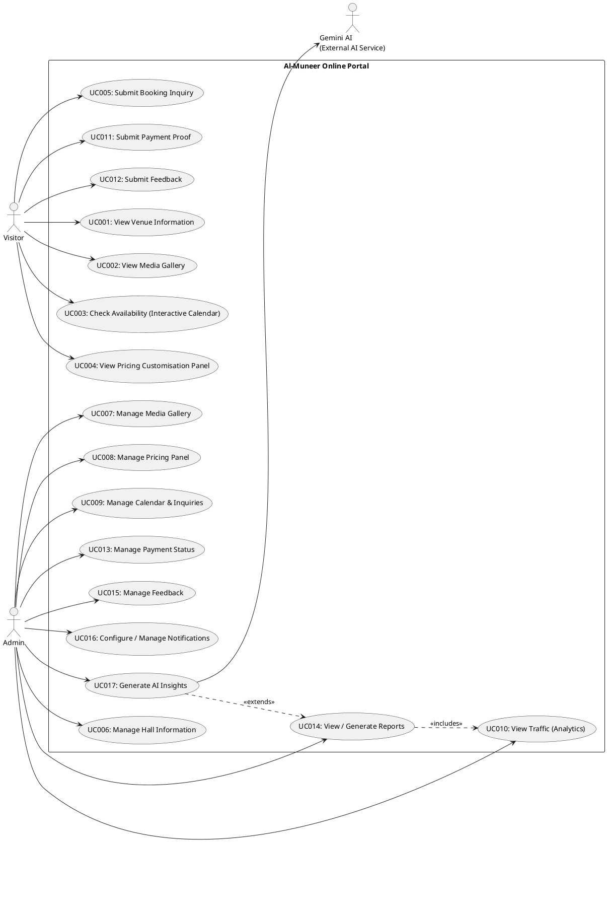
```plantuml
@startuml
left to right direction
actor Visitor
actor Admin
actor "Gemini AI\n(External AI Service)" as Gemini

rectangle "Al-Muneer Online Portal" {
  usecase "UC001: View Venue Information" as UC1
  usecase "UC002: View Media Gallery" as UC2
  usecase "UC003: Check Availability (Interactive Calendar)" as UC3
  usecase "UC004: View Pricing Customisation Panel" as UC4
  usecase "UC005: Submit Booking Inquiry" as UC5
  usecase "UC011: Submit Payment Proof" as UC11
  usecase "UC012: Submit Feedback" as UC12

  usecase "UC006: Manage Hall Information" as UC6
  usecase "UC007: Manage Media Gallery" as UC7
  usecase "UC008: Manage Pricing Panel" as UC8
  usecase "UC009: Manage Calendar & Inquiries" as UC9
  usecase "UC013: Manage Payment Status" as UC13
  usecase "UC015: Manage Feedback" as UC15
  usecase "UC010: View Traffic (Analytics)" as UC10
  usecase "UC014: View / Generate Reports" as UC14
  usecase "UC016: Configure / Manage Notifications" as UC16
  usecase "UC017: Generate AI Insights" as UC17
}

Visitor --> UC1
Visitor --> UC2
Visitor --> UC3
Visitor --> UC4
Visitor --> UC5
Visitor --> UC11
Visitor --> UC12

Admin --> UC6
Admin --> UC7
Admin --> UC8
Admin --> UC9
Admin --> UC13
Admin --> UC15
Admin --> UC10
Admin --> UC16
Admin --> UC14
Admin --> UC17

UC14 ..> UC10 : <<includes>>
UC17 ..> UC14 : <<extends>>
UC17 --> Gemini

@enduml
```

_Figure 2.1: Use Case Diagram for Al-Muneer Online Portal_

**Table 2.1: Description of Modules and Functions for Al-Muneer Online Portal**

|   |   |   |
|---|---|---|
|**Module**|**Function**|**Description**|
|**Visitor Interaction Module**|Handles all functionalities accessible to public visitors.||
||UC001: View Venue Information|Allows visitors to view detailed descriptions, services, and location of the hall.|
||UC002: View Media Gallery|Allows visitors to browse images and videos of the hall.|
||UC003: Check Availability|Enables visitors to check for available dates using an interactive calendar.|
||UC004: View Pricing Panel|Allows visitors to see pricing information and package details.|
||UC005: Submit Booking Inquiry|Provides a form for visitors to send booking requests or inquiries to the hall management.|
||UC011: Submit Payment Proof|Allows visitors to upload a screenshot or image as proof of payment for a booking.|
||UC012: Submit Feedback|Enables visitors to provide feedback about the venue or portal.|
|**Administrator Control Module**|Handles all functionalities accessible to the authenticated administrator for managing the portal.||
||UC006: Manage Hall Information|Enables the admin to update venue descriptions, services, FAQs, etc.|
||UC007: Manage Media Gallery|Allows the admin to upload, delete, or modify media items in the gallery.|
||UC008: Manage Pricing Panel|Enables the admin to set and update pricing structures and package details.|
||UC009: Manage Calendar & Inquiries|Allows the admin to update the availability calendar and view/manage submitted inquiries.|
||UC010: View Traffic Analytics|Provides the admin with interactive traffic charts and an AI-generated funnel advisor that suggests concrete conversion improvements.|
||UC013: Manage Payment Status|Enables the admin to view uploaded payment proofs and update booking confirmation statuses.|
||UC014: View/Generate Reports|Allows the admin to access visual reports on inquiries, bookings, and feedback, augmented by an AI-generated business advisor.|
||UC015: Manage Feedback|Enables the admin to view and manage user-submitted feedback, supported by an AI feedback advisor that highlights complaints and positives.|
||UC016: Configure/Manage Notifications|Allows the admin to set up or manage templates/triggers for system notifications.|
||UC017: Generate AI Insights|Produces AI-generated advisory insights on the Reports, Analytics, and Feedback pages by submitting aggregated operational metrics to the external Gemini AI service.|

The domain model illustrating the key entities and their attributes within the Al-Muneer Online Portal is shown in Figure 2.2. This model focuses on the data aspects of the system from a requirements perspective.

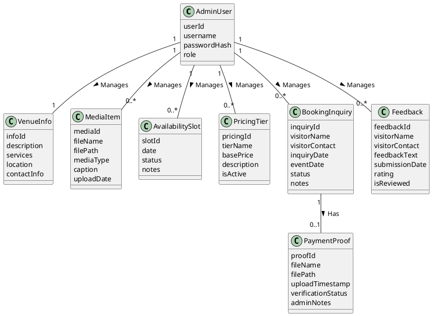
```plantuml
@startuml
class AdminUser {
  userId
  username
  passwordHash
  role
}

class VenueInfo {
  infoId
  description
  services
  location
  contactInfo
}

class MediaItem {
  mediaId
  fileName
  filePath
  mediaType
  caption
  uploadDate
}

class AvailabilitySlot {
  slotId
  date
  status
  notes
}

class PricingTier {
  pricingId
  tierName
  basePrice
  description
  isActive
}

class BookingInquiry {
  inquiryId
  visitorName
  visitorContact
  inquiryDate
  eventDate
  status
  notes
}

class PaymentProof {
  proofId
  fileName
  filePath
  uploadTimestamp
  verificationStatus
  adminNotes
}

class Feedback {
  feedbackId
  visitorName
  visitorContact
  feedbackText
  submissionDate
  rating
  isReviewed
}

AdminUser "1" -- "1" VenueInfo : Manages >
AdminUser "1" -- "0..*" MediaItem : Manages >
AdminUser "1" -- "0..*" AvailabilitySlot : Manages >
AdminUser "1" -- "0..*" PricingTier : Manages >
AdminUser "1" -- "0..*" BookingInquiry : Manages >
AdminUser "1" -- "0..*" Feedback : Manages >

BookingInquiry "1" -- "0..1" PaymentProof : Has >
@enduml
```

_Figure 2.2: Domain Model for Al-Muneer Online Portal_

This domain model depicts the core entities: `AdminUser` for system administrators; `VenueInfo` for static hall details; `MediaItem` for gallery content; `AvailabilitySlot` for calendar dates and booking status; `PricingTier` for different costings; `BookingInquiry` for client requests; `PaymentProof` for uploaded payment confirmations; and `Feedback` for user comments. Relationships indicate how administrators manage these entities and how inquiries can lead to payment proofs.

### 2.3 Use Case Details

This section provides detailed descriptions for each use case identified for the Al-Muneer Online Portal. Each use case includes a specification table, an activity diagram, and a sequence diagram to illustrate its flow and interactions.

#### 2.3.1 UC001: Use Case

**Table 2.2: Use Case Description for View Venue Information**

|   |   |
|---|---|
|**Attribute**|**Description**|
|**Use Case ID**|UC001|
|**Use Case Name**|View Venue Information|
|**Description**|This use case allows a Visitor to view comprehensive descriptive information about Al-Muneer Hall.|
|**Actor(s)**|Visitor|
|**Pre-condition(s)**|Visitor has access to a web browser and an internet connection, and has navigated to the portal's URL.|
|**Normal Flow(s)- NF**|1. Visitor navigates to the "Venue Information" or "About Us" section of the portal (e.g., via a menu link or homepage section).  2. System retrieves the latest venue details (description, services offered, capacity, location, contact information) from the database. **[If retrieval fails due to a temporary issue → AF1; if the content is missing/not configured → EF1]**  3. System renders and displays the formatted venue information page to the Visitor.|
|**Alternative Flow(s) - AF**|**AF1: Information Temporarily Unavailable (triggered at NF step 2):**  AF1.1. The venue information cannot be retrieved from the database due to a temporary issue (e.g., brief database connection problem); the system displays a user-friendly message indicating that the information is currently unavailable and suggests trying again shortly.  AF1.2. Use case ends.|
|**Exception Flow(s) - EF**|**EF1: Content Not Found (triggered at NF step 2):**  EF1.1. The venue information content is missing or not configured in the database (e.g., after a faulty admin update); the system displays a "Content not available" message or redirects to a relevant section of the homepage.  EF1.2. Use case ends.|
|**Post-condition(s)**|Visitor has viewed the venue information.  The system state remains unchanged for other users.|

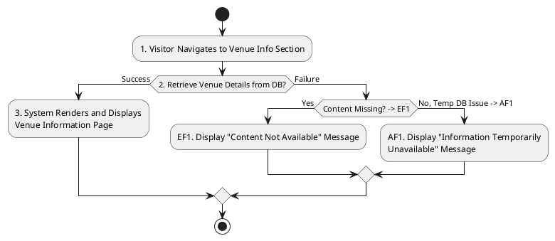
```plantuml
@startuml
start
:1. Visitor Navigates to Venue Info Section;
if (2. Retrieve Venue Details from DB?) then (Success)
  :3. System Renders and Displays\nVenue Information Page;
else (Failure)
  if (Content Missing? -> EF1) then (Yes)
    :EF1. Display "Content Not Available" Message;
  else (No, Temp DB Issue -> AF1)
    :AF1. Display "Information Temporarily\nUnavailable" Message;
  endif
endif
stop
@enduml
```

_Figure 2.3: Activity Diagram for View Venue Information_

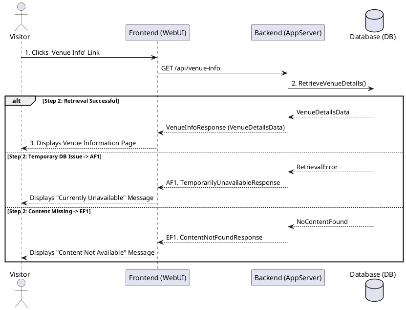
```plantuml
@startuml
actor Visitor
participant "Frontend (WebUI)" as UI
participant "Backend (AppServer)" as App
database "Database (DB)" as DB

Visitor -> UI : 1. Clicks 'Venue Info' Link
UI -> App : GET /api/venue-info
App -> DB : 2. RetrieveVenueDetails()
alt Step 2: Retrieval Successful
    DB --> App : VenueDetailsData
    App --> UI : VenueInfoResponse (VenueDetailsData)
    UI --> Visitor : 3. Displays Venue Information Page
else Step 2: Temporary DB Issue -> AF1
    DB --> App : RetrievalError
    App --> UI : AF1. TemporarilyUnavailableResponse
    UI --> Visitor : Displays "Currently Unavailable" Message
else Step 2: Content Missing -> EF1
    DB --> App : NoContentFound
    App --> UI : EF1. ContentNotFoundResponse
    UI --> Visitor : Displays "Content Not Available" Message
end
@enduml
```

_Figure 2.4: Sequence Diagram for View Venue Information_

#### 2.3.2 UC002: Use Case

**Table 2.3: Use Case Description for View Media Gallery**

|   |   |
|---|---|
|**Attribute**|**Description**|
|**Use Case ID**|UC002|
|**Use Case Name**|View Media Gallery|
|**Description**|This use case allows a Visitor to browse a collection of images and potentially videos of Al-Muneer Hall.|
|**Actor(s)**|Visitor|
|**Pre-condition(s)**|Visitor has access to a web browser and an internet connection, and has navigated to the portal's URL.|
|**Normal Flow(s)- NF**|1. Visitor navigates to the "Media Gallery" section of the portal.  2. System retrieves a list of media items (image thumbnails, video placeholders) from the database. **[If no media items are configured → AF1; if retrieval fails → EF1]**  3. System displays the gallery layout with the retrieved media items.  4. Visitor clicks on a specific media item (e.g., an image thumbnail).  5. System displays the full-size image or plays the video in a lightbox or dedicated view. **[If the media file cannot be loaded → AF2]**|
|**Alternative Flow(s) - AF**|**AF1: Empty Gallery (triggered at NF step 2):**  AF1.1. No media items are currently configured; the system displays a message such as "Our gallery is currently being updated. Please check back soon!"  AF1.2. Use case ends.  **AF2: Media Item Not Found/Corrupted (triggered at NF step 5):**  AF2.1. A specific media file cannot be loaded (e.g., file deleted, path incorrect); the system displays a placeholder or an error icon for that item, while other items remain accessible.  AF2.2. Flow resumes at NF step 4 (Visitor may select another item).|
|**Exception Flow(s) - EF**|**EF1: Error Loading Gallery Data (triggered at NF step 2):**  EF1.1. The system encounters an error while retrieving the list of media items (e.g., database error) and displays a general error message to the Visitor.  EF1.2. Use case ends.|
|**Post-condition(s)**|Visitor has viewed the media gallery and potentially individual media items.  The system state remains unchanged for other users.|

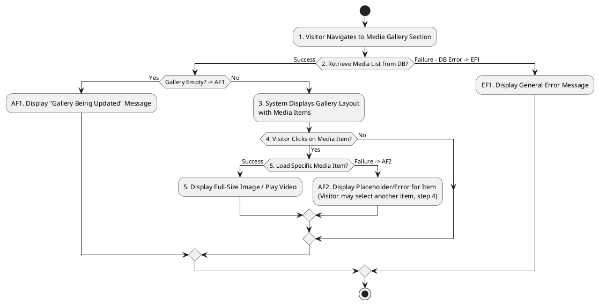
```plantuml
@startuml
start
:1. Visitor Navigates to Media Gallery Section;
if (2. Retrieve Media List from DB?) then (Success)
  if (Gallery Empty? -> AF1) then (Yes)
    :AF1. Display "Gallery Being Updated" Message;
  else (No)
    :3. System Displays Gallery Layout\nwith Media Items;
    if (4. Visitor Clicks on Media Item?) then (Yes)
      if (5. Load Specific Media Item?) then (Success)
        :5. Display Full-Size Image / Play Video;
      else (Failure -> AF2)
        :AF2. Display Placeholder/Error for Item\n(Visitor may select another item, step 4);
      endif
    else (No)
    endif
  endif
else (Failure - DB Error -> EF1)
  :EF1. Display General Error Message;
endif
stop
@enduml
```

_Figure 2.5: Activity Diagram for View Media Gallery_

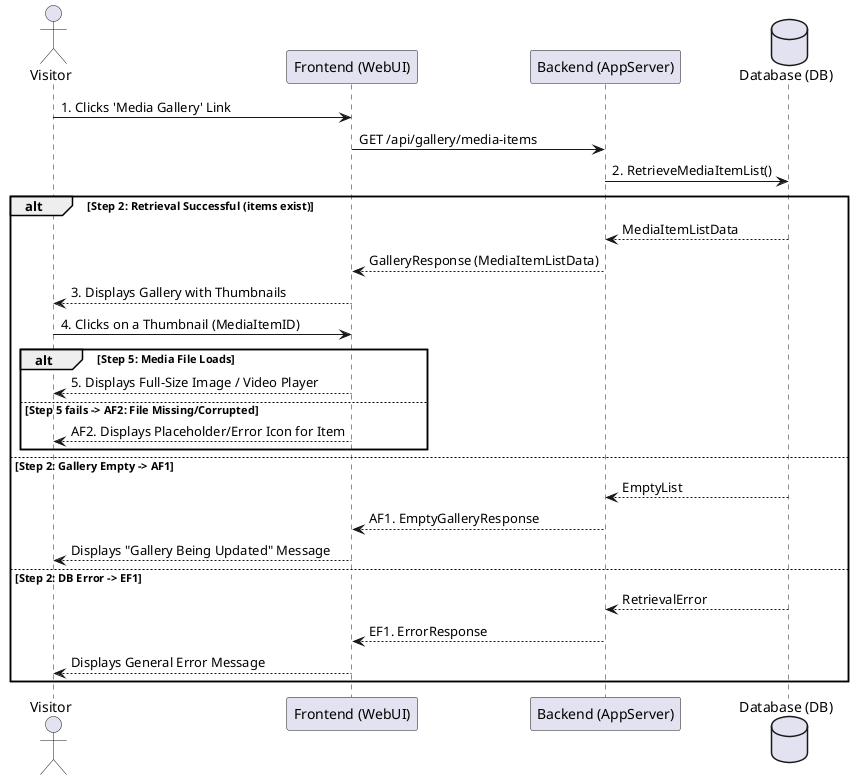
```plantuml
@startuml
actor Visitor
participant "Frontend (WebUI)" as UI
participant "Backend (AppServer)" as App
database "Database (DB)" as DB

Visitor -> UI : 1. Clicks 'Media Gallery' Link
UI -> App : GET /api/gallery/media-items
App -> DB : 2. RetrieveMediaItemList()
alt Step 2: Retrieval Successful (items exist)
    DB --> App : MediaItemListData
    App --> UI : GalleryResponse (MediaItemListData)
    UI --> Visitor : 3. Displays Gallery with Thumbnails
    Visitor -> UI : 4. Clicks on a Thumbnail (MediaItemID)
    alt Step 5: Media File Loads
        UI --> Visitor : 5. Displays Full-Size Image / Video Player
    else Step 5 fails -> AF2: File Missing/Corrupted
        UI --> Visitor : AF2. Displays Placeholder/Error Icon for Item
    end
else Step 2: Gallery Empty -> AF1
    DB --> App : EmptyList
    App --> UI : AF1. EmptyGalleryResponse
    UI --> Visitor : Displays "Gallery Being Updated" Message
else Step 2: DB Error -> EF1
    DB --> App : RetrievalError
    App --> UI : EF1. ErrorResponse
    UI --> Visitor : Displays General Error Message
end
@enduml
```

_Figure 2.6: Sequence Diagram for View Media Gallery_

#### 2.3.3 UC003: Use Case

**Table 2.4: Use Case Description for Check Availability**

|   |   |
|---|---|
|**Attribute**|**Description**|
|**Use Case ID**|UC003|
|**Use Case Name**|Check Availability|
|**Description**|This use case allows a Visitor to view an interactive calendar displaying booked and available dates for Al-Muneer Hall.|
|**Actor(s)**|Visitor|
|**Pre-condition(s)**|Visitor has access to a web browser and an internet connection, and has navigated to the portal's URL.|
|**Normal Flow(s)- NF**|1. Visitor navigates to the "Availability" or "Calendar" section of the portal.  2. System retrieves current booking status data (booked dates, pending dates if applicable) from the database for a default period (e.g., current month and next few months). **[If no booking data exists for the period → AF1; if retrieval fails persistently → EF1]**  3. System renders and displays an interactive calendar, visually differentiating between available, booked, and potentially pending dates.  4. Visitor may interact with the calendar (e.g., navigate to different months/years).  5. For each navigation, System retrieves and updates the calendar display with the relevant booking status data for the selected period. **[If no booking data exists for the new period → AF1; if retrieval fails persistently → EF1]**|
|**Alternative Flow(s) - AF**|**AF1: No Booking Data Available (triggered at NF step 2 or step 5):**  AF1.1. No bookings are marked for the requested period (possible for a new setup); the calendar displays all dates in the view as available, or a message indicates no specific bookings are marked for the current view.  AF1.2. Flow resumes at NF step 4.|
|**Exception Flow(s) - EF**|**EF1: Error Loading Calendar Data (triggered at NF step 2 or step 5):**  EF1.1. The system encounters a persistent error while retrieving booking status data (e.g., database connection error) and displays a general error message to the Visitor, suggesting they try again later or contact the hall directly.  EF1.2. Use case ends.|
|**Post-condition(s)**|Visitor has viewed the availability status of the hall for the selected period(s).  The system state remains unchanged for other users.|

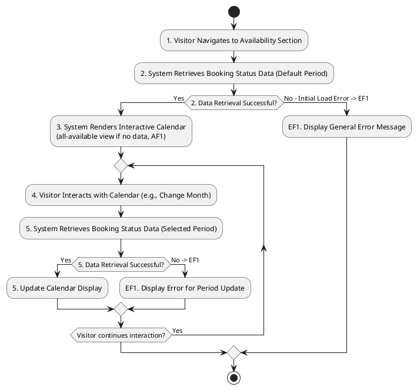
```plantuml
@startuml
start
:1. Visitor Navigates to Availability Section;
:2. System Retrieves Booking Status Data (Default Period);
if (2. Data Retrieval Successful?) then (Yes)
  :3. System Renders Interactive Calendar
  (all-available view if no data, AF1);
  repeat
    :4. Visitor Interacts with Calendar (e.g., Change Month);
    :5. System Retrieves Booking Status Data (Selected Period);
    if (5. Data Retrieval Successful?) then (Yes)
      :5. Update Calendar Display;
    else (No -> EF1)
      :EF1. Display Error for Period Update;
    endif
  repeat while (Visitor continues interaction?) is (Yes)
else (No - Initial Load Error -> EF1)
  :EF1. Display General Error Message;
endif
stop
@enduml
```

_Figure 2.7: Activity Diagram for Check Availability_

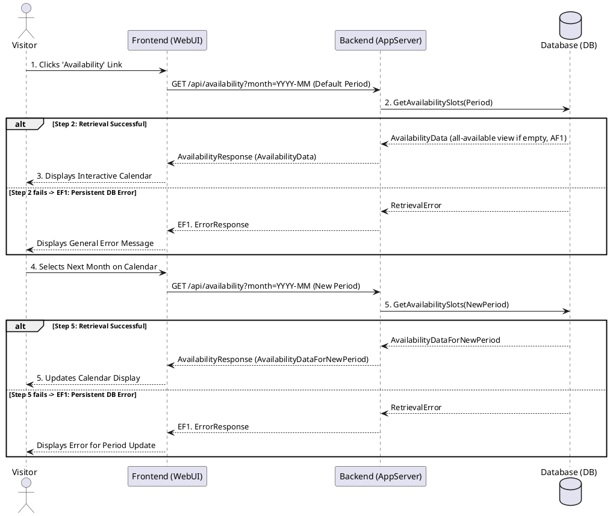
```plantuml
@startuml
actor Visitor
participant "Frontend (WebUI)" as UI
participant "Backend (AppServer)" as App
database "Database (DB)" as DB

Visitor -> UI : 1. Clicks 'Availability' Link
UI -> App : GET /api/availability?month=YYYY-MM (Default Period)
App -> DB : 2. GetAvailabilitySlots(Period)
alt Step 2: Retrieval Successful
    DB --> App : AvailabilityData (all-available view if empty, AF1)
    App --> UI : AvailabilityResponse (AvailabilityData)
    UI --> Visitor : 3. Displays Interactive Calendar
else Step 2 fails -> EF1: Persistent DB Error
    DB --> App : RetrievalError
    App --> UI : EF1. ErrorResponse
    UI --> Visitor : Displays General Error Message
end

Visitor -> UI : 4. Selects Next Month on Calendar
UI -> App : GET /api/availability?month=YYYY-MM (New Period)
App -> DB : 5. GetAvailabilitySlots(NewPeriod)
alt Step 5: Retrieval Successful
    DB --> App : AvailabilityDataForNewPeriod
    App --> UI : AvailabilityResponse (AvailabilityDataForNewPeriod)
    UI --> Visitor : 5. Updates Calendar Display
else Step 5 fails -> EF1: Persistent DB Error
    DB --> App : RetrievalError
    App --> UI : EF1. ErrorResponse
    UI --> Visitor : Displays Error for Period Update
end
@enduml
```

_Figure 2.8: Sequence Diagram for Check Availability (Initial Load & Month Navigation)_

#### 2.3.4 UC004: Use Case

**Table 2.5: Use Case Description for View Pricing Panel**

|   |   |
|---|---|
|**Attribute**|**Description**|
|**Use Case ID**|UC004|
|**Use Case Name**|View Pricing Panel|
|**Description**|This use case allows a Visitor to view detailed pricing information, packages, and potentially customizable options for Al-Muneer Hall services.|
|**Actor(s)**|Visitor|
|**Pre-condition(s)**|Visitor has access to a web browser and an internet connection, and has navigated to the portal's URL.|
|**Normal Flow(s)- NF**|1. Visitor navigates to the "Pricing" or "Packages" section of the portal.  2. System retrieves current pricing tiers, package details, and any configurable options from the database. **[If no pricing tiers are configured → AF1; if retrieval fails → EF1]**  3. System renders and displays the formatted pricing information to the Visitor.  4. (Optional) If interactive elements for customizing a package are present (e.g., selecting add-on services), Visitor interacts with these elements.  5. (Optional) System dynamically updates the displayed estimated price based on Visitor's selections.|
|**Alternative Flow(s) - AF**|**AF1: No Specific Pricing Configured (triggered at NF step 2):**  AF1.1. Detailed pricing tiers are not yet configured by the admin; the system displays a general statement about pricing or a prompt to contact the hall for a custom quote.  AF1.2. Use case ends.|
|**Exception Flow(s) - EF**|**EF1: Error Loading Pricing Data (triggered at NF step 2):**  EF1.1. The system encounters an error while retrieving pricing information (e.g., database error) and displays a general error message to the Visitor.  EF1.2. Use case ends.|
|**Post-condition(s)**|Visitor has viewed the pricing information for Al-Muneer Hall.  The system state remains unchanged for other users.|

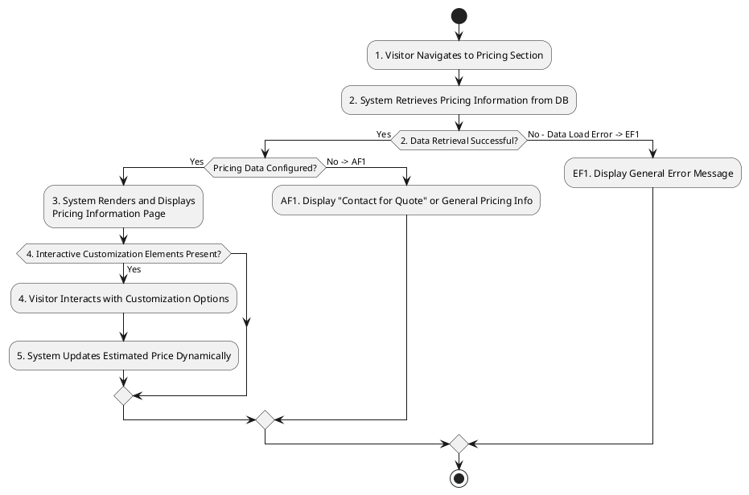
```plantuml
@startuml
start
:1. Visitor Navigates to Pricing Section;
:2. System Retrieves Pricing Information from DB;
if (2. Data Retrieval Successful?) then (Yes)
  if (Pricing Data Configured?) then (Yes)
    :3. System Renders and Displays\nPricing Information Page;
    if (4. Interactive Customization Elements Present?) then (Yes)
      :4. Visitor Interacts with Customization Options;
      :5. System Updates Estimated Price Dynamically;
    endif
  else (No -> AF1)
    :AF1. Display "Contact for Quote" or General Pricing Info;
  endif
else (No - Data Load Error -> EF1)
  :EF1. Display General Error Message;
endif
stop
@enduml
```

_Figure 2.9: Activity Diagram for View Pricing Panel_

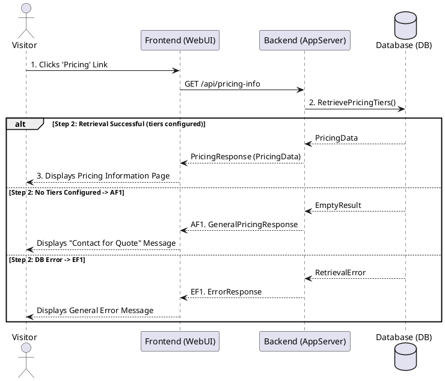
```plantuml
@startuml
actor Visitor
participant "Frontend (WebUI)" as UI
participant "Backend (AppServer)" as App
database "Database (DB)" as DB

Visitor -> UI : 1. Clicks 'Pricing' Link
UI -> App : GET /api/pricing-info
App -> DB : 2. RetrievePricingTiers()
alt Step 2: Retrieval Successful (tiers configured)
    DB --> App : PricingData
    App --> UI : PricingResponse (PricingData)
    UI --> Visitor : 3. Displays Pricing Information Page
else Step 2: No Tiers Configured -> AF1
    DB --> App : EmptyResult
    App --> UI : AF1. GeneralPricingResponse
    UI --> Visitor : Displays "Contact for Quote" Message
else Step 2: DB Error -> EF1
    DB --> App : RetrievalError
    App --> UI : EF1. ErrorResponse
    UI --> Visitor : Displays General Error Message
end
@enduml
```

_Figure 2.10: Sequence Diagram for View Pricing Panel_

#### 2.3.5 UC005: Use Case

**Table 2.6: Use Case Description for Submit Booking Inquiry**

|   |   |
|---|---|
|**Attribute**|**Description**|
|**Use Case ID**|UC005|
|**Use Case Name**|Submit Booking Inquiry|
|**Description**|This use case allows a Visitor to submit a formal inquiry or booking request for Al-Muneer Hall.|
|**Actor(s)**|Visitor|
|**Pre-condition(s)**|Visitor has browsed venue information and is interested in making a booking or asking specific questions not covered in the FAQ/general info. Visitor is on the inquiry page/form.|
|**Normal Flow(s)- NF**|1. Visitor accesses the booking form on the portal.  2. Visitor fills in required fields such as name, contact number (phone/WhatsApp), email (optional), preferred event date(s), estimated number of guests, type of event, and any specific questions or requirements in a message field.  3. Visitor clicks the "Submit Booking" button.  4. System validates the submitted data (e.g., checks for mandatory fields, valid contact format). **[If validation fails → AF1]**  5. System saves the booking details (including timestamp) into the database. **[If the save operation fails → EF1]**  6. System displays a confirmation message with the booking reference code to the Visitor (e.g., "Your booking has been successfully submitted. We will contact you shortly.").|
|**Alternative Flow(s) - AF**|**AF1: Invalid Input Data (triggered at NF step 4):**  AF1.1. Data validation fails; the system highlights the fields with errors and displays appropriate error messages (e.g., "Please enter a valid phone number," "Required field missing.").  AF1.2. Visitor remains on the form page and corrects the input.  AF1.3. Flow resumes at NF step 3.|
|**Exception Flow(s) - EF**|**EF1: Database Save Error (triggered at NF step 5):**  EF1.1. The database fails to save the data; the system displays an error message stating that the booking could not be submitted.  EF1.2. Visitor may retry (flow resumes at NF step 3) or abandon the use case. Use case ends.|
|**Post-condition(s)**|The booking inquiry is successfully recorded in the system's database.  The Administrator is (ideally) notified of the new inquiry.  The Visitor receives an on-screen confirmation of submission.|

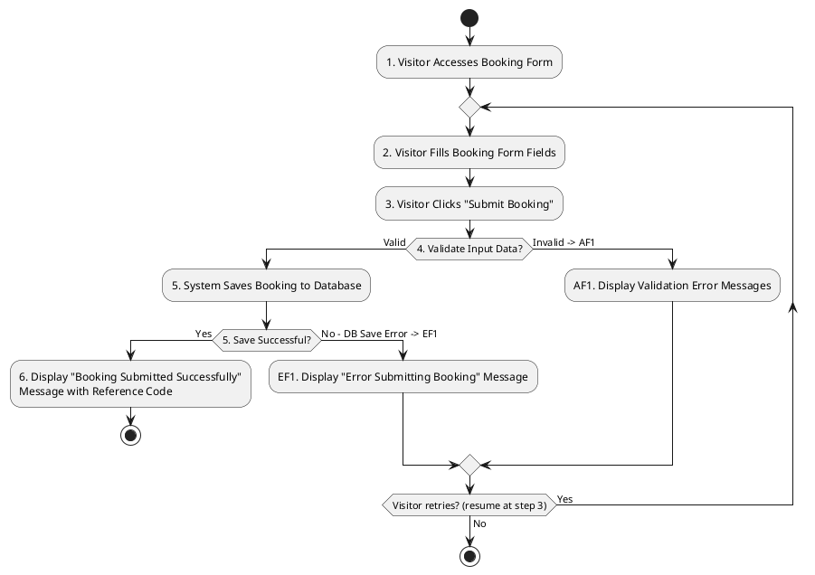
```plantuml
@startuml
start
:1. Visitor Accesses Booking Form;
repeat
  :2. Visitor Fills Booking Form Fields;
  :3. Visitor Clicks "Submit Booking";
  if (4. Validate Input Data?) then (Valid)
    :5. System Saves Booking to Database;
    if (5. Save Successful?) then (Yes)
      :6. Display "Booking Submitted Successfully"
      Message with Reference Code;
      stop
    else (No - DB Save Error -> EF1)
      :EF1. Display "Error Submitting Booking" Message;
    endif
  else (Invalid -> AF1)
    :AF1. Display Validation Error Messages;
  endif
repeat while (Visitor retries? (resume at step 3)) is (Yes) not (No)
stop
@enduml
```

_Figure 2.11: Activity Diagram for Submit Booking Inquiry_

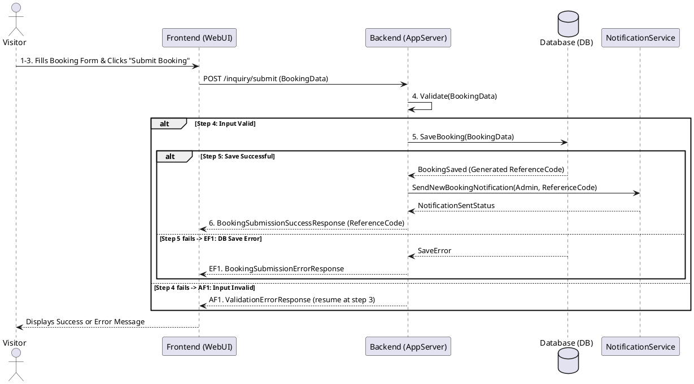
```plantuml
@startuml
actor Visitor
participant "Frontend (WebUI)" as UI
participant "Backend (AppServer)" as App
database "Database (DB)" as DB
participant "NotificationService" as NS

Visitor -> UI : 1-3. Fills Booking Form & Clicks "Submit Booking"
UI -> App : POST /inquiry/submit (BookingData)
App -> App : 4. Validate(BookingData)
alt Step 4: Input Valid
  App -> DB : 5. SaveBooking(BookingData)
  alt Step 5: Save Successful
    DB --> App : BookingSaved (Generated ReferenceCode)
    App -> NS : SendNewBookingNotification(Admin, ReferenceCode)
    NS --> App : NotificationSentStatus
    App --> UI : 6. BookingSubmissionSuccessResponse (ReferenceCode)
  else Step 5 fails -> EF1: DB Save Error
    DB --> App : SaveError
    App --> UI : EF1. BookingSubmissionErrorResponse
  end
else Step 4 fails -> AF1: Input Invalid
  App --> UI : AF1. ValidationErrorResponse (resume at step 3)
end
UI --> Visitor : Displays Success or Error Message
@enduml
```

_Figure 2.12: Sequence Diagram for Submit Booking Inquiry_

#### 2.3.6 UC006: Use Case

**Table 2.7: Use Case Description for Manage Hall Information**

|   |   |
|---|---|
|**Attribute**|**Description**|
|**Use Case ID**|UC006|
|**Use Case Name**|Manage Hall Information|
|**Description**|This use case allows the Administrator to create, read, update, and delete (CRUD) general descriptive information about Al-Muneer Hall, such as venue description, services offered, capacity, location, contact details, and FAQs.|
|**Actor(s)**|Administrator|
|**Pre-condition(s)**|Administrator is logged into the admin panel.|
|**Normal Flow(s)- NF**|NF1: View Hall Information:  1. Administrator navigates to the "Venue Information" or "Content Management" section in the admin panel.  2. System retrieves the current hall information from the database.  3. System displays the information in editable fields/text areas. **[If the Administrator chooses to add a new FAQ item instead of editing existing content → AF2]**      NF2: Update Hall Information:  1. Administrator modifies the content in the displayed fields (e.g., changes description, updates contact number, adds a new FAQ).  2. Administrator clicks a "Save" or "Update" button.  3. System validates the input (e.g., checks for required fields if any, character limits). **[If validation fails → AF1]**  4. System saves the updated information to the database. **[If the save operation fails → EF1]**  5. System displays a success message (e.g., "Information updated successfully.").|
|**Alternative Flow(s) - AF**|**AF1: Input Validation Error (triggered at NF2 step 3):**  AF1.1. Validation fails; the system displays an error message next to the problematic fields.  AF1.2. Administrator corrects the input.  AF1.3. Flow resumes at NF2 step 2.      **AF2: Create New FAQ Item (triggered at NF1 step 3):**  AF2.1. Administrator clicks "Add New FAQ".  AF2.2. System displays fields for Question and Answer.  AF2.3. Administrator fills the fields and saves.  AF2.4. Flow resumes at NF2 step 3 (validation and save proceed as in the update flow).|
|**Exception Flow(s) - EF**|**EF1: Error Saving Data (triggered at NF2 step 4):**  EF1.1. The system encounters an error while saving to the database (e.g., database connection error) and displays a general error message (e.g., "Failed to update information. Please try again.").  EF1.2. Administrator may retry (flow resumes at NF2 step 2) or abandon the use case. Use case ends.|
|**Post-condition(s)**|Hall information displayed on the public portal is updated (after successful update).  Database reflects the changes.|

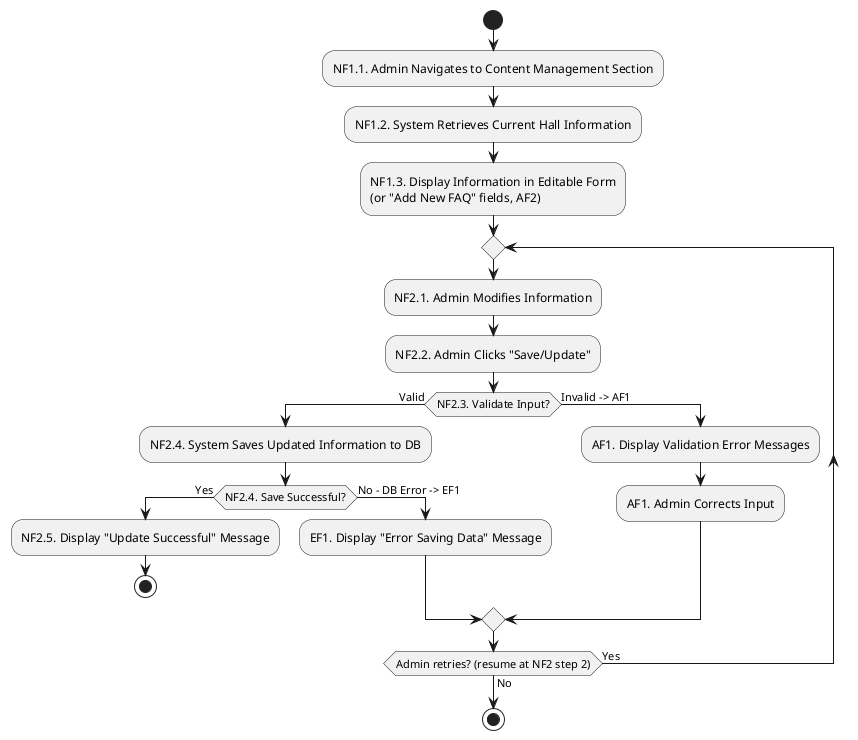
```plantuml
@startuml
start
:NF1.1. Admin Navigates to Content Management Section;
:NF1.2. System Retrieves Current Hall Information;
:NF1.3. Display Information in Editable Form
(or "Add New FAQ" fields, AF2);
repeat
  :NF2.1. Admin Modifies Information;
  :NF2.2. Admin Clicks "Save/Update";
  if (NF2.3. Validate Input?) then (Valid)
    :NF2.4. System Saves Updated Information to DB;
    if (NF2.4. Save Successful?) then (Yes)
      :NF2.5. Display "Update Successful" Message;
      stop
    else (No - DB Error -> EF1)
      :EF1. Display "Error Saving Data" Message;
    endif
  else (Invalid -> AF1)
    :AF1. Display Validation Error Messages;
    :AF1. Admin Corrects Input;
  endif
repeat while (Admin retries? (resume at NF2 step 2)) is (Yes) not (No)
stop
@enduml
```

_Figure 2.13: Activity Diagram for Manage Hall Information (Update Flow)_

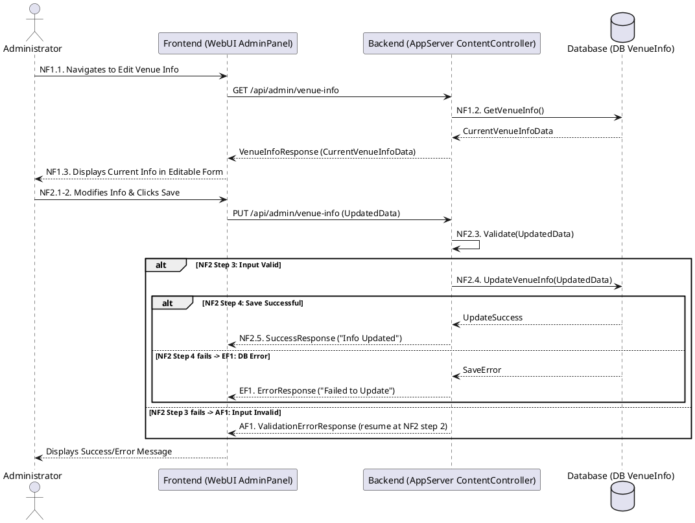
```plantuml
@startuml
actor Administrator as Admin
participant "Frontend (WebUI AdminPanel)" as UI
participant "Backend (AppServer ContentController)" as App
database "Database (DB VenueInfo)" as DB

Admin -> UI : NF1.1. Navigates to Edit Venue Info
UI -> App : GET /api/admin/venue-info
App -> DB : NF1.2. GetVenueInfo()
DB --> App : CurrentVenueInfoData
App --> UI : VenueInfoResponse (CurrentVenueInfoData)
UI --> Admin : NF1.3. Displays Current Info in Editable Form

Admin -> UI : NF2.1-2. Modifies Info & Clicks Save
UI -> App : PUT /api/admin/venue-info (UpdatedData)
App -> App : NF2.3. Validate(UpdatedData)
alt NF2 Step 3: Input Valid
  App -> DB : NF2.4. UpdateVenueInfo(UpdatedData)
  alt NF2 Step 4: Save Successful
    DB --> App : UpdateSuccess
    App --> UI : NF2.5. SuccessResponse ("Info Updated")
  else NF2 Step 4 fails -> EF1: DB Error
    DB --> App : SaveError
    App --> UI : EF1. ErrorResponse ("Failed to Update")
  end
else NF2 Step 3 fails -> AF1: Input Invalid
  App --> UI : AF1. ValidationErrorResponse (resume at NF2 step 2)
end
UI --> Admin : Displays Success/Error Message
@enduml
```

_Figure 2.14: Sequence Diagram for Manage Hall Information (Update Flow)_

#### 2.3.7 UC007: Use Case

**Table 2.8: Use Case Description for Manage Media Gallery**

|   |   |
|---|---|
|**Attribute**|**Description**|
|**Use Case ID**|UC007|
|**Use Case Name**|Manage Media Gallery|
|**Description**|This use case allows the Administrator to upload new media items (images, videos) to the gallery, view existing items, and delete items from the gallery.|
|**Actor(s)**|Administrator|
|**Pre-condition(s)**|Administrator is logged into the admin panel.|
|**Normal Flow(s)- NF**|NF1: View Gallery Items:  1. Administrator navigates to the "Media Gallery Management" section.  2. System retrieves and displays a list or grid of existing media items (thumbnails, names).      NF2: Upload New Media Item:  1. Administrator clicks "Upload New Media".  2. System presents a file selection dialog and fields for optional caption/details.  3. Administrator selects a media file (image/video) and enters details.  4. Administrator clicks "Upload".  5. System validates the file (type, size). **[If validation fails → AF1]**  6. System uploads the file to the server/file storage. **[If the upload fails → EF1]**  7. System saves metadata (filename, path, caption) to the database. **[If the save fails → EF2]**  8. System displays a success message and refreshes the gallery list.      NF3: Delete Media Item:  1. Administrator selects a media item to delete (e.g., clicks a delete icon next to an item).  2. System prompts for confirmation.  3. Administrator confirms deletion. **[If the Administrator cancels → AF2]**  4. System deletes the media file from storage.  5. System deletes the metadata from the database. **[If the delete fails → EF2]**  6. System displays a success message and refreshes the gallery list.|
|**Alternative Flow(s) - AF**|**AF1: File Validation Error (triggered at NF2 step 5):**  AF1.1. File validation fails; the system displays an error (e.g., "Invalid file type" or "File too large").  AF1.2. Flow resumes at NF2 step 3 (Administrator re-selects a file).      **AF2: Deletion Cancelled (triggered at NF3 step 3):**  AF2.1. Administrator cancels the deletion at the confirmation prompt; the system takes no action.  AF2.2. Flow resumes at NF1 step 2. Use case may end.|
|**Exception Flow(s) - EF**|**EF1: Upload Failure (triggered at NF2 step 6):**  EF1.1. The file upload fails due to a server error; the system displays an error message.  EF1.2. Administrator may retry (flow resumes at NF2 step 4) or abandon. Use case ends.      **EF2: Database Save/Delete Failure (triggered at NF2 step 7 or NF3 step 5):**  EF2.1. Saving/deleting metadata fails; the system displays an error message. Manual cleanup may be required if the file operation succeeded but the database operation failed.  EF2.2. Use case ends.|
|**Post-condition(s)**|Media gallery content is updated (new item added or existing item removed).  Public gallery reflects changes.|

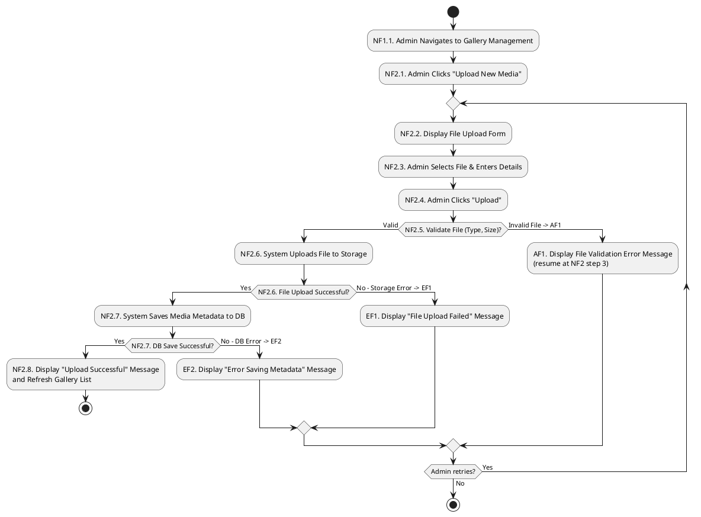
```plantuml
@startuml
start
:NF1.1. Admin Navigates to Gallery Management;
:NF2.1. Admin Clicks "Upload New Media";
repeat
  :NF2.2. Display File Upload Form;
  :NF2.3. Admin Selects File & Enters Details;
  :NF2.4. Admin Clicks "Upload";
  if (NF2.5. Validate File (Type, Size)?) then (Valid)
    :NF2.6. System Uploads File to Storage;
    if (NF2.6. File Upload Successful?) then (Yes)
      :NF2.7. System Saves Media Metadata to DB;
      if (NF2.7. DB Save Successful?) then (Yes)
        :NF2.8. Display "Upload Successful" Message
        and Refresh Gallery List;
        stop
      else (No - DB Error -> EF2)
        :EF2. Display "Error Saving Metadata" Message;
      endif
    else (No - Storage Error -> EF1)
      :EF1. Display "File Upload Failed" Message;
    endif
  else (Invalid File -> AF1)
    :AF1. Display File Validation Error Message
    (resume at NF2 step 3);
  endif
repeat while (Admin retries?) is (Yes) not (No)
stop
@enduml
```

_Figure 2.15: Activity Diagram for Manage Media Gallery (Upload Flow)_

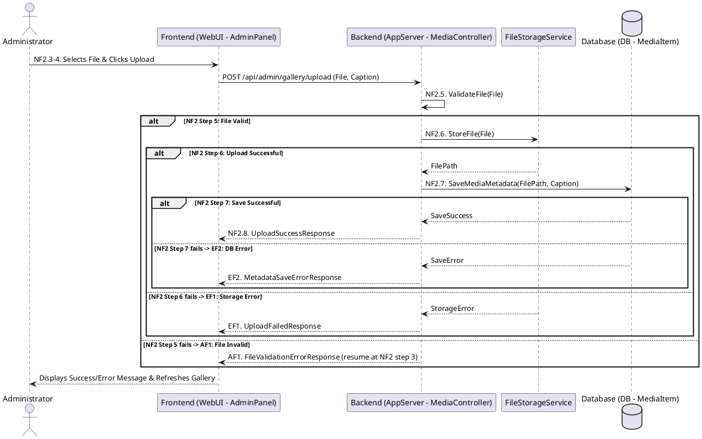
```plantuml
@startuml
actor Administrator as Admin
participant "Frontend (WebUI - AdminPanel)" as UI
participant "Backend (AppServer - MediaController)" as App
participant "FileStorageService" as Storage
database "Database (DB - MediaItem)" as DB

Admin -> UI : NF2.3-4. Selects File & Clicks Upload
UI -> App : POST /api/admin/gallery/upload (File, Caption)
App -> App : NF2.5. ValidateFile(File)
alt NF2 Step 5: File Valid
  App -> Storage : NF2.6. StoreFile(File)
  alt NF2 Step 6: Upload Successful
    Storage --> App : FilePath
    App -> DB : NF2.7. SaveMediaMetadata(FilePath, Caption)
    alt NF2 Step 7: Save Successful
      DB --> App : SaveSuccess
      App --> UI : NF2.8. UploadSuccessResponse
    else NF2 Step 7 fails -> EF2: DB Error
      DB --> App : SaveError
      App --> UI : EF2. MetadataSaveErrorResponse
    end
  else NF2 Step 6 fails -> EF1: Storage Error
    Storage --> App : StorageError
    App --> UI : EF1. UploadFailedResponse
  end
else NF2 Step 5 fails -> AF1: File Invalid
  App --> UI : AF1. FileValidationErrorResponse (resume at NF2 step 3)
end
UI --> Admin : Displays Success/Error Message & Refreshes Gallery
@enduml
```

_Figure 2.16: Sequence Diagram for Manage Media Gallery (Upload Flow)_

#### 2.3.8 UC008: Use Case

**Table 2.9: Use Case Description for Manage Pricing Panel**

|   |   |
|---|---|
|**Attribute**|**Description**|
|**Use Case ID**|UC008|
|**Use Case Name**|Manage Pricing Panel|
|**Description**|This use case allows the Administrator to define, view, update, and delete pricing tiers, packages, and any configurable pricing options for Al-Muneer Hall services.|
|**Actor(s)**|Administrator|
|**Pre-condition(s)**|Administrator is logged into the admin panel.|
|**Normal Flow(s)- NF**|NF1: View Pricing Tiers:  1. Administrator navigates to the "Pricing Management" section.  2. System retrieves and displays existing pricing tiers/packages.      NF2: Add New Pricing Tier:  1. Administrator clicks "Add New Tier".  2. System displays a form for tier name, base price, description, included services.  3. Administrator fills in the details and clicks "Save".  4. System validates input. **[If validation fails → AF1]**  5. System saves the new pricing tier to the database. **[If the save fails → EF1]**  6. System displays a success message and refreshes the list.      NF3: Update Existing Pricing Tier:  1. Administrator selects an existing tier to edit.  2. System populates a form with the tier's current details.  3. Administrator modifies details and clicks "Update".  4. System validates input. **[If validation fails → AF1]**  5. System saves changes to the database. **[If the save fails → EF1]**  6. System displays success message.      NF4: Delete Pricing Tier:  1. Administrator selects a tier to delete.  2. System prompts for confirmation.  3. Administrator confirms.  4. System deletes the tier from the database (may require checks if linked to active bookings out of simple scope). **[If the delete fails → EF1]**  5. System displays success message.|
|**Alternative Flow(s) - AF**|**AF1: Input Validation Error (triggered at NF2 step 4 or NF3 step 4):**  AF1.1. Validation fails; the system displays error messages next to the problematic fields.  AF1.2. Administrator corrects the input.  AF1.3. Flow resumes at NF2 step 3 (or NF3 step 3 respectively).|
|**Exception Flow(s) - EF**|**EF1: Database Error (triggered at NF2 step 5, NF3 step 5, or NF4 step 4):**  EF1.1. The database operation fails; the system displays a general error message.  EF1.2. Administrator may retry the failed action or abandon it. Use case ends.|
|**Post-condition(s)**|Pricing information is updated in the database.  Public pricing page reflects changes.|

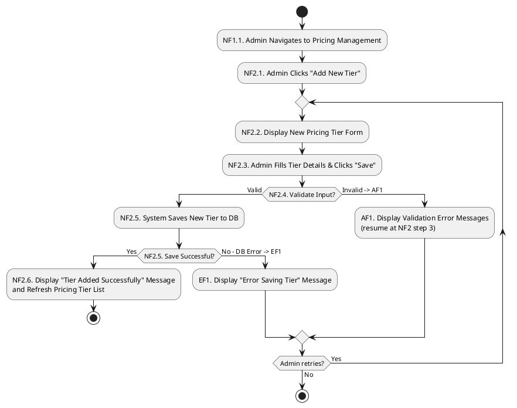
```plantuml
@startuml
start
:NF1.1. Admin Navigates to Pricing Management;
:NF2.1. Admin Clicks "Add New Tier";
repeat
  :NF2.2. Display New Pricing Tier Form;
  :NF2.3. Admin Fills Tier Details & Clicks "Save";
  if (NF2.4. Validate Input?) then (Valid)
    :NF2.5. System Saves New Tier to DB;
    if (NF2.5. Save Successful?) then (Yes)
      :NF2.6. Display "Tier Added Successfully" Message
      and Refresh Pricing Tier List;
      stop
    else (No - DB Error -> EF1)
      :EF1. Display "Error Saving Tier" Message;
    endif
  else (Invalid -> AF1)
    :AF1. Display Validation Error Messages
    (resume at NF2 step 3);
  endif
repeat while (Admin retries?) is (Yes) not (No)
stop
@enduml
```

_Figure 2.17: Activity Diagram for Manage Pricing Panel (Add New Tier Flow)_

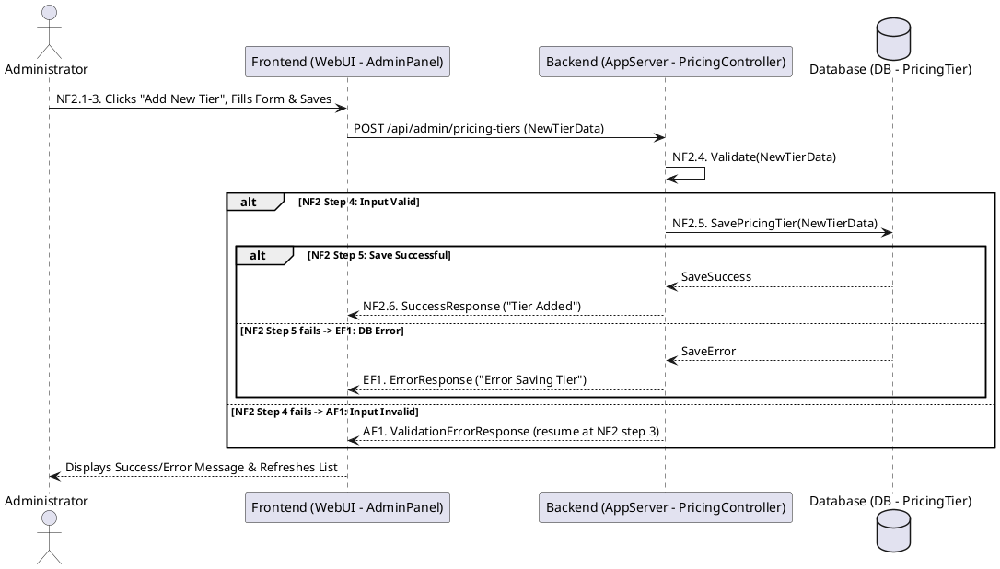
```plantuml
@startuml
actor Administrator as Admin
participant "Frontend (WebUI - AdminPanel)" as UI
participant "Backend (AppServer - PricingController)" as App
database "Database (DB - PricingTier)" as DB

Admin -> UI : NF2.1-3. Clicks "Add New Tier", Fills Form & Saves
UI -> App : POST /api/admin/pricing-tiers (NewTierData)
App -> App : NF2.4. Validate(NewTierData)
alt NF2 Step 4: Input Valid
  App -> DB : NF2.5. SavePricingTier(NewTierData)
  alt NF2 Step 5: Save Successful
    DB --> App : SaveSuccess
    App --> UI : NF2.6. SuccessResponse ("Tier Added")
  else NF2 Step 5 fails -> EF1: DB Error
    DB --> App : SaveError
    App --> UI : EF1. ErrorResponse ("Error Saving Tier")
  end
else NF2 Step 4 fails -> AF1: Input Invalid
  App --> UI : AF1. ValidationErrorResponse (resume at NF2 step 3)
end
UI --> Admin : Displays Success/Error Message & Refreshes List
@enduml
```

_Figure 2.18: Sequence Diagram for Manage Pricing Panel (Add New Tier Flow)_

#### 2.3.9 UC009: Use Case <Manage Calendar & Inquiries>

**Table 2.10: Use Case Description for Manage Calendar & Inquiries**

|   |   |
|---|---|
|**Attribute**|**Description**|
|**Use Case ID**|UC009|
|**Use Case Name**|Manage Calendar & Inquiries|
|**Description**|This use case allows the Administrator to manually update the availability calendar (mark dates as booked/available/pending) and to view details of submitted booking inquiries.|
|**Actor(s)**|Administrator|
|**Pre-condition(s)**|Administrator is logged into the admin panel.|
|**Normal Flow(s)- NF**|NF1: View Inquiries:  1. Administrator navigates to the "Booking Inquiries" section.  2. System retrieves and displays a list of submitted inquiries (e.g., visitor name, contact, event date, status). **[If no inquiries exist → AF1]**  3. Administrator can click on an inquiry to view its full details.      NF2: Update Calendar Manually:  1. Administrator navigates to the "Calendar Management" section.  2. System displays an interactive calendar showing current statuses.  3. Administrator selects a date or date range.  4. Administrator chooses a new status (e.g., Booked, Available, Pending).  5. Administrator saves the change.  6. System updates the availability slot(s) in the database. **[If the update fails → EF1]**  7. System displays a success message and refreshes the calendar view.      NF3: Update Inquiry Status (Simple):  1. When viewing an inquiry (NF1 step 3), Administrator can update its status (e.g., "Viewed", "Contacted", "Tentatively Booked" - prior to payment proof).  2. Administrator saves the status change.  3. System updates the inquiry status in the database. **[If the update fails → EF1]**|
|**Alternative Flow(s) - AF**|**AF1: No Inquiries (triggered at NF1 step 2):**  AF1.1. No inquiries exist; the system displays "No new inquiries."  AF1.2. Use case ends (or Administrator proceeds to NF2).|
|**Exception Flow(s) - EF**|**EF1: Database Error (triggered at NF2 step 6 or NF3 step 3):**  EF1.1. The database operation fails; the system displays a general error message.  EF1.2. Administrator may retry the failed action (flow resumes at NF2 step 5 or NF3 step 2 respectively) or abandon it. Use case ends.|
|**Post-condition(s)**|Availability calendar is updated.  Status of inquiries may be updated.|

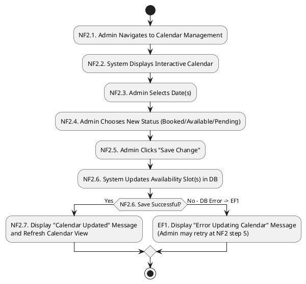
```plantuml
@startuml
start
:NF2.1. Admin Navigates to Calendar Management;
:NF2.2. System Displays Interactive Calendar;
:NF2.3. Admin Selects Date(s);
:NF2.4. Admin Chooses New Status (Booked/Available/Pending);
:NF2.5. Admin Clicks "Save Change";
:NF2.6. System Updates Availability Slot(s) in DB;
if (NF2.6. Save Successful?) then (Yes)
  :NF2.7. Display "Calendar Updated" Message
  and Refresh Calendar View;
else (No - DB Error -> EF1)
  :EF1. Display "Error Updating Calendar" Message
  (Admin may retry at NF2 step 5);
endif
stop
@enduml
```

_Figure 2.19: Activity Diagram for Manage Calendar (Update Manually)_

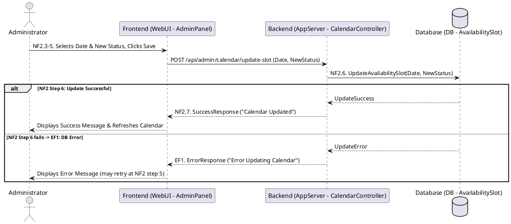
```plantuml
@startuml
actor Administrator as Admin
participant "Frontend (WebUI - AdminPanel)" as UI
participant "Backend (AppServer - CalendarController)" as App
database "Database (DB - AvailabilitySlot)" as DB

Admin -> UI : NF2.3-5. Selects Date & New Status, Clicks Save
UI -> App : POST /api/admin/calendar/update-slot (Date, NewStatus)
App -> DB : NF2.6. UpdateAvailabilitySlot(Date, NewStatus)
alt NF2 Step 6: Update Successful
  DB --> App : UpdateSuccess
  App --> UI : NF2.7. SuccessResponse ("Calendar Updated")
  UI --> Admin : Displays Success Message & Refreshes Calendar
else NF2 Step 6 fails -> EF1: DB Error
  DB --> App : UpdateError
  App --> UI : EF1. ErrorResponse ("Error Updating Calendar")
  UI --> Admin : Displays Error Message (may retry at NF2 step 5)
end
@enduml
```

_Figure 2.20: Sequence Diagram for Manage Calendar (Update Manually)_

#### 2.3.10 UC010: Use Case

**Table 2.11: Use Case Description for View Traffic Analytics**

|   |   |
|---|---|
|**Attribute**|**Description**|
|**Use Case ID**|UC010|
|**Use Case Name**|View Traffic Analytics|
|**Description**|This use case allows the Administrator to view website traffic analytics through interactive Chart.js visualisations and to receive an AI-generated traffic funnel advisor that analyses Home → Gallery → Pricing → Inquiry visit counts and suggests concrete conversion improvements.|
|**Actor(s)**|Administrator|
|**Pre-condition(s)**|Administrator is logged into the admin panel.  Page visit data has been logged by the system.|
|**Normal Flow(s)- NF**|1. Administrator navigates to the "Analytics" section in the admin panel.  2. System retrieves logged page-visit data for the last 30 days. **[If no traffic data has been logged → AF1; if retrieval fails → EF1]**  3. System displays a bar chart of top pages and a line chart of daily traffic trends.  4. System asynchronously requests an AI funnel insight based on the retrieved traffic data. **[If the AI service is unavailable → AF2]**  5. System displays the AI-generated funnel insight when it becomes available.|
|**Alternative Flow(s) - AF**|**AF1: No Data Logged Yet (triggered at NF step 2):**  AF1.1. No traffic data has been logged; the system displays "No traffic data available yet."  AF1.2. Use case ends.  **AF2: AI Service Unavailable (triggered at NF step 4):**  AF2.1. The AI advisor request fails or returns no insight; the system displays a graceful fallback message (e.g., "AI insight temporarily unavailable; charts are still up to date.") without delaying the rest of the page.  AF2.2. Use case ends (charts from NF step 3 remain displayed).|
|**Exception Flow(s) - EF**|**EF1: Error Retrieving Log Data (triggered at NF step 2):**  EF1.1. The system encounters an error while retrieving analytics data and displays a general error message.  EF1.2. Use case ends.|
|**Post-condition(s)**|Administrator has viewed the available traffic analytics and any AI-generated insight.|

```plantuml
@startuml
start
:1. Admin Navigates to Analytics Section;
:2. System Retrieves Page-Visit Data (last 30 days);
if (2. Data Retrieval Successful?) then (Yes)
  if (Data Available?) then (Yes)
    :3. Display Traffic Charts (Top Pages + Daily Trends);
    :4. Asynchronously Request AI Funnel Insight;
    if (4. AI Insight Available?) then (Yes)
      :5. Display AI Funnel Recommendation;
    else (No / Error -> AF2)
      :AF2. Display Graceful Fallback Message;
    endif
  else (No Data Yet -> AF1)
    :AF1. Display "No Traffic Data Available Yet";
  endif
else (No - Retrieval Error -> EF1)
  :EF1. Display Error Message;
endif
stop
@enduml
```

_Figure 2.21: Activity Diagram for View Traffic Analytics_

```plantuml
@startuml
actor Administrator as Admin
participant "Frontend (WebUI - AdminPanel)" as UI
participant "Backend (AppServer - AnalyticsController)" as App
database "Database (DB - PageVisit)" as DB
participant "GeminiService" as AI

Admin -> UI : 1. Navigates to Analytics Section
UI -> App : GET /api/admin/analytics
App -> DB : 2. GetTrafficData(last 30 days)
DB --> App : TrafficData
App --> UI : AnalyticsResponse (Charts Data)
UI --> Admin : 3. Displays Traffic Charts

UI -> App : 4. GET /api/admin/analytics/ai-insight (async)
App -> AI : AnalyseFunnel(TrafficData)
alt Step 4: AI Insight Returned
  AI --> App : FunnelInsight (HTML bullets)
  App --> UI : AIInsightResponse
  UI --> Admin : 5. Displays AI Funnel Advisor Panel
else Step 4 fails -> AF2: AI Service Unavailable
  AI --> App : Error / Empty Response
  App --> UI : AF2. FallbackMessageResponse
  UI --> Admin : Displays "AI Insight Temporarily Unavailable"
end
@enduml
```

_Figure 2.22: Sequence Diagram for View Traffic Analytics_

#### 2.3.11 UC011: Use Case

**Table 2.12: Use Case Description for Submit Payment Proof**

|   |   |
|---|---|
|**Attribute**|**Description**|
|**Use Case ID**|UC011|
|**Use Case Name**|Submit Payment Proof|
|**Description**|This use case allows a Visitor, typically after making a booking inquiry and arranging an offline payment (e.g., local bank transfer), to upload a proof of payment (e.g., screenshot of transfer receipt) to the portal.|
|**Actor(s)**|Visitor|
|**Pre-condition(s)**|Visitor has made a booking inquiry (UC005).  Visitor has been instructed by the Administrator to submit payment proof, or a booking has reached a stage where payment proof is expected.  Visitor has an image file of the payment proof.|
|**Normal Flow(s)- NF**|1. Visitor navigates to the payment proof upload page from their booking status page.  2. System presents a file upload form pre-linked to the visitor's booking.  3. Visitor selects the payment proof image file (JPG/PNG, within size limit).  4. Visitor clicks "Upload Proof".  5. System validates the file and uploads it to secure storage. **[If validation fails → AF1; if the upload to storage fails → EF1]**  6. System records the proof metadata (filename, path, timestamp, booking link) in the database. **[If the save fails → EF2]**  7. System displays a success message and notifies the Administrator.|
|**Alternative Flow(s) - AF**|**AF1: Invalid File Type/Size (triggered at NF step 5):**  AF1.1. File validation fails; the system displays an error message specifying the issue.  AF1.2. Visitor remains on the form and selects a valid file.  AF1.3. Flow resumes at NF step 4.|
|**Exception Flow(s) - EF**|**EF1: File Upload Failure (triggered at NF step 5):**  EF1.1. The system fails to upload the file to storage due to a server-side error and displays a general error message.  EF1.2. Visitor may retry (flow resumes at NF step 4) or abandon. Use case ends.  **EF2: Database Save Failure (triggered at NF step 6):**  EF2.1. The system fails to save the payment proof metadata and displays an error message.  EF2.2. Use case ends.|
|**Post-condition(s)**|Payment proof file is uploaded and its metadata is stored, linked to the relevant booking inquiry.  Administrator is notified of the new submission.  Visitor receives confirmation of submission.|

```plantuml
@startuml
start
:1-2. Visitor Navigates to Payment Proof Upload Page;
repeat
  :3. Visitor Selects Payment Proof File;
  :4. Visitor Clicks "Upload Proof";
  if (5. Validate File (Type, Size)?) then (Valid)
    :5. System Uploads File to Storage;
    if (5. Upload Successful?) then (Yes)
      :6. System Saves Proof Metadata to DB;
      if (6. Save Successful?) then (Yes)
        :7. Notify Administrator and Display
        "Proof Submitted Successfully" Message;
        stop
      else (No - Save Error -> EF2)
        :EF2. Display "Error Saving Proof Information" Message;
        stop
      endif
    else (No - Storage Error -> EF1)
      :EF1. Display General Upload Error Message;
    endif
  else (Invalid File -> AF1)
    :AF1. Display File Validation Error Message
    (resume at step 4);
  endif
repeat while (Visitor retries?) is (Yes) not (No)
stop
@enduml
```

_Figure 2.23: Activity Diagram for Submit Payment Proof_

```plantuml
@startuml
actor Visitor
participant "Frontend (WebUI)" as UI
participant "Backend (AppServer)" as App
participant "FileStorageService" as Storage
database "Database (DB)" as DB
participant "NotificationService" as NS

Visitor -> UI : 1-4. Accesses Upload Form, Selects File, Clicks "Upload Proof"
UI -> App : POST /api/payment-proof/upload (File, BookingRef, otherData)
App -> App : 5. ValidateFile(File)
alt Step 5: File Valid
  App -> Storage : 5. StoreProofFile(File)
  alt Step 5: Storage Successful
    Storage --> App : FilePath
    App -> DB : 6. SavePaymentProofMetadata(FilePath, BookingRef)
    alt Step 6: Save Successful
      DB --> App : SaveSuccess (ProofID)
      App -> NS : 7. SendNewPaymentProofNotification(Admin, ProofID)
      NS --> App : NotificationSentStatus
      App --> UI : 7. UploadSuccessResponse
    else Step 6 fails -> EF2: DB Save Failure
      DB --> App : SaveError
      App --> UI : EF2. MetadataSaveErrorResponse
    end
  else Step 5 fails -> EF1: Storage Error
    Storage --> App : StorageError
    App --> UI : EF1. UploadFailedResponse
  end
else Step 5 fails -> AF1: File Invalid
  App --> UI : AF1. ValidationErrorResponse (resume at step 4)
end
UI --> Visitor : Displays Success or Error Message
@enduml
```

_Figure 2.24: Sequence Diagram for Submit Payment Proof_

#### 2.3.12 UC012: Use Case

**Table 2.13: Use Case Description for Submit Feedback**

|   |   |
|---|---|
|**Attribute**|**Description**|
|**Use Case ID**|UC012|
|**Use Case Name**|Submit Feedback|
|**Description**|This use case allows a Visitor or client to submit feedback about their experience with Al-Muneer Hall or the online portal itself.|
|**Actor(s)**|Visitor (can be anonymous or provide contact details)|
|**Pre-condition(s)**|Visitor has accessed the Al-Muneer Online Portal.|
|**Normal Flow(s)- NF**|1. Visitor navigates to the "Feedback" or "Contact Us" section that includes a feedback form.  2. Visitor optionally enters their name and contact details (email/phone). **[If the Visitor omits name and contact details → AF1]**  3. Visitor types their feedback message in a text area.  4. Visitor optionally selects a rating (e.g., star rating) if provided.  5. Visitor clicks the "Submit Feedback" button.  6. System validates input (e.g., checks if feedback text is provided, validates contact format if entered). **[If validation fails → AF2]**  7. System saves the feedback (including timestamp, contact details if provided, rating) to the database. **[If the save fails → EF1]**  8. System displays a success message to the Visitor (e.g., "Thank you for your feedback!").  9. System may trigger a notification to the Administrator about the new feedback.|
|**Alternative Flow(s) - AF**|**AF1: Anonymous Feedback (triggered at NF step 2):**  AF1.1. Visitor chooses not to enter name or contact details; the system will save the feedback as anonymous.  AF1.2. Flow resumes at NF step 3.      **AF2: Input Validation Error (triggered at NF step 6):**  AF2.1. Validation fails (e.g., feedback text is empty); the system displays an error message.  AF2.2. Visitor remains on the form and corrects the input.  AF2.3. Flow resumes at NF step 5.|
|**Exception Flow(s) - EF**|**EF1: System Failure to Save Feedback (triggered at NF step 7):**  EF1.1. The system encounters an error while saving feedback to the database and displays a general error message to the Visitor.  EF1.2. Visitor may retry (flow resumes at NF step 5) or abandon. Use case ends.|
|**Post-condition(s)**|Feedback is successfully recorded in the system.  Administrator may be notified.|

```plantuml
@startuml
start
:1. Visitor Navigates to Feedback Form;
repeat
  :2. Visitor Optionally Enters Name/Contact
  (anonymous if omitted, AF1);
  :3. Visitor Enters Feedback Message;
  :4. Visitor Optionally Selects Rating;
  :5. Visitor Clicks "Submit Feedback";
  if (6. Validate Input (e.g., Feedback Text not empty)?) then (Valid)
    :7. System Saves Feedback to Database;
    if (7. Save Successful?) then (Yes)
      :8. Display "Feedback Submitted Successfully" Message;
      :9. [Optional] Trigger Notification to Admin;
      stop
    else (No - DB Save Error -> EF1)
      :EF1. Display "Error Submitting Feedback" Message;
    endif
  else (Invalid -> AF2)
    :AF2. Display Validation Error Message
    (resume at step 5);
  endif
repeat while (Visitor retries?) is (Yes) not (No)
stop
@enduml
```

_Figure 2.25: Activity Diagram for Submit Feedback_

```plantuml
@startuml
actor Visitor
participant "Frontend (WebUI)" as UI
participant "Backend (AppServer)" as App
database "Database (DB)" as DB
participant "NotificationService (Optional)" as NS

Visitor -> UI : 1-5. Fills Feedback Form & Clicks "Submit Feedback"
UI -> App : POST /api/feedback (FeedbackData)
App -> App : 6. Validate(FeedbackData)
alt Step 6: Input Valid
  App -> DB : 7. SaveFeedback(FeedbackData)
  alt Step 7: Save Successful
    DB --> App : FeedbackSaved (Generated FeedbackID)
    App -> NS : 9. SendNewFeedbackNotification(Admin, FeedbackID)
    NS --> App : NotificationSentStatus
    App --> UI : 8. FeedbackSubmissionSuccessResponse
  else Step 7 fails -> EF1: DB Save Error
    DB --> App : SaveError
    App --> UI : EF1. FeedbackSaveErrorResponse
  end
else Step 6 fails -> AF2: Input Invalid
  App --> UI : AF2. FeedbackValidationErrorResponse (resume at step 5)
end
UI --> Visitor : Displays Success or Error Message
@enduml
```

_Figure 2.26: Sequence Diagram for Submit Feedback_

#### 2.3.13 UC013: Use Case

**Table 2.14: Use Case Description for Manage Payment Status**

|   |   |
|---|---|
|**Attribute**|**Description**|
|**Use Case ID**|UC013|
|**Use Case Name**|Manage Payment Status|
|**Description**|This use case allows the Administrator to view submitted payment proofs and update the verification status of a payment, thereby confirming or rejecting a booking associated with it.|
|**Actor(s)**|Administrator|
|**Pre-condition(s)**|Administrator is logged into the admin panel.  One or more payment proofs have been submitted by visitors (UC011).|
|**Normal Flow(s)- NF**|1. Administrator navigates to the "Payment Proofs" section in the admin panel.  2. System retrieves and displays submitted payment proofs with status and booking link. **[If no proofs are pending review → AF1]**  3. Administrator selects a proof to review; system displays the uploaded image. **[If the image cannot be accessed → EF1]**  4. Administrator verifies the payment offline and updates the status (Verified/Rejected), optionally adding notes.  5. Administrator saves the changes.  6. System updates the payment proof status, cascades the status to the linked booking and availability slot, and displays a success message. **[If the update fails → EF2]**  7. System notifies the Visitor of the verification outcome.|
|**Alternative Flow(s) - AF**|**AF1: No Payment Proofs Submitted (triggered at NF step 2):**  AF1.1. No payment proofs are pending review; the system displays "No new payment proofs to verify."  AF1.2. Use case ends.|
|**Exception Flow(s) - EF**|**EF1: Error Viewing Image File (triggered at NF step 3):**  EF1.1. The uploaded image cannot be accessed; the system displays an error.  EF1.2. Flow resumes at NF step 2 (Administrator may select another proof). Use case may end.  **EF2: Database Update Failure (triggered at NF step 6):**  EF2.1. The system fails to save the updated status and displays an error message.  EF2.2. Administrator may retry (flow resumes at NF step 5) or abandon. Use case ends.|
|**Post-condition(s)**|The verification status of the payment proof is updated.  The linked booking inquiry and availability slot statuses are cascaded accordingly.  Visitor is notified of the outcome.|

```plantuml
@startuml
start
:1. Admin Navigates to Payment Proofs Section;
:2. System Displays List of Submitted Payment Proofs;
if (2. Payment Proofs Exist?) then (Yes)
  :3. Admin Selects a Payment Proof;
  if (3. Proof Image Accessible?) then (Yes)
    :3. System Displays Proof Image;
    :4. Admin Verifies Payment Offline and
    Updates Status (Verified/Rejected) with Notes;
    :5. Admin Clicks "Save Status";
    :6. System Updates Proof, Booking, and Slot Statuses;
    if (6. Save Successful?) then (Yes)
      :6. Display "Status Updated Successfully" Message;
      :7. Notify Visitor;
    else (No - DB Error -> EF2)
      :EF2. Display "Error Updating Status" Message
      (Admin may retry at step 5);
    endif
  else (No -> EF1)
    :EF1. Display Image Access Error
    (Admin may select another proof, step 2);
  endif
else (No Proofs -> AF1)
  :AF1. Display "No New Payment Proofs" Message;
endif
stop
@enduml
```

_Figure 2.27: Activity Diagram for Manage Payment Status_

```plantuml
@startuml
actor Administrator as Admin
participant "Frontend (WebUI - AdminPanel)" as UI
participant "Backend (AppServer - PaymentController)" as App
database "Database (DB)" as DB
participant "NotificationService" as NS

Admin -> UI : 1-3. Navigates to Payment Proofs, Selects a Proof
UI --> Admin : 3. Displays Proof Details and Image
Admin -> UI : 4-5. Updates Status (Verified/Rejected) & Clicks Save
UI -> App : PUT /api/admin/payment-proofs/{proofId}/status
App -> DB : 6. UpdatePaymentProofStatus(ProofID, NewStatus)
App -> DB : 6. UpdateBookingStatus(AssociatedBookingID)
App -> DB : 6. UpdateAvailabilitySlotStatus(AssociatedSlotID)
alt Step 6: Update Successful
  DB --> App : UpdateSuccess
  App -> NS : 7. SendPaymentStatusNotification(Visitor, ProofID, NewStatus)
  NS --> App : NotificationSentStatus
  App --> UI : 6. StatusUpdateSuccessResponse
  UI --> Admin : Displays Success Message
else Step 6 fails -> EF2: DB Update Failure
  DB --> App : UpdateError
  App --> UI : EF2. StatusUpdateErrorResponse
  UI --> Admin : Displays Error Message (may retry at step 5)
end
@enduml
```

_Figure 2.28: Sequence Diagram for Manage Payment Status_

#### 2.3.14 UC014: Use Case <View/Generate Reports>

**Table 2.15: Use Case Description for View/Generate Reports**

|   |   |
|---|---|
|**Attribute**|**Description**|
|**Use Case ID**|UC014|
|**Use Case Name**|View/Generate Reports|
|**Description**|This use case allows the Administrator to view operational reports with interactive visual charts and to receive an AI-generated business advisor that computes conversion and cancellation rates and suggests number-backed action bullets.|
|**Actor(s)**|Administrator|
|**Pre-condition(s)**|Administrator is logged into the admin panel.  Data (inquiries, payment proofs, feedback) exists in the system.|
|**Normal Flow(s)- NF**|1. Administrator navigates to the "Reports" section in the admin panel.  2. System displays available report types and a date-range filter.  3. Administrator selects a report type and optionally specifies a date range.  4. System retrieves the relevant data from the database. **[If no data matches the selection → AF1; if retrieval fails → EF1]**  5. System displays the report using visual charts (e.g., pie charts for inquiry/payment status, bar chart for feedback ratings).  6. System asynchronously requests an AI business insight based on the report data. **[If the AI service is unavailable → AF2]**  7. System displays the AI-generated action bullets when available.|
|**Alternative Flow(s) - AF**|**AF1: No Data for Report (triggered at NF step 4):**  AF1.1. No data matches the selected report type or date range; the system displays "No data available for this report."  AF1.2. Flow resumes at NF step 3 (Administrator may adjust the selection). Use case may end.  **AF2: AI Service Unavailable (triggered at NF step 6):**  AF2.1. The AI advisor request fails; the system displays a graceful fallback message without blocking the report view.  AF2.2. Use case ends (charts from NF step 5 remain displayed).|
|**Exception Flow(s) - EF**|**EF1: Error Generating Report (triggered at NF step 4):**  EF1.1. The system encounters an error while retrieving data or generating the report and displays a general error message.  EF1.2. Use case ends.|
|**Post-condition(s)**|Administrator has viewed the generated report and any AI-generated insight.  System data remains unchanged by report generation.|

```plantuml
@startuml
start
:1. Admin Navigates to Reports Section;
:2. System Displays Report Types and Date Filter;
:3. Admin Selects Report Type and Date Range;
:4. System Retrieves Data from DB;
if (4. Data Retrieval Successful?) then (Yes)
  if (Data Exists?) then (Yes)
    :5. Display Report with Visual Charts;
    :6. Asynchronously Request AI Business Insight;
    if (6. AI Insight Available?) then (Yes)
      :7. Display AI Action Bullets;
    else (No / Error -> AF2)
      :AF2. Display Graceful Fallback Message;
    endif
  else (No Data -> AF1)
    :AF1. Display "No Data Available for Report" Message
    (Admin may adjust selection, step 3);
  endif
else (No - Retrieval Error -> EF1)
  :EF1. Display "Error Generating Report" Message;
endif
stop
@enduml
```

_Figure 2.29: Activity Diagram for View/Generate Reports_

```plantuml
@startuml
actor Administrator as Admin
participant "Frontend (WebUI - AdminPanel)" as UI
participant "Backend (AppServer - ReportController)" as App
database "Database (DB)" as DB
participant "GeminiService" as AI

Admin -> UI : 1-3. Navigates to Reports, Selects Type & Date Range
UI -> App : GET /api/admin/reports/{reportType}?fromDate=...&toDate=...
App -> DB : 4. FetchReportData(ReportType, DateRange)
alt Step 4: Retrieval Successful
  DB --> App : ReportData
  App --> UI : ReportResponse (Charts Data)
  UI --> Admin : 5. Displays Report with Charts
else Step 4 fails -> EF1: Retrieval Error
  DB --> App : RetrievalError
  App --> UI : EF1. ErrorResponse
  UI --> Admin : Displays "Error Generating Report" Message
end

UI -> App : 6. GET /api/admin/reports/ai-insight (async)
App -> AI : GenerateBusinessInsight(ReportData)
alt Step 6: AI Insight Returned
  AI --> App : Insight (HTML bullets)
  App --> UI : AIInsightResponse
  UI --> Admin : 7. Displays AI Business Advisor Panel
else Step 6 fails -> AF2: AI Service Unavailable
  AI --> App : Error / Empty Response
  App --> UI : AF2. FallbackMessageResponse
  UI --> Admin : Displays Graceful Fallback Message
end
@enduml
```

_Figure 2.30: Sequence Diagram for View/Generate Reports_

#### 2.3.15 UC015: Use Case

**Table 2.16: Use Case Description for Manage Feedback**

|   |   |
|---|---|
|**Attribute**|**Description**|
|**Use Case ID**|UC015|
|**Use Case Name**|Manage Feedback|
|**Description**|This use case allows the Administrator to view submitted user feedback, mark it as reviewed, add internal notes, and receive an AI-generated feedback advisor that separates low-rating complaints from positive highlights and recommends what to address first.|
|**Actor(s)**|Administrator|
|**Pre-condition(s)**|Administrator is logged into the admin panel.  User feedback may have been submitted (UC012).|
|**Normal Flow(s)- NF**|1. Administrator navigates to the "Feedback Management" section in the admin panel.  2. System retrieves submitted feedback entries. **[If no feedback entries exist → AF1]**  3. System asynchronously requests an AI feedback analysis based on the feedback data. **[If the AI service is unavailable → AF2]**  4. System displays the feedback list together with the AI advisor panel highlighting complaints and positives.  5. Administrator selects a feedback entry to view its full details.  6. Administrator marks the feedback as "Reviewed" or adds internal notes.  7. Administrator saves the changes.  8. System updates the feedback entry and displays a success message. **[If the update fails → EF1]**|
|**Alternative Flow(s) - AF**|**AF1: No Feedback Submitted (triggered at NF step 2):**  AF1.1. No feedback entries exist; the system displays "No user feedback submitted yet."  AF1.2. Use case ends.  **AF2: AI Service Unavailable (triggered at NF step 3):**  AF2.1. The AI advisor request fails; the system displays a graceful fallback message while still showing the feedback list.  AF2.2. Flow resumes at NF step 4 (list is displayed without the AI panel).|
|**Exception Flow(s) - EF**|**EF1: Database Update Failure (triggered at NF step 8):**  EF1.1. The system fails to save changes to a feedback entry and displays an error message.  EF1.2. Administrator may retry (flow resumes at NF step 7) or abandon. Use case ends.|
|**Post-condition(s)**|Administrator has reviewed user feedback and any AI-generated insight.  Review status or notes for feedback entries may be updated in the system.|

```plantuml
@startuml
start
:1. Admin Navigates to Feedback Management;
:2. System Retrieves Feedback Entries;
if (2. Feedback Entries Exist?) then (Yes)
  :3. Asynchronously Request AI Feedback Analysis
  (graceful fallback if unavailable, AF2);
  :4. Display Feedback List and AI Advisor Panel;
  :5. Admin Selects a Feedback Entry;
  :5. System Displays Full Feedback Details;
  :6. Admin Marks as Reviewed or Adds Notes;
  :7. Admin Clicks "Save Changes";
  :8. System Updates Feedback Entry in DB;
  if (8. Save Successful?) then (Yes)
    :8. Display "Feedback Updated" Message;
  else (No - DB Error -> EF1)
    :EF1. Display "Error Updating Feedback" Message
    (Admin may retry at step 7);
  endif
else (No Feedback -> AF1)
  :AF1. Display "No Feedback Submitted Yet" Message;
endif
stop
@enduml
```

_Figure 2.31: Activity Diagram for Manage Feedback_

```plantuml
@startuml
actor Administrator as Admin
participant "Frontend (WebUI - AdminPanel)" as UI
participant "Backend (AppServer - FeedbackController)" as App
database "Database (DB - Feedback)" as DB
participant "GeminiService" as AI

Admin -> UI : 1. Navigates to Feedback Management
UI -> App : GET /api/admin/feedback
App -> DB : 2. GetFeedbackList()
DB --> App : FeedbackList
App --> UI : FeedbackListResponse
UI --> Admin : 4. Displays Feedback List

UI -> App : 3. GET /api/admin/feedback/ai-insight (async)
App -> AI : AnalyseFeedback(FeedbackList)
alt Step 3: AI Insight Returned
  AI --> App : FeedbackInsight (complaints / positives / priority)
  App --> UI : AIInsightResponse
  UI --> Admin : 4. Displays AI Feedback Advisor Panel
else Step 3 fails -> AF2: AI Service Unavailable
  AI --> App : Error / Empty Response
  App --> UI : AF2. FallbackMessageResponse
  UI --> Admin : Displays Graceful Fallback Message
end

Admin -> UI : 5-7. Selects Entry, Marks Reviewed, Clicks Save
UI -> App : PUT /api/admin/feedback/{feedbackId}/status
App -> DB : 8. UpdateFeedbackEntry(FeedbackID, NewStatus, Notes)
alt Step 8: Update Successful
  DB --> App : UpdateSuccess
  App --> UI : 8. FeedbackUpdateSuccessResponse
  UI --> Admin : Displays Success Message
else Step 8 fails -> EF1: DB Update Failure
  DB --> App : UpdateError
  App --> UI : EF1. FeedbackUpdateErrorResponse
  UI --> Admin : Displays Error Message (may retry at step 7)
end
@enduml
```

_Figure 2.32: Sequence Diagram for Manage Feedback_

#### 2.3.16 UC016: Use Case <Configure/Manage Notifications>

**Table 2.17: Use Case Description for Configure/Manage Notifications**

|   |   |
|---|---|
|**Attribute**|**Description**|
|**Use Case ID**|UC016|
|**Use Case Name**|Configure/Manage Notifications|
|**Description**|This use case allows the Administrator to create, read, update, and delete notification templates for dynamic WhatsApp messages. Templates include placeholders (e.g., [ClientName], [Date]) that are resolved client-side before generating a `wa.me` deep-link on the inquiry or payment detail pages.|
|**Actor(s)**|Administrator|
|**Pre-condition(s)**|Administrator is logged into the admin panel.|
|**Normal Flow(s)- NF**|1. Administrator navigates to the "Message Templates" section.  2. System displays current WhatsApp message templates.  3. Administrator creates a new template, edits an existing template, or deletes a template.  4. System validates the template text and placeholders. **[If validation fails → AF1]**  5. System saves the changes to the database and displays a success message. **[If the save fails → EF1]**  6. When viewing a booking or payment proof, Administrator selects a template from a dropdown; system resolves placeholders and generates a pre-filled WhatsApp deep-link.|
|**Alternative Flow(s) - AF**|**AF1: Template Validation Error (triggered at NF step 4):**  AF1.1. Template content contains invalid syntax; the system displays an error and prevents saving until corrected.  AF1.2. Flow resumes at NF step 3.|
|**Exception Flow(s) - EF**|**EF1: Error Saving Configuration (triggered at NF step 5):**  EF1.1. The system fails to save template changes and displays an error message.  EF1.2. Administrator may retry (flow resumes at NF step 3) or abandon. Use case ends.|
|**Post-condition(s)**|Notification templates are updated and available for selection when sending WhatsApp messages to visitors.|

```plantuml
@startuml
start
:1. Admin Navigates to Notification Templates;
:2. System Displays Current WhatsApp Message Templates;
repeat
  :3. Admin Modifies Templates (e.g., edits text, inserts placeholders);
  :3. Admin Clicks "Save Templates";
  if (4. Validate Template Syntax (e.g., valid placeholders)?) then (Valid)
    :5. System Saves Updated Templates to DB;
    if (5. Save Successful?) then (Yes)
      :5. Display "Templates Updated Successfully" Message;
      stop
    else (No - Save Error -> EF1)
      :EF1. Display "Error Saving Templates" Message;
    endif
  else (Invalid Template -> AF1)
    :AF1. Display Template Validation Error Message
    (resume at step 3);
  endif
repeat while (Admin retries?) is (Yes) not (No)
stop
@enduml
```

_Figure 2.33: Activity Diagram for Configure/Manage Notifications_

```plantuml
@startuml
actor Administrator as Admin
participant "Frontend (WebUI - AdminPanel)" as UI
participant "Backend (AppServer - NotificationTemplateController)" as App
database "Database (TemplateConfig)" as DB

Admin -> UI : 1-3. Navigates to Templates, Creates/Edits/Deletes Template, Clicks Save
UI -> App : POST /admin/templates (TemplateData)
App -> App : 4. Validate(TemplateData)
alt Step 4: Template Valid
  App -> DB : 5. SaveTemplate(TemplateData)
  alt Step 5: Save Successful
    DB --> App : SaveSuccess
    App --> UI : 5. TemplateUpdateSuccessResponse
    UI --> Admin : Displays Success Message
  else Step 5 fails -> EF1: Save Error
    DB --> App : SaveError
    App --> UI : EF1. TemplateSaveErrorResponse
    UI --> Admin : Displays "Error Saving Templates" Message
  end
else Step 4 fails -> AF1: Template Invalid
  App --> UI : AF1. TemplateValidationErrorResponse (resume at step 3)
  UI --> Admin : Displays Validation Error Message
end

Admin -> UI : 6. Selects Template on Booking/Payment Detail Page
UI -> App : GET /admin/templates/{id}
App -> DB : 6. GetTemplate(TemplateID)
DB --> App : TemplateData
App --> UI : TemplateResponse
UI --> Admin : 6. Displays Resolved Message Preview and wa.me Deep-Link
@enduml
```

_Figure 2.34: Sequence Diagram for Configure/Manage Notifications_

#### 2.3.17 UC017: Use Case <Generate AI Insights>

**Table 2.18: Use Case Description for Generate AI Insights**

|   |   |
|---|---|
|**Attribute**|**Description**|
|**Use Case ID**|UC017|
|**Use Case Name**|Generate AI Insights|
|**Description**|This use case describes how the system produces AI-generated advisory insights for the Administrator on the Reports, Analytics, and Feedback Management pages. The system compiles the current operational metrics into a structured prompt, submits it to the external Gemini AI service, and displays the returned data-grounded recommendations in a non-blocking panel.|
|**Actor(s)**|Administrator (primary), Gemini AI — external AI service (secondary)|
|**Pre-condition(s)**|Administrator is logged into the admin panel.  A valid Gemini API key is configured in the application settings.  Operational data (bookings, page visits, or feedback) exists in the system.|
|**Normal Flow(s)- NF**|1. Administrator opens an admin page that hosts an AI advisor panel (Reports, Analytics, or Feedback Management).  2. System renders the page immediately with its charts and lists; the AI panel shows a loading state.  3. The page asynchronously requests the AI insight endpoint.  4. System aggregates the current metrics (e.g., booking conversion and cancellation rates, traffic funnel counts, or feedback ratings) and composes a structured prompt. **[If no data is available to analyse → AF1]**  5. System submits the prompt to the Gemini AI service. **[If the service call fails or times out → EF1]**  6. Gemini AI returns the generated insight text.  7. System sanitises the response and displays the insight bullets in the AI advisor panel.|
|**Alternative Flow(s) - AF**|**AF1: Insufficient Data (triggered at NF step 4):**  AF1.1. There is no meaningful data to analyse; the system displays a message indicating that insights will become available once sufficient data exists.  AF1.2. Use case ends (the rest of the page remains fully functional).|
|**Exception Flow(s) - EF**|**EF1: AI Service Failure (triggered at NF step 5):**  EF1.1. The Gemini API call fails or times out; the system logs the error and displays a graceful fallback message (e.g., "AI insight temporarily unavailable") in the panel.  EF1.2. Use case ends (charts and lists rendered at NF step 2 remain displayed; no page functionality is blocked).|
|**Post-condition(s)**|Administrator has viewed an AI-generated, data-grounded insight, or a graceful fallback message.  System data remains unchanged; the AI service receives only aggregated metrics, never personal visitor data.|

```plantuml
@startuml
start
:1. Admin Opens Reports / Analytics / Feedback Page;
:2. System Renders Page with Charts
(AI Panel Shows Loading State);
:3. Page Asynchronously Requests AI Insight;
if (4. Sufficient Data to Analyse?) then (Yes)
  :4. System Aggregates Metrics and Composes Prompt;
  :5. System Submits Prompt to Gemini AI;
  if (5. Gemini Call Successful?) then (Yes)
    :6. Gemini Returns Generated Insight;
    :7. Display Insight Bullets in AI Advisor Panel;
  else (No - Failure/Timeout -> EF1)
    :EF1. Log Error and Display
    "AI Insight Temporarily Unavailable";
  endif
else (No -> AF1)
  :AF1. Display "Insights Available
  Once Sufficient Data Exists";
endif
stop
@enduml
```

_Figure 2.35: Activity Diagram for Generate AI Insights_

```plantuml
@startuml
actor Administrator as Admin
participant "Frontend (WebUI - AdminPanel)" as UI
participant "Backend (AppServer - GeminiService)" as App
database "Database (DB)" as DB
actor "Gemini AI\n(External Service)" as Gemini

Admin -> UI : 1. Opens Reports / Analytics / Feedback Page
UI --> Admin : 2. Renders Page (AI Panel Loading)
UI -> App : 3. GET /admin/.../ai-insight (async)
App -> DB : 4. AggregateCurrentMetrics()
DB --> App : MetricsData
alt Step 4: Sufficient Data
  App -> App : 4. ComposeStructuredPrompt(MetricsData)
  App -> Gemini : 5. generateContent(Prompt)
  alt Step 5: Call Successful
    Gemini --> App : 6. GeneratedInsightText
    App --> UI : 7. AIInsightResponse (Sanitised)
    UI --> Admin : Displays Insight Bullets in Advisor Panel
  else Step 5 fails -> EF1: API Failure/Timeout
    Gemini --> App : Error / Timeout
    App --> UI : EF1. FallbackMessageResponse
    UI --> Admin : Displays "AI Insight Temporarily Unavailable"
  end
else Step 4: Insufficient Data -> AF1
  App --> UI : AF1. InsufficientDataResponse
  UI --> Admin : Displays "Insights Available Once Data Exists"
end
@enduml
```

_Figure 2.36: Sequence Diagram for Generate AI Insights_

### 2.4 Performance and Other Requirements

This section specifies the non-functional requirements that describe how the Al-Muneer Online Portal should operate, focusing on performance, usability, security, reliability, maintainability, and any other pertinent quality attributes.

#### 2.4.1 Software System Attributes

**Usability:**

- The system shall be intuitive and easy to learn for both Visitor and Administrator user types. Visitors with basic web browsing skills should be able to navigate the portal, find information, and submit inquiries or feedback without specific training.

- The Administrator panel shall be designed for ease of content management, requiring minimal training for an individual with general computer and office software proficiency.

- Error messages displayed to users shall be clear, understandable, and provide guidance where possible.

- The primary language for the public-facing site will be Arabic. Key navigational elements and administrative functions may also be available in English to support broader usability, if deemed feasible within the project timeline. The cultural context of Yemen shall be considered in design elements and information presentation.

- The system shall feature a responsive design, ensuring a consistent and usable experience across common devices including desktops, tablets, and smartphones.

**Reliability:**

- The system shall be available for use at least 99% of the time, excluding scheduled maintenance periods.

- In the event of an error during data submission (e.g., inquiry, feedback, payment proof), the system shall provide an appropriate error message and prevent data loss where possible (e.g., by allowing the user to retry or by preserving entered form data if feasible).

- AI advisor panels shall load asynchronously and degrade gracefully: if the external GenAI service is unavailable or returns an error, the rest of the admin page must continue to function normally and a user-friendly fallback message shall be displayed.

- The system's database operations should ensure data integrity. Regular (e.g., daily) backups of the database and uploaded files (payment proofs) should be planned as an operational procedure to prevent data loss in case of system failure.

**Maintainability:**

- The system shall be developed using well-structured, commented code following the MVC pattern with Spring Boot for the backend, and clear separation of concerns for the frontend (HTML, CSS, JS).

- Configuration settings (e.g., database connection strings, notification service credentials) shall be externalized from the application code where possible to simplify updates.

**Portability:**

- As a web-based application, the visitor and admin interfaces shall be accessible using common modern web browsers (e.g., Chrome, Firefox, Safari, Edge) on standard operating systems (Windows, macOS, Linux, Android, iOS).

- The backend application (Spring Boot) is Java-based and containerization (e.g., Docker, though not explicitly in PSM1 scope for full implementation) could be considered for future deployment to enhance portability across different hosting environments. The initial deployment target is a Cloud VPS.

**Compatibility:**

- The system must be compatible with the chosen database (MySQL or PostgreSQL).

#### 2.4.2 Performance Requirements

**Response Time:**

- Standard informational pages (e.g., Venue Info, Gallery thumbnails, Pricing, FAQ) shall load within 3-5 seconds on an average broadband internet connection.

- The interactive availability calendar shall update within 2-3 seconds when navigating between months.

- Form submissions (inquiry, feedback, payment proof upload) shall be processed and a response (success/error) returned to the user within 5-7 seconds, excluding file upload time which is dependent on file size and user's connection speed.

- Admin panel operations (e.g., saving content changes, updating calendar, viewing lists of inquiries) shall complete within 3-5 seconds.

- Basic report generation for the admin should complete within 10-15 seconds for typical data volumes anticipated.

**Throughput:**

- The system is initially designed to handle up to approximately 10,000 monthly visitors, which translates to a moderate number of concurrent users (e.g., 10-20 simultaneous active sessions during peak times). The system should not exhibit significant performance degradation under this load.

**Capacity:**

- The system shall support storage for all venue information, an expanding media gallery (e.g., hundreds of images/videos, with appropriate file size limits per item).

- The database shall be capable of storing records for several years of inquiries, bookings, payment proofs, and feedback. Specific storage capacity will depend on the hosting plan chosen for the VPS and database.

- The payment proof upload feature shall support common image file types (JPG, PNG) with a maximum file size of, for example, 5MB per file.

**Availability:**

- The system is expected to be operational 24 hours a day, 7 days a week.

- Scheduled downtime for maintenance (e.g., software updates, backups) should be minimal and planned for off-peak hours where possible.

#### 2.4.3 Other Requirements

**3. Security:**

- 3.1 Authentication: The administrator login shall be protected by strong password policies (enforced manually by admin choice initially, but system should support robust hashed storage). Session management should prevent unauthorized access.

- 3.2 Authorization: Access to administrative functionalities shall be restricted to authenticated administrators only.

- 3.3 Data Encryption: All communication between the client browser and the server shall be encrypted using HTTPS (SSL/TLS). Sensitive data stored in the database (e.g., admin passwords) shall be hashed. Consideration should be given to the secure storage and access control of uploaded payment proof files.

- 3.4 Input Validation: The system shall validate all user inputs on both client-side (for immediate feedback) and server-side (for security and integrity) to prevent common web vulnerabilities such as Cross-Site Scripting (XSS) or SQL Injection.

- 3.5 Protection against Automated Abuse: Basic measures (e.g., CAPTCHA on forms if spam becomes an issue) may be considered if automated abuse of inquiry or feedback forms is detected post-deployment (out of initial scope for PSM1 implementation planning).

**4. Legal and Regulatory:**

- 4.1 The system shall be developed with consideration for general data privacy principles, even if specific data protection laws in Yemen are not as stringent as GDPR. User data collected (names, contact details) should be used solely for the purpose of managing inquiries and bookings for Al-Muneer Hall.

- 4.2 The system should not store full payment card details, as it only handles proof of offline payments.

**5. Environmental (Not directly applicable to software, but noted if physical server was self-hosted):**

- 5.1 Not applicable as the system will be deployed on a Cloud VPS.

### 2.5 Design Constraints

This section outlines any constraints that limit the design choices for the Al-Muneer Online Portal.

- **Development Technology Stack:**

    - The backend must be developed using the Spring Boot framework (Java) with an MVC architecture.

    - The database must be a relational database, specifically MySQL or PostgreSQL.

    - The frontend must be developed using HTML5, CSS3, and JavaScript (without mandatory use of a specific large JavaScript framework like React/Angular/Vue for core PSM1/PSM2 delivery unless student proficiency allows and it significantly benefits the project within the timeline).

- **Deployment Environment:** The system is planned for deployment on a Cloud Virtual Private Server (VPS). This choice impacts considerations for server management, security configurations, and cost. Serverless or highly specialized PaaS solutions are not the primary target unless the VPS proves unsuitable.

- **Project Timeline:** The system must be developed within the academic timeline of the FYP1 (PSM1 for analysis and design, PSM2 for implementation and deployment) and FYP2. This constrains the complexity of features that can be reliably implemented and tested. Progress 2 submission deadline is May 30, 2025. Final PSM1 report submission is June 26, 2025.

- **Solo Developer:** The project is undertaken by a single student developer. This impacts the breadth and depth of features that can be implemented, favoring a focused approach on core functionalities.

- **Stakeholder Technical Proficiency:** The admin panel must be designed for ease of use by an administrator (Mr. Almunajid) who may not have extensive technical expertise. Complex configuration options should be avoided unless essential.

- **Local Internet Infrastructure (Yemen):** While the portal is web-based, consideration for users with potentially slower or less stable internet connections in Yemen should guide design choices towards reasonably optimized page loads and clear feedback during data submission. This might influence image optimization strategies and the avoidance of overly heavy client-side frameworks if they impede performance significantly on lower-end connections/devices.

- **Communication Preferences:** The preference for WhatsApp for notifications over email in the target user environment (Yemen) influences the design of the notification module, favoring simpler or more readily available integration options for these channels.

- **No Direct Payment Integration:** A core constraint is that the system will not integrate with online payment gateways or banks due to the local business context (cash and local transfers are king) and project complexity. Only proof of offline payment will be handled.

- **AI Integration:** AI advisor features rely on the external Google GenAI service (Gemini) accessed through the `google-genai` Java SDK. The system must be designed so that AI insights are optional and asynchronous; all core admin functionality must work without the AI service being available. The Gemini API key shall be configurable via `application.properties` and must not be hard-coded.

## Appendix A: Evidence of Requirements Elicitation Artefacts

The requirements detailed in this Software Requirements Specification (SRS) document for the Al-Muneer Online Portal were gathered and refined through an iterative process involving direct stakeholder interaction, project documentation, and an understanding of similar systems. This appendix provides a reference to the key artefacts and processes that constitute the evidence of requirements elicitation, structured chronologically by engagement phase.

### A.1 Initial Requirements Elicitation (Pre-SRS - March 15, 2025)

The primary source of initial requirements stemmed from a formal video conference meeting (Google Meet) held on March 15, 2025, between the student developer, Ahmed Ghaleb, and the key stakeholder, Mr. Ahmed Almunajid, owner of Al-Muneer Hall. This session aimed to understand the current operational challenges and Mr. Almunajid's high-level vision for an online presence. This initial engagement was formally documented.

_[Image: Screenshot of WhatsApp chat indicating missed voice calls and messages reading "نحن هنا" and "این انتم" and a discussion about reservations done through phone calls or office visits.]_ _Figure A.1: Google Meet Session for Initial Requirements Elicitation_

During this meeting, while the developer already knows the business of the stakeholder, the current manual processes of Al-Muneer Hall were discussed. It was identified that reservations were primarily handled via phone or in-office visits, leading to frequent, repetitive calls regarding booking and pricing details, and that media (photos/videos) was inefficiently shared via the WhatsApp Business application. Mr. Almunajid articulated a clear vision for an online presence: a website to modernize and promote his business. Key desired functionalities included an interactive calendar to display available and booked slots, a system for the owner to manually set and change base prices for booking slots, and a feature allowing customers to transparently view all pricing options based on their selections. Furthermore, he emphasized the need for a "fancy" website to effectively showcase the hall's photos and videos, along with essential details like location and contact information.

_[Image: Screenshot of WhatsApp chat detailing current system issues and what the owner wants. The text notes repetitive calls, media shared over WhatsApp Business, and the owner's desire for a website with an interactive calendar, dynamic pricing, and a media gallery.]_ _Figure A.2: Key Findings from Initial Stakeholder Meeting_

The developer's initial understanding from this meeting was that the stakeholder aimed to enhance business promotion through an appealing online presence and to alleviate the burden of repetitive manual inquiries by transforming them into automated website functionalities.

### A.2 Refinement and Clarification (Post-SRS Interview - August 06, 2025)

Following the initial draft of the SRS and subsequent internal review, further discussions were conducted, primarily via asynchronous communication and a focused interview, to refine specific requirements and clarify ambiguities. This "post-SRS interview" aimed to drill down into the details of complex features, particularly pricing, and ensure alignment with practical business needs. During this subsequent phase, it was clarified that pricing is dynamic, varying by demand and subject to administrative changes, and is also significantly influenced by the specific "type & size of wedding," necessitating predefined packages. This consolidated understanding confirmed that pricing would be determined by both the administrative-specified package type and the demand-driven availability of dates. The client interaction flow was detailed: visitors would first select a desired date, then choose a pricing tier (or opt for direct consultation), with tiers serving to provide transparent pricing guidelines. The typical pathway for a client would involve selecting the event type before choosing a package, or engaging in direct communication for bespoke arrangements. To ensure a comprehensive understanding and capture nuanced requirements, the developer proactively asked probing questions. These included inquiries about specific daily pain points the website should address beyond general promotion, a deeper exploration of how pricing currently varies (e.g., by date, event type, or add-on services), details on the information exchanged during booking inquiries, current booking confirmation and payment processes, desired basic reports for business insights, and existing methods for gathering client feedback.

### A.3 Project Proposal Documents

The initial project proposal documents served as a foundational baseline for requirements, developed collaboratively with the stakeholder and project supervisor. Specifically, the Project Proposal & Supervision Consent Form (PSM1.PF_.05u-1) outlined the preliminary project idea, problem statement, proposed solution, and high-level objectives for the Al-Muneer Online Portal, capturing the initial understanding of the stakeholder's needs (Version 1.0, March 2025). This was further expanded by the NABC Supplement Document (PSM1.PF_.05u-1 NABC Supplement Document v2.1), which detailed the Need, Approach, Benefits, and Competition. It provided deeper context on the problem, a refined solution, and crucial evidence of stakeholder agreement, including translated communications. This supplement was subsequently updated to incorporate examiner feedback, leading to the inclusion of features such as payment proof, feedback, reporting, and notifications (Version 2.1, March 2025, with updates).

### A.4 FYP1 Progress Reports

The structuring and detailing of gathered requirements, an iterative process of analysis and refinement, were significantly advanced through the development of the FYP1 Progress Reports. The FYPI Progress 1 Report (Chapters 1 & 2) documented the project's initial problem background, objectives, scope, and a contextualizing literature review. Notably, its Case Study section elaborated on the stakeholder and the outcomes of the initial engagement (May 2025). Building on this, the FYPI Progress 2 Report (Chapters 3, 4, & 5), which forms the direct basis for Section 2 of this SRS with its detailed Requirements Analysis (Chapter 4), system design, and methodology, marked a crucial step in formalizing and documenting the elicited requirements to a granular level (May 2025).

### A.5 Comparative Analysis of Existing Systems (Implied Requirements)

During the literature review and project planning phase, an analysis of existing online venue management systems, booking platforms, and typical features of business websites was conducted. While not a direct elicitation method from the stakeholder, this analysis proved instrumental in informing discussions about generally expected features and potential value-added functionalities. These insights were then validated or adapted based on Mr. Almunajid's specific context and needs (e.g., the preference for simple payment proof over full online payment). (Reference: FYPI Progress 1 Report, Chapter 2 - Literature Review).
