# UNIVERSITI TEKNOLOGI MALAYSIA

## FACULTY OF COMPUTING - UTM Johor Bahru

**SECJ 3032:** Software Engineering PSM1

**Semester:** 01, 2024/2025

# User Acceptance Test (UAT) Document

**Project:** Al-Muneer Online Portal

**Version:** 1.0

**Prepared by:** Ahmed Ghaleb

**Appendix:** APPENDIX E — UAT

---

## Document Overview

This document records the user acceptance testing performed against the Al-Muneer Online Portal, following the test cases defined in the Software Test Documentation (STD), Version 1.4. For each test case, the actions performed, the expected results, the observed outcome, and supporting screenshots are recorded below.

| Field | Detail |
|-------|--------|
| **Test date** | 29/06/2026 20:27 UTC |
| **STD reference** | Version 1.4 |

### Performed by

1. **Visitor** — public pages (`/`, `/inquiry`, `/feedback`, `/payment/upload`)
2. **Administrator** — admin dashboard (`/admin/*`)

### Summary

| Total test cases | 38 |
|---|---|
| Pass | 38 |
| Fail | 0 |
| Blocked | 0 |

> Screenshots are stored under `test-execution/uat-screenshots/` and are referenced as figures below each test case table. Figure labels follow the format “Figure 〈test case no.〉 (〈letter〉)”, for example Figure 2.2 (b) denotes the second screenshot captured for test case 2.2.

---

## PART 1

### VISITOR MODULE (PUBLIC WEBSITE)

**Description:**

This part covers visitor-facing functionality on the public website: venue information, media gallery, the availability calendar, the pricing panel, booking inquiries, payment proof upload, and feedback submission.

**Performed by:**

1. Visitor (public browser)

---

### 1.0 View Venue Information & FAQ

**STD reference:** TC_V_001

| No | Action | Expected Result | Result | Comment |
|----|--------|------------------|--------|---------|
| 1.1 | 1. Open the home page (`/`). 2. Scroll to the Venue section, or click **Venue** in the navigation bar. 3. Scroll to the FAQ section, or click **FAQ** in the navigation bar. 4. Click a FAQ question. 5. Open `/faq` directly in the browser address bar. | 1. The home page loads successfully. (Figure 1.1 (a)) 2. The venue description, capacity, contact details, location, services, an embedded map, and an “Open in Google Maps” link are displayed. (Figure 1.1 (b)) 3. The FAQ section is visible, showing a summary of each question. 4. The corresponding answer expands within the accordion; the first item may be expanded by default. (Figure 1.1 (c)) 5. The browser redirects to `/#faq`. | **Pass** | |
| 1.2 | 1. Open the home page and scroll past the pricing section. 2. Navigate to `/#faq`. | 1. No FAQ section is rendered. The **FAQ** navigation link may still be present, but the corresponding section is absent. The prerequisite step of clearing all FAQ entries in the admin panel is shown in the figure below. (Figure 1.2 (a)) 2. No FAQ content is displayed, and the page does not produce an error. | **Pass** | |

**Screenshots**

*Test case 1.1*

<table>
<tr><td align="center"> Figure 1.1 (a)</td><td align="center">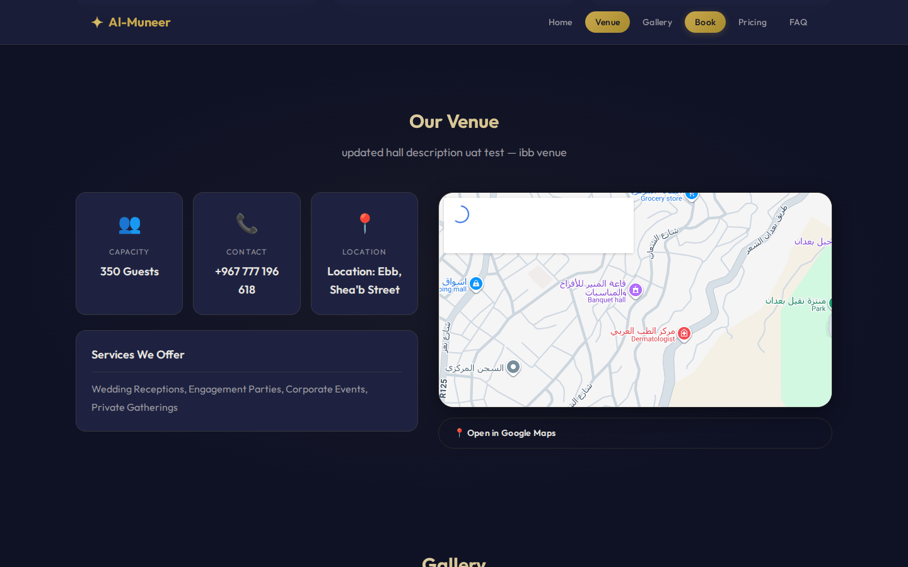 Figure 1.1 (b)</td><td align="center">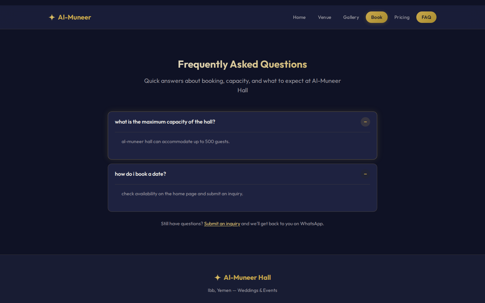 Figure 1.1 (c)</td></tr>
</table>

*Test case 1.2*

<table>
<tr><td align="center"> Figure 1.2 (a)</td></tr>
</table>

---

### 2.0 View Media Gallery

**STD reference:** TC_V_002

| No | Action | Expected Result | Result | Comment |
|----|--------|------------------|--------|---------|
| 2.1 | 1. Open the home page and scroll to the Gallery section. 2. Click a category filter button. 3. Click an image thumbnail. 4. Close the lightbox. | 1. Thumbnails are displayed in a masonry layout. (Figure 2.1 (a)) 2. The grid filters to the matching category; the **All** option restores the full set. 3. A lightbox opens showing the full-size image. (Figure 2.1 (b)) 4. The view returns to the gallery grid. | **Pass** | |
| 2.2 | 1. Open `/#gallery` with the `media_items` table empty. | 1. A placeholder message (e.g. “Gallery coming soon”) is displayed, and no error occurs. (Figure 2.2 (a)) | **Pass** | |

**Screenshots**

*Test case 2.1*

<table>
<tr><td align="center">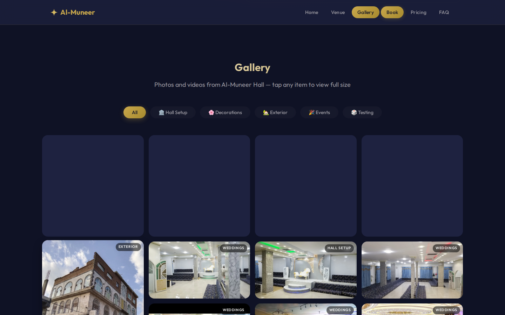 Figure 2.1 (a)</td><td align="center">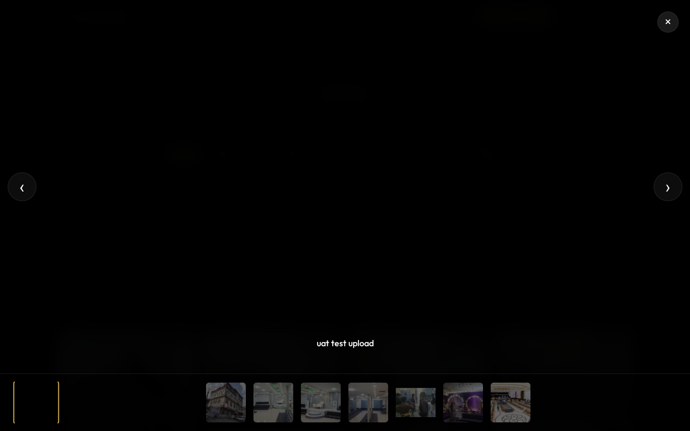 Figure 2.1 (b)</td></tr>
</table>

*Test case 2.2*

<table>
<tr><td align="center">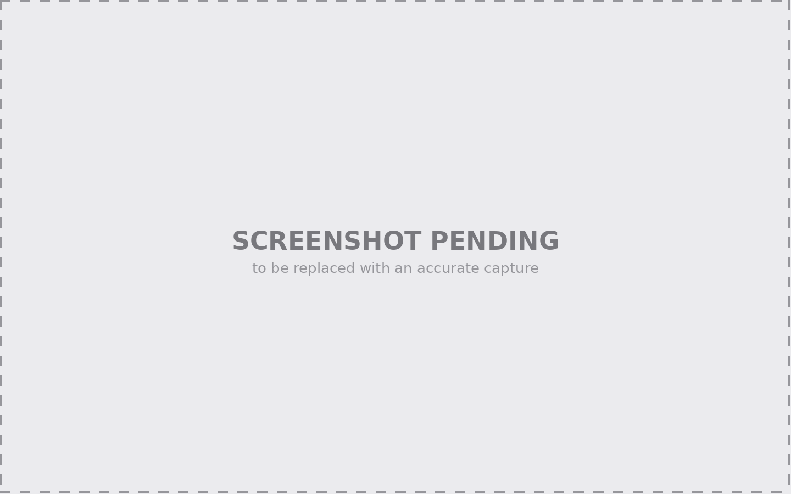 Figure 2.2 (a)</td><!-- TODO: Capture the actual empty-gallery placeholder screen. --></tr>
</table>

---

### 3.0 Check Availability Calendar

**STD reference:** TC_V_003

| No | Action | Expected Result | Result | Comment |
|----|--------|------------------|--------|---------|
| 3.1 | 1. Open the Availability section (`/#availability`). 2. Observe dates that have been configured by the administrator. 3. Observe past dates on the calendar. 4. Observe a future date with no configured status. | 1. An interactive calendar for the current month is displayed. 2. Dates marked **Booked** and **Pending** are visually distinct from **Available** dates. (Figure 3.1 (a)) 3. Past dates are dimmed and not selectable. (Figure 3.1 (b)) 4. The date is treated as **Available** and remains clickable. | **Pass** | |
| 3.2 | 1. Click **Next month** on the calendar. 2. Select an available future date, e.g. 2026-07-01. 3. Click **Submit inquiry**. | 1. The calendar updates and the displayed statuses match the database for that month. (Figure 3.2 (a)) 2. The date is highlighted, and a **Submit inquiry** action becomes available. (Figure 3.2 (b)) 3. The browser navigates to `/inquiry?date=2026-07-01` with the event date pre-filled. (Figure 3.2 (c)) | **Pass** | |

**Screenshots**

*Test case 3.1*

<table>
<tr><td align="center"> Figure 3.1 (a)</td><td align="center">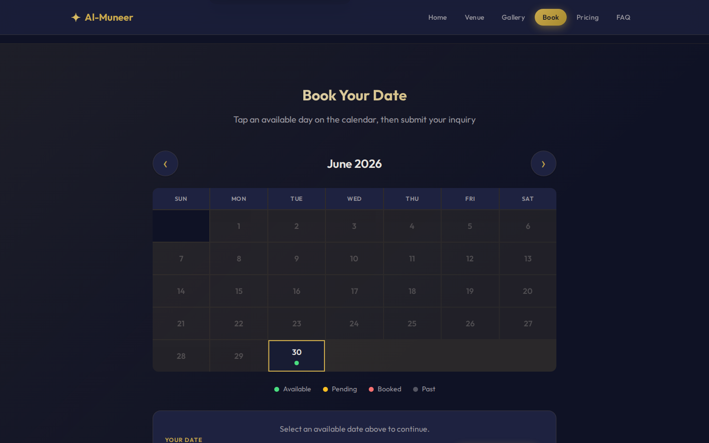 Figure 3.1 (b)</td></tr>
</table>

*Test case 3.2*

<table>
<tr><td align="center">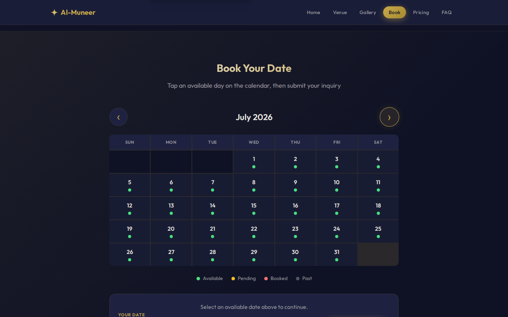 Figure 3.2 (a)</td><td align="center">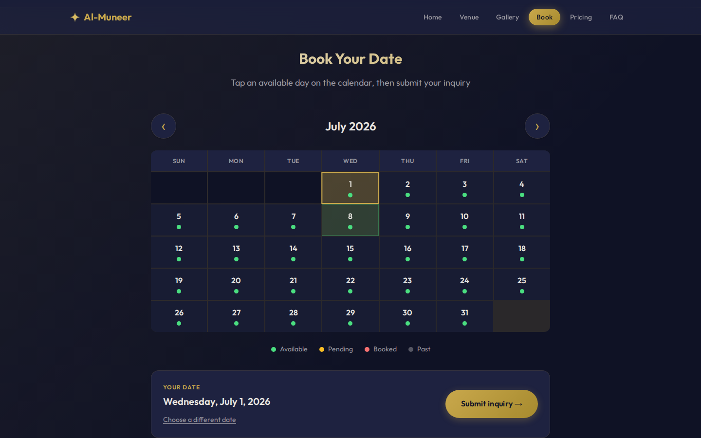 Figure 3.2 (b)</td><td align="center">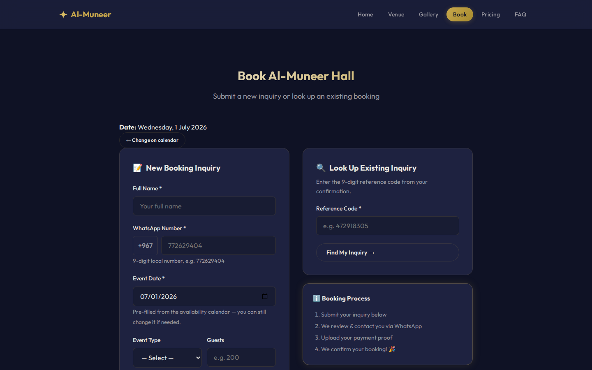 Figure 3.2 (c)</td></tr>
</table>

---

### 4.0 View Pricing Panel

**STD reference:** TC_V_004

| No | Action | Expected Result | Result | Comment |
|----|--------|------------------|--------|---------|
| 4.1 | 1. Open the Pricing section (`/#pricing`). 2. Verify that an inactive tier is not shown. 3. Click **Book [package name]** on an active tier. | 1. Active pricing tiers are displayed with their name, price, and description. (Figure 4.1 (a)) 2. The inactive tier does not appear on the public page; the admin panel confirms both the active and inactive tiers exist in the database. (Figure 4.1 (b)) 3. The browser navigates to `/inquiry?pricingId={id}` with the corresponding package pre-selected on the form. (Figure 4.1 (c)) | **Pass** | |
| 4.2 | 1. Open the home page with no active pricing tiers configured. | 1. The pricing section is hidden from the public page. (Figure 4.2 (a)) | **Pass** | |

**Screenshots**

*Test case 4.1*

<table>
<tr><td align="center">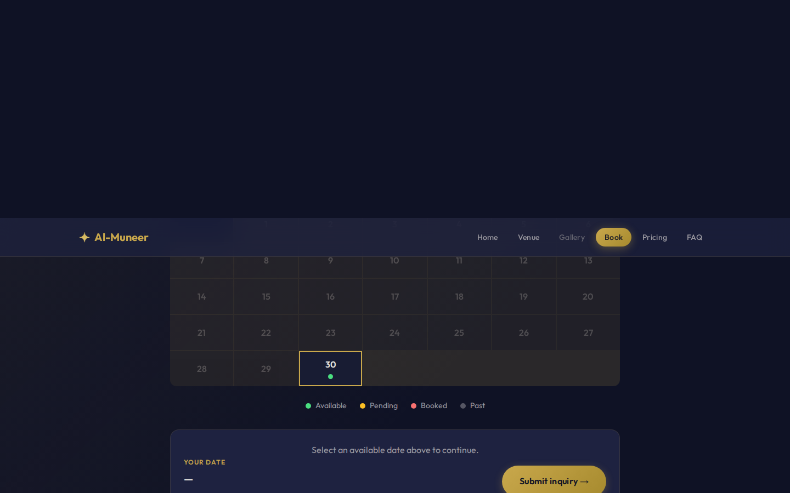 Figure 4.1 (a)</td><!-- TODO: Screenshot content is inaccurate — replace with a capture of the active pricing tiers on the public page. --><td align="center">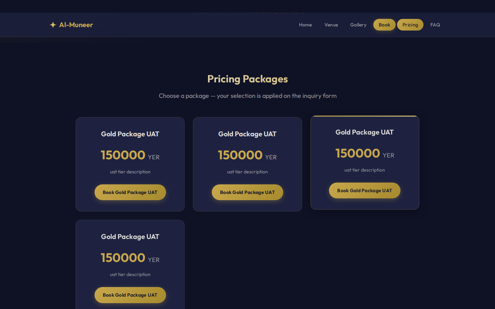 Figure 4.1 (b)</td><!-- TODO: Screenshot content is inaccurate — replace with a capture of the admin panel showing active and inactive tiers. --><td align="center">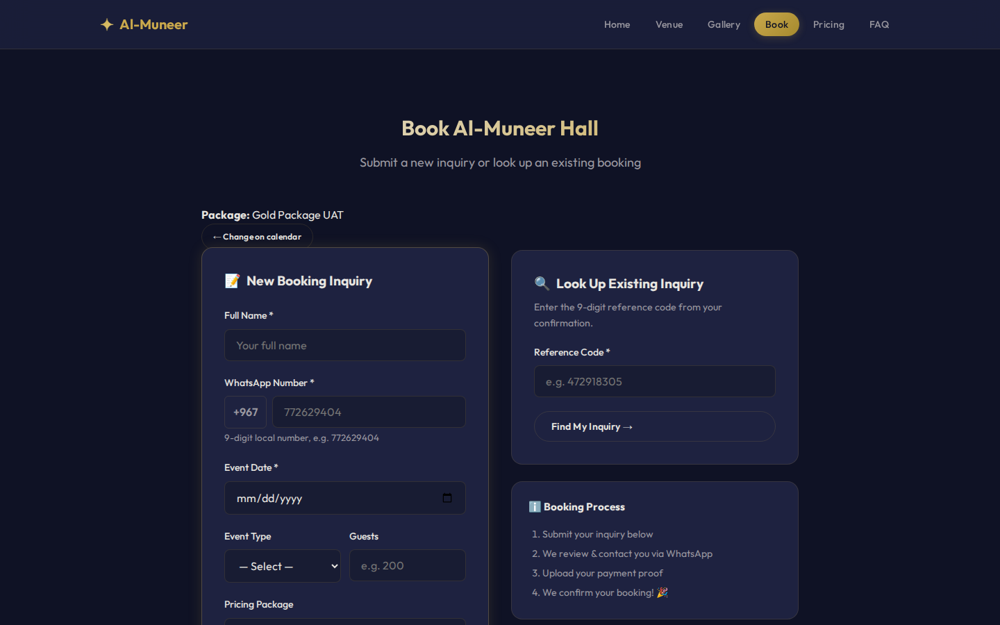 Figure 4.1 (c)</td><!-- TODO: Screenshot content is inaccurate — replace with a capture of the `/inquiry?pricingId=` navigation. --></tr>
</table>

*Test case 4.2*

<table>
<tr><td align="center"> Figure 4.2 (a)</td><!-- TODO: Capture the home page with no active pricing tiers configured. --></tr>
</table>

---

### 5.0 Submit Booking Inquiry

**STD reference:** TC_V_005

| No | Action | Expected Result | Result | Comment |
|----|--------|------------------|--------|---------|
| 5.1 | 1. Open the inquiry form (`/inquiry`). 2. Complete the required fields and submit the form. 3. Review the confirmation page. 4. Check the database for the submitted inquiry. 5. Revisit `/inquiry`. | 1. The inquiry form is displayed. (Figure 5.1 (a)) 2. The browser is redirected to `/inquiry/confirmation/{9-digit-code}`, where the confirmation page displays a 9-digit reference code. (Figure 5.1 (b)) 3. The visitor name, event date, and a status of **New** are displayed alongside the reference code. 4. A corresponding `booking_inquiries` record exists with the matching data and reference code. 5. The existing inquiry is surfaced automatically via the stored cookie. (Figure 5.1 (c)) | **Pass** | |
| 5.2 | 1. Leave the **Full Name** field empty and submit the form. 2. Provide a name, leave the **WhatsApp** field empty, and submit the form. | 1. Native browser (HTML5) validation prevents submission. (Figure 5.2 (a)) 2. Submission is blocked, and the required field is indicated. | **Pass** | |
| 5.3 | 1. Enter a non-numeric WhatsApp number (e.g. `abc`) and submit the form. 2. Enter a WhatsApp number shorter than nine digits and submit the form. | 1. Pattern validation blocks submission. (Figure 5.3 (a)) 2. Pattern validation blocks submission. | **Pass** | |
| 5.4 | 1. Submit an inquiry for a date already marked **Booked**, e.g. 2026-08-29. | 1. An error message is displayed indicating the date is unavailable, and no new inquiry is created. (Figure 5.4 (a)) | **Pass** | |

**Screenshots**

*Test case 5.1*

<table>
<tr><td align="center">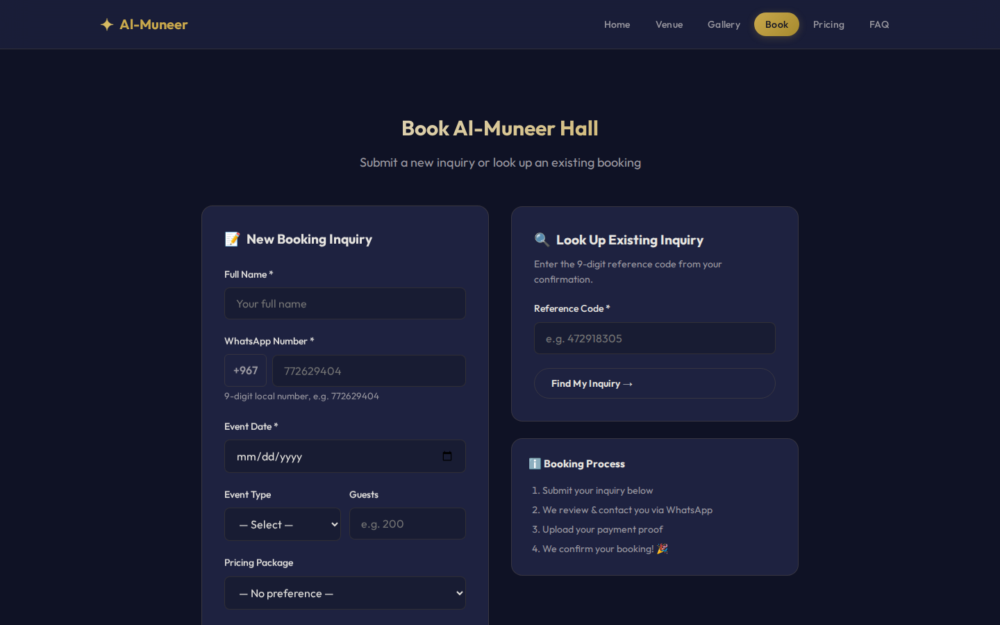 Figure 5.1 (a)</td><td align="center">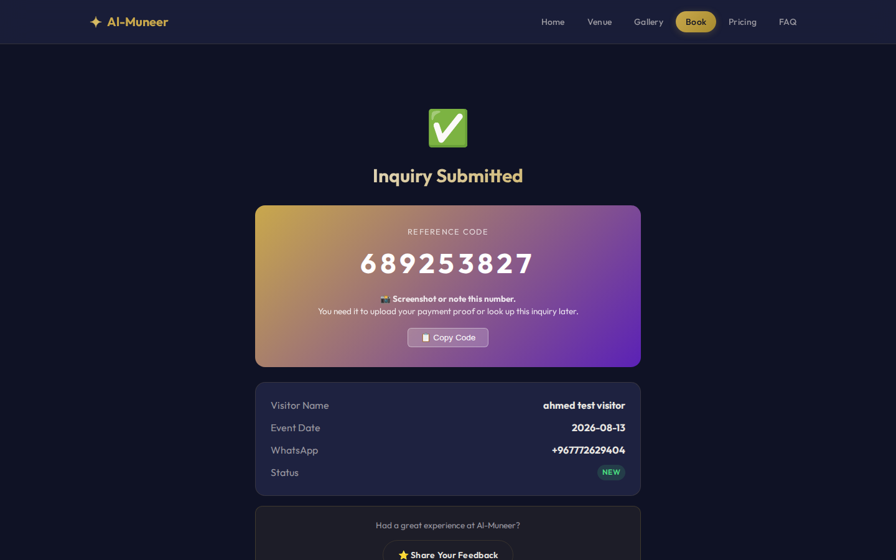 Figure 5.1 (b)</td><td align="center">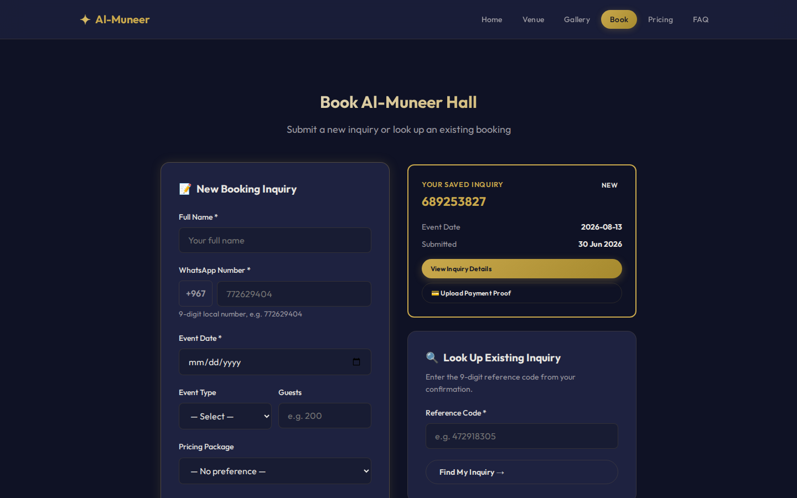 Figure 5.1 (c)</td></tr>
</table>

*Test case 5.2*

<table>
<tr><td align="center">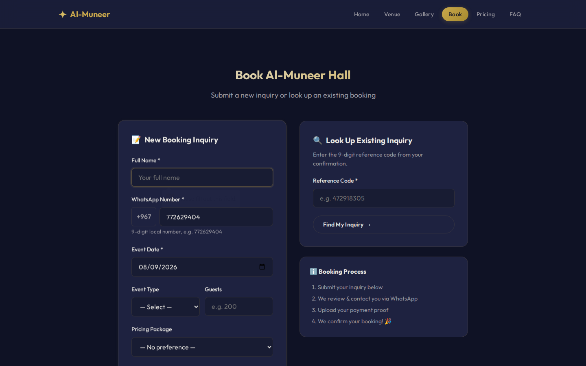 Figure 5.2 (a)</td><!-- TODO: Screenshot is inaccurate — replace with a capture of the blocked empty-name submission. --></tr>
</table>

*Test case 5.3*

<table>
<tr><td align="center"> Figure 5.3 (a)</td><!-- TODO: Screenshot is inaccurate — replace with a capture of the blocked WhatsApp validation. --></tr>
</table>

*Test case 5.4*

<table>
<tr><td align="center">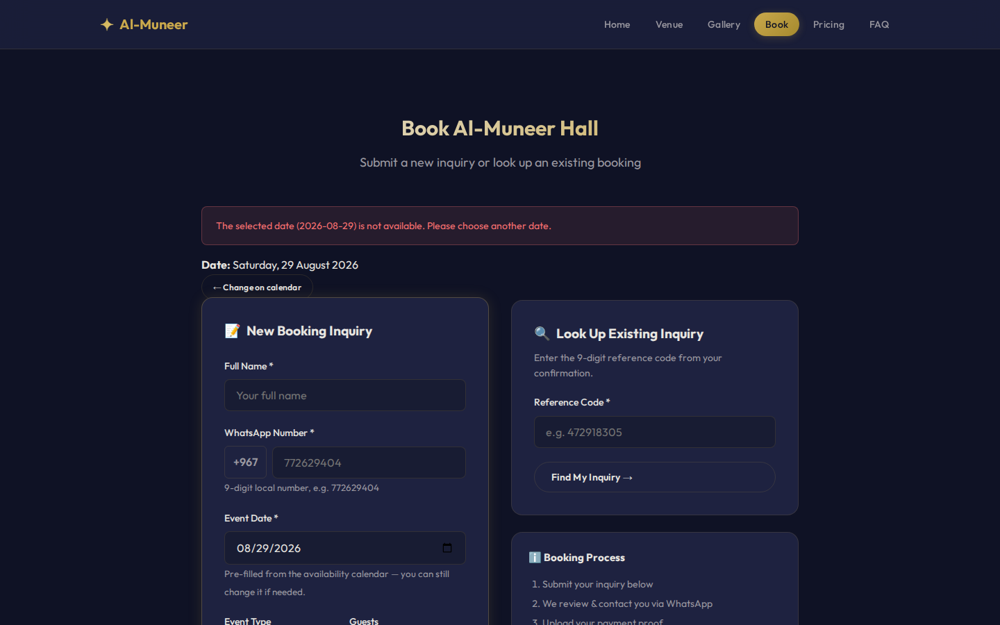 Figure 5.4 (a)</td></tr>
</table>

---

### 6.0 Submit Payment Proof

**STD reference:** TC_V_011

| No | Action | Expected Result | Result | Comment |
|----|--------|------------------|--------|---------|
| 6.1 | 1. Open the payment upload page from the inquiry confirmation page. 2. Select a valid receipt image and submit it. 3. Check the admin payments list (`/admin/payments`). | 1. The upload form displays a banner with the visitor name and event date. (Figure 6.1 (a)) 2. A success message is shown, and a `payment_proofs` record is created with status **Pending verification**. (Figure 6.1 (b)) 3. The new proof appears in the list as pending. (Figure 6.1 (c)) | **Pass** | |

**Screenshots**

*Test case 6.1*

<table>
<tr><td align="center">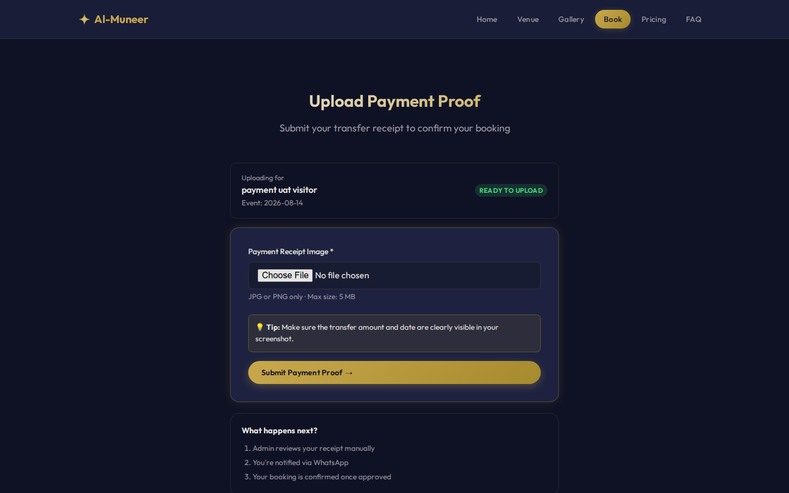 Figure 6.1 (a)</td><td align="center">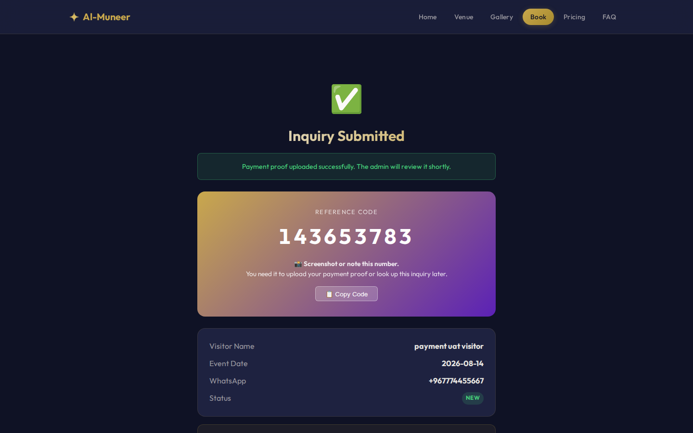 Figure 6.1 (b)</td><td align="center">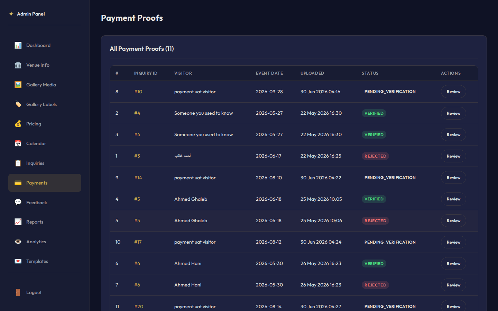 Figure 6.1 (c)</td></tr>
</table>

---

### 7.0 Submit Feedback

**STD reference:** TC_V_012

| No | Action | Expected Result | Result | Comment |
|----|--------|------------------|--------|---------|
| 7.1 | 1. Open the feedback form (`/feedback`). 2. Submit the form with a rating and message. 3. Submit the form anonymously, leaving the name and WhatsApp fields blank. | 1. The form is displayed with an optional name and WhatsApp field, a required star rating, and a required message field. (Figure 7.1 (a)) 2. A thank-you message is displayed, and a record is created in the `feedback` table with `isReviewed = false`. (Figure 7.1 (b)) 3. The submission is accepted and stored with null contact fields. | **Pass** | |
| 7.2 | 1. Leave the message field blank and submit the form. | 1. An error message indicates that the message is required, and no database record is created. (Figure 7.2 (a)) | **Pass** | |

**Screenshots**

*Test case 7.1*

<table>
<tr><td align="center">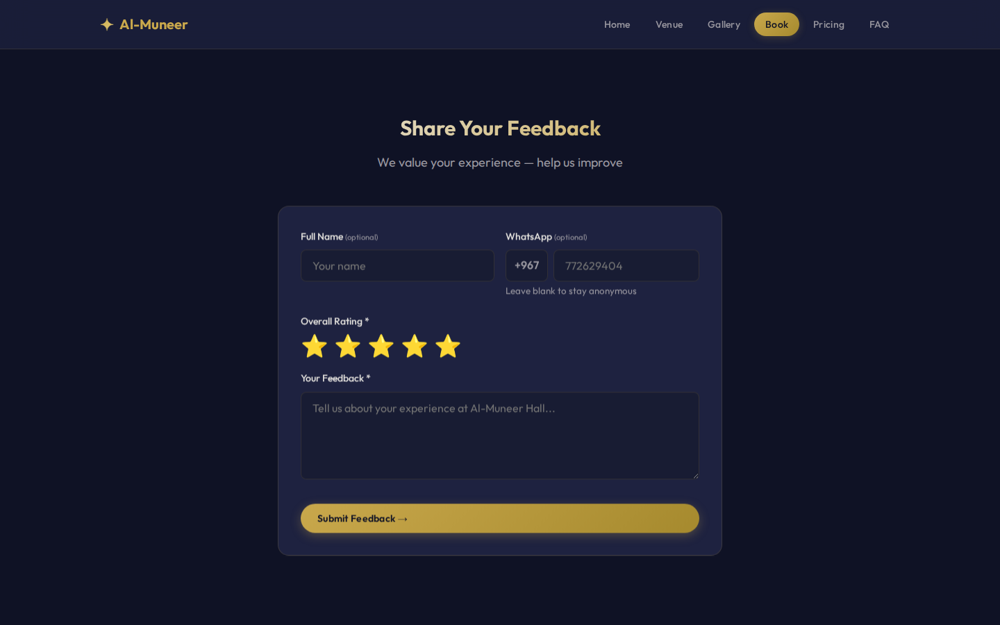 Figure 7.1 (a)</td><td align="center">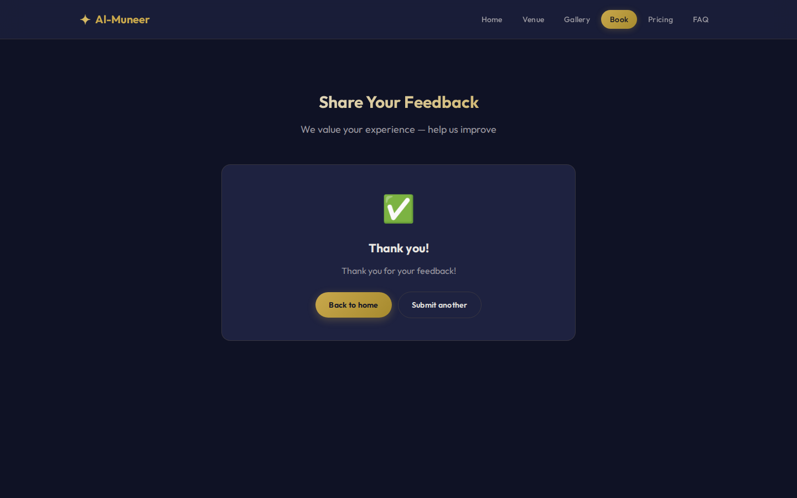 Figure 7.1 (b)</td></tr>
</table>

*Test case 7.2*

<table>
<tr><td align="center">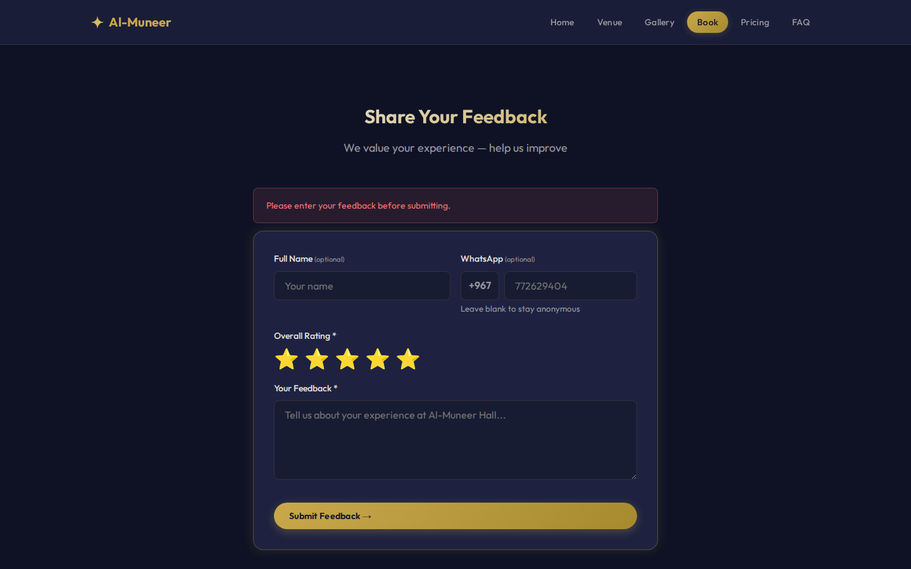 Figure 7.2 (a)</td></tr>
</table>

---

## PART 2

### ADMINISTRATOR MODULE (ADMIN DASHBOARD)

**Description:**

This part covers administrator functionality within the admin dashboard: secure login, content management, calendar and inquiry handling, payment verification, traffic analytics, report generation, feedback review, and WhatsApp notification templates.

**Performed by:**

1. Administrator (`admin`)

---

### 1.0 Login

**STD reference:** TC_A_000

| No | Action | Expected Result | Result | Comment |
|----|--------|------------------|--------|---------|
| 1.1 | 1. Navigate to `/admin/login`. 2. Enter the valid username and password, and submit the form. 3. Attempt to access `/admin/inquiries`. | 1. The login form is displayed. (Figure 1.1 (a)) 2. The browser redirects to `/admin/dashboard`, and the dashboard loads. (Figure 1.1 (b)) 3. The inquiry management page loads directly, without being redirected to the login page. (Figure 1.1 (c)) | **Pass** | |
| 1.2 | 1. Navigate to `/admin/login`. 2. Enter the valid username with an incorrect password and submit the form. 3. Navigate directly to `/admin/dashboard` without logging in. | 1. The login form is displayed. (Figure 1.2 (a)) 2. An error message is displayed, and the user remains on the login page. (Figure 1.2 (b)) 3. The browser redirects to `/admin/login`. (Figure 1.2 (c)) | **Pass** | |

**Screenshots**

*Test case 1.1*

<table>
<tr><td align="center">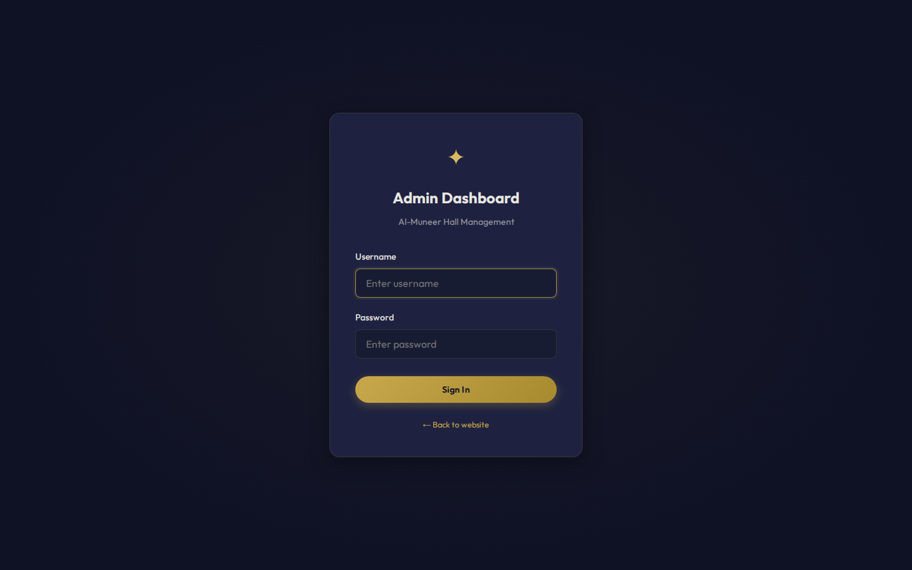 Figure 1.1 (a)</td><td align="center">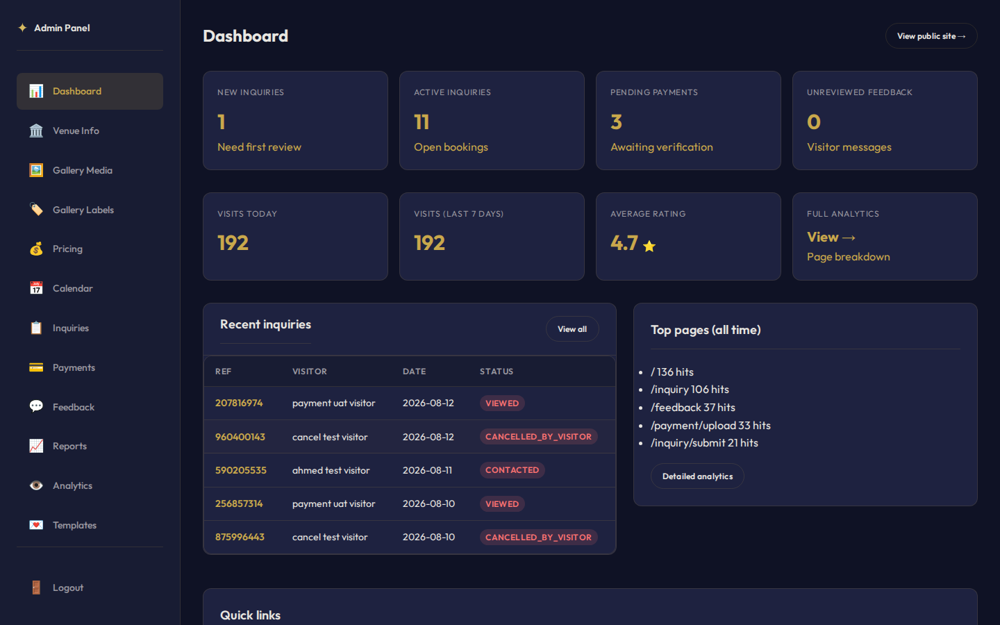 Figure 1.1 (b)</td><td align="center">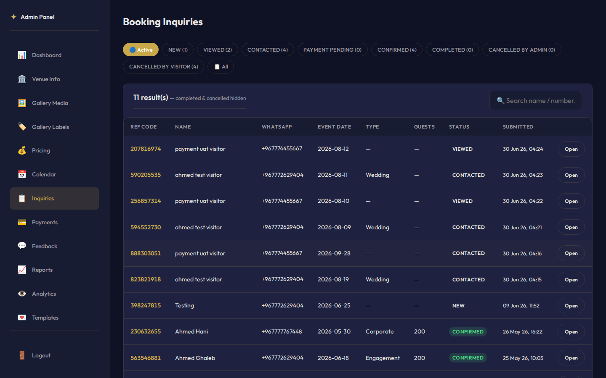 Figure 1.1 (c)</td></tr>
</table>

*Test case 1.2*

<table>
<tr><td align="center">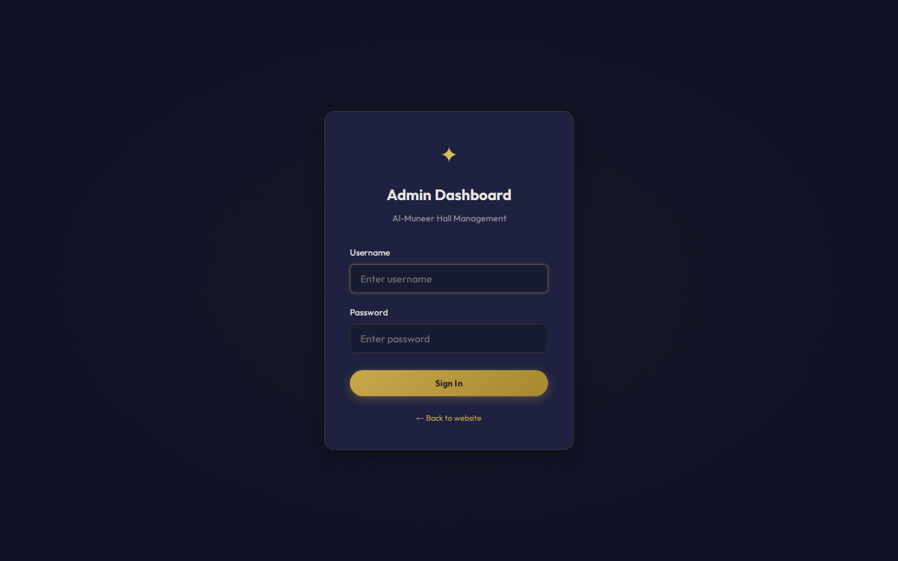 Figure 1.2 (a)</td><td align="center"> Figure 1.2 (b)</td><td align="center"> Figure 1.2 (c)</td></tr>
</table>

---

### 2.0 Manage Hall Information & FAQ

**STD reference:** TC_A_006

| No | Action | Expected Result | Result | Comment |
|----|--------|------------------|--------|---------|
| 2.1 | 1. Navigate to `/admin/venue`. 2. Update the description and map URLs, then save. 3. Open the Venue section on the public site (`/#venue`). | 1. An editable venue form with a live preview is displayed. (Figure 2.1 (a)) 2. A success message is shown, and the database is updated. (Figure 2.1 (b)) 3. The updated description and map embed are reflected on the public page. (Figure 2.1 (c)) | **Pass** | |

**Screenshots**

*Test case 2.1*

<table>
<tr><td align="center">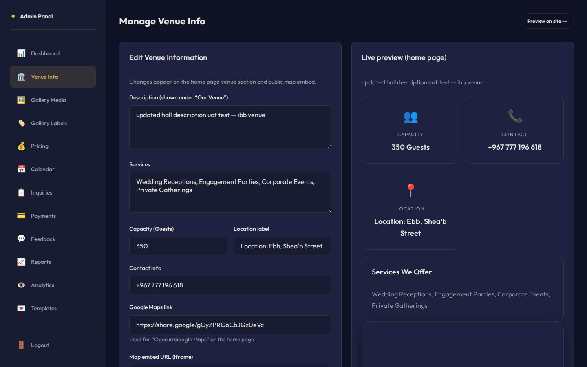 Figure 2.1 (a)</td><td align="center">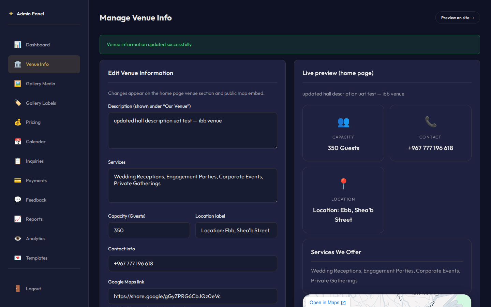 Figure 2.1 (b)</td><td align="center">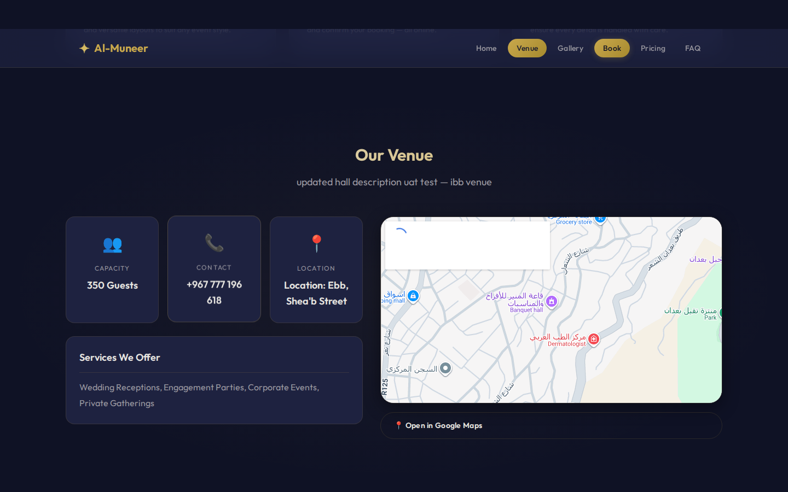 Figure 2.1 (c)</td></tr>
</table>

---

### 3.0 Manage Media Gallery

**STD reference:** TC_A_007

| No | Action | Expected Result | Result | Comment |
|----|--------|------------------|--------|---------|
| 3.1 | 1. On `/admin/gallery`, upload a valid JPG or PNG image. 2. Open the Gallery section on the public site (`/#gallery`). | 1. A success message is shown, and the item appears in the admin list. (Figure 3.1 (a)) 2. The new image is visible in the masonry grid. (Figure 3.1 (b)) | **Pass** | |
| 3.3 | 1. Upload a PDF file via the gallery upload form. | 1. An error message indicates that only JPG and PNG files are allowed, and no database record is created. (Figure 3.3 (a)) | **Pass** | |

**Screenshots**

*Test case 3.1*

<table>
<tr><td align="center">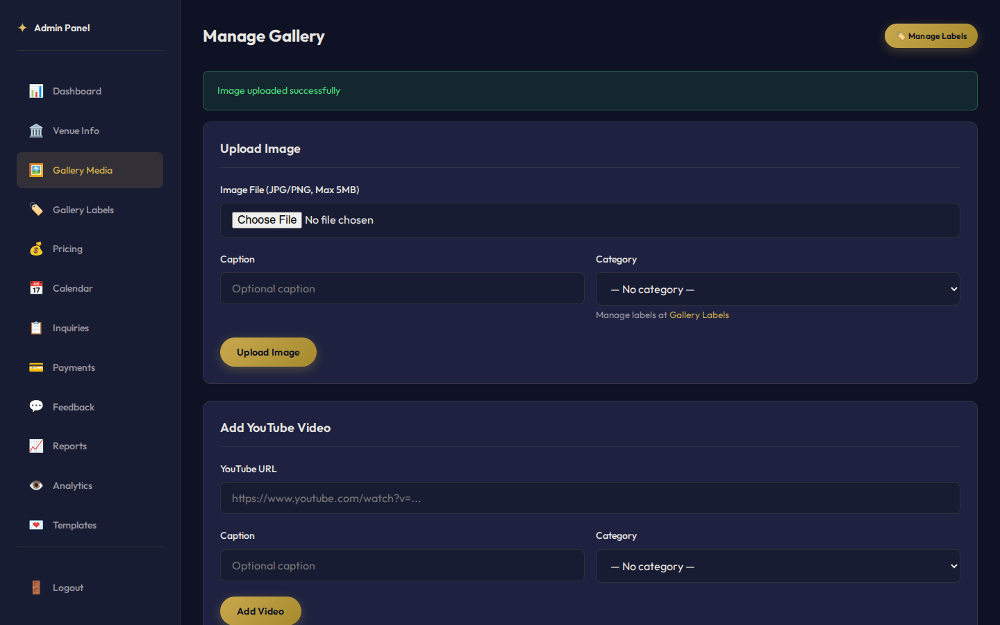 Figure 3.1 (a)</td><td align="center">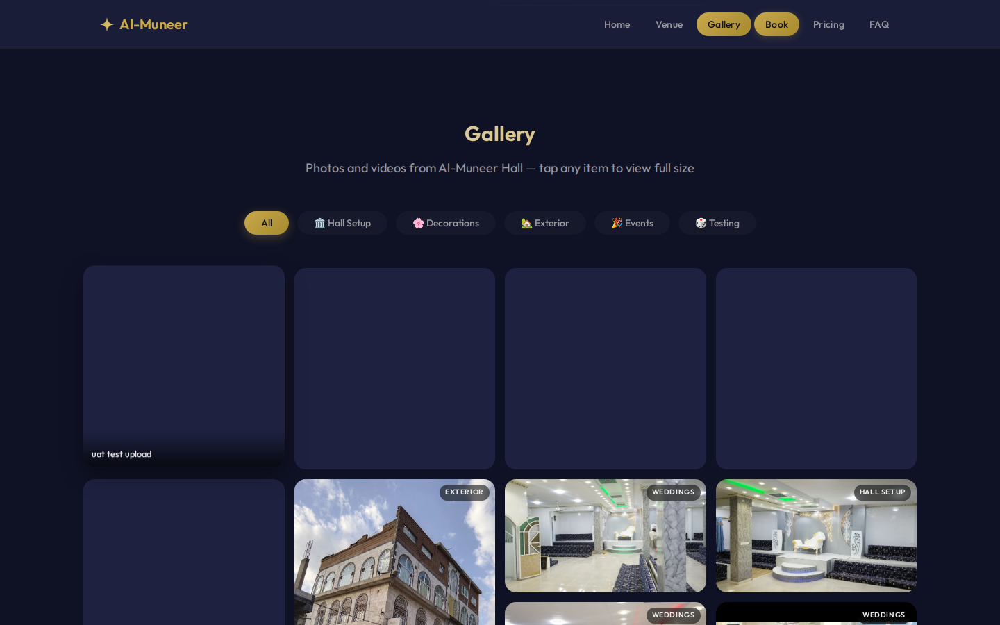 Figure 3.1 (b)</td><!-- TODO: Replace with a clearer capture — the current image is not properly visible. --></tr>
</table>

*Test case 3.3*

<table>
<tr><td align="center">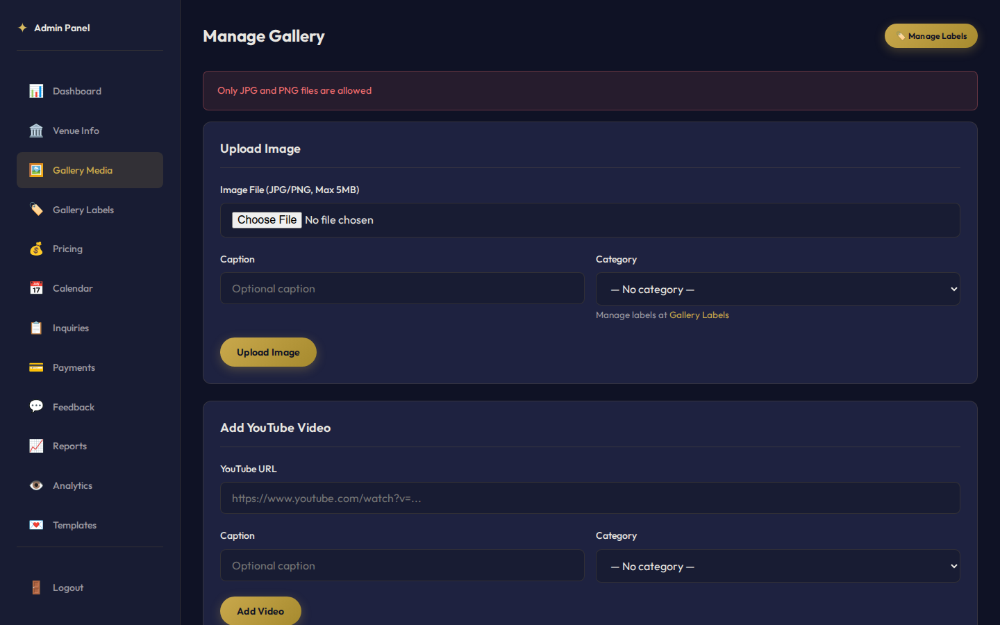 Figure 3.3 (a)</td></tr>
</table>

---

### 4.0 Manage Pricing Panel

**STD reference:** TC_A_008

| No | Action | Expected Result | Result | Comment |
|----|--------|------------------|--------|---------|
| 4.1 | 1. Create a new pricing tier on `/admin/pricing`. 2. Open the Pricing section on the public site (`/#pricing`). 3. Edit the price, set the tier to inactive, and save. | 1. A success message is shown, and the tier appears in the admin list. (Figure 4.1 (a)) 2. The new tier is visible to the public. (Figure 4.1 (b)) 3. The tier is hidden from the public pricing section. | **Pass** | |
| 4.2 | 1. Attempt to create a tier with an empty name field. 2. Attempt to create a tier with a non-numeric price value. | 1. Validation prevents the record from being saved. (Figure 4.2 (a)) 2. Validation prevents the record from being saved. (Figure 4.2 (b)) | **Pass** | |

**Screenshots**

*Test case 4.1*

<table>
<tr><td align="center">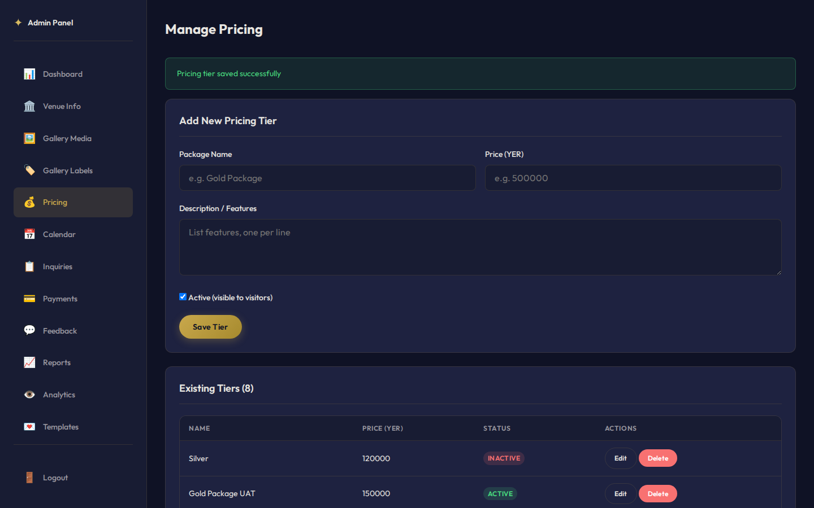 Figure 4.1 (a)</td><!-- TODO: Replace with an accurate capture of the tier in the admin list. --><td align="center"> Figure 4.1 (b)</td><!-- TODO: Replace with an accurate capture of the tier on the public pricing page. --></tr>
</table>

*Test case 4.2*

<table>
<tr><td align="center">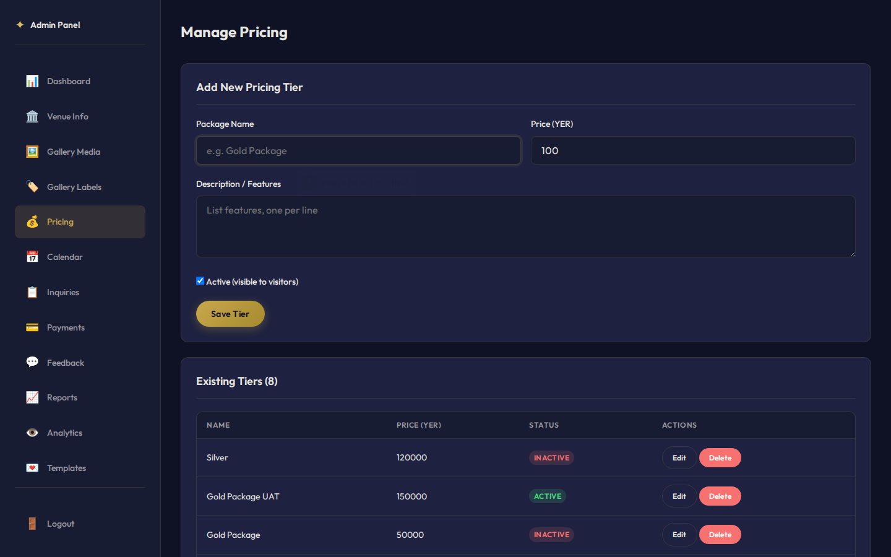 Figure 4.2 (a)</td><!-- TODO: Screenshots are inaccurate — replace with a capture of the empty-name validation error. --><td align="center">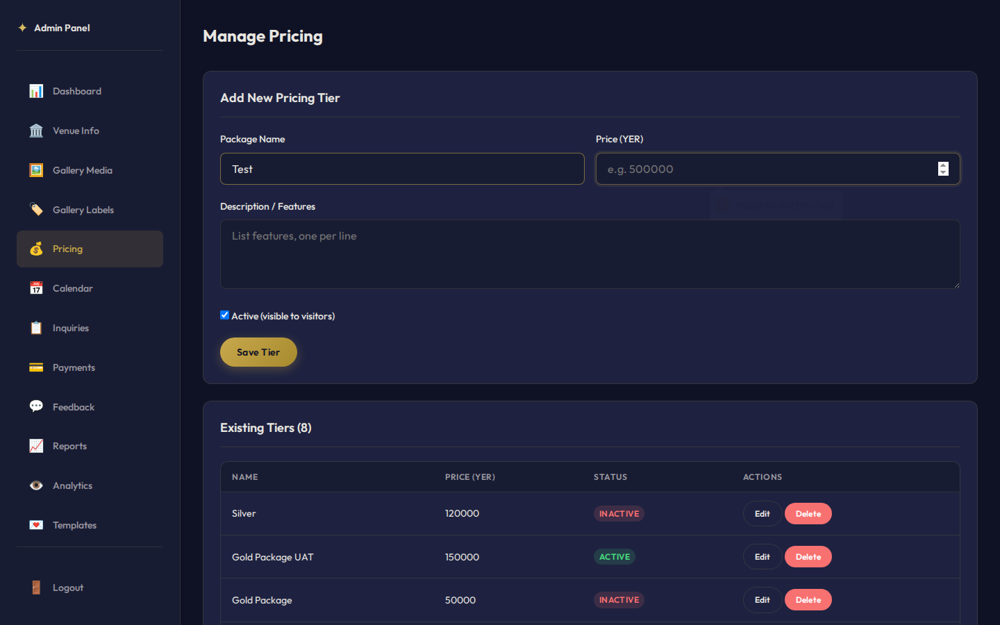 Figure 4.2 (b)</td><!-- TODO: Screenshots are inaccurate — replace with a capture of the non-numeric price validation error. --></tr>
</table>

---

### 5.0 Manage Calendar & Inquiries

**STD reference:** TC_A_009

| No | Action | Expected Result | Result | Comment |
|----|--------|------------------|--------|---------|
| 5.1 | 1. Open the admin calendar (`/admin/calendar`). 2. Select a date, e.g. 2026-09-18, set its status to **Booked**, and save. 3. Open the visitor-facing calendar (`/#availability`) for the same date. 4. Verify the calendar refresh behaviour after the update. | 1. The calendar is displayed with the current slot statuses. 2. A success message is shown, and the `availability_slots` record is updated in the database. (Figure 5.1 (a)) 3. The date is shown as **Booked**. (Figure 5.1 (b)) 4. The grid remains on the selected month without a full-page reload or jump. | **Pass** | |
| 5.2 | 1. Open `/admin/inquiries` and open an inquiry detail view. 2. Update the status to **Contacted** and save. | 1. A status drop-down and notes field are displayed. (Figure 5.2 (a)) 2. The change is saved in the database, and the inquiry list reflects the new status. (Figure 5.2 (b)) | **Pass** | |

**Screenshots**

*Test case 5.1*

<table>
<tr><td align="center">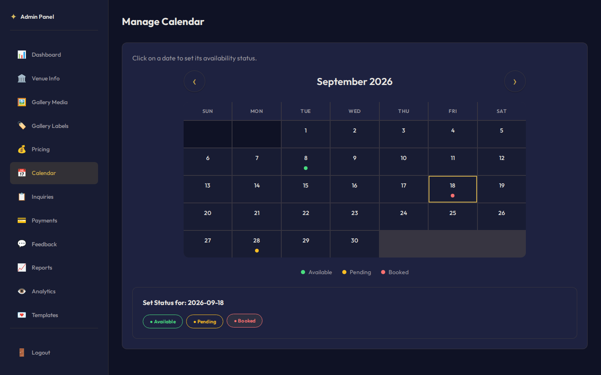 Figure 5.1 (a)</td><!-- TODO: Replace with an accurate admin-side capture of the date set to Booked. --><td align="center">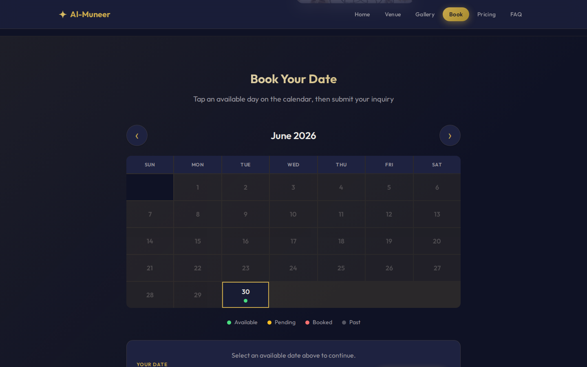 Figure 5.1 (b)</td><!-- TODO: Replace with an accurate visitor-side capture of the same date shown as Booked. --></tr>
</table>

*Test case 5.2*

<table>
<tr><td align="center">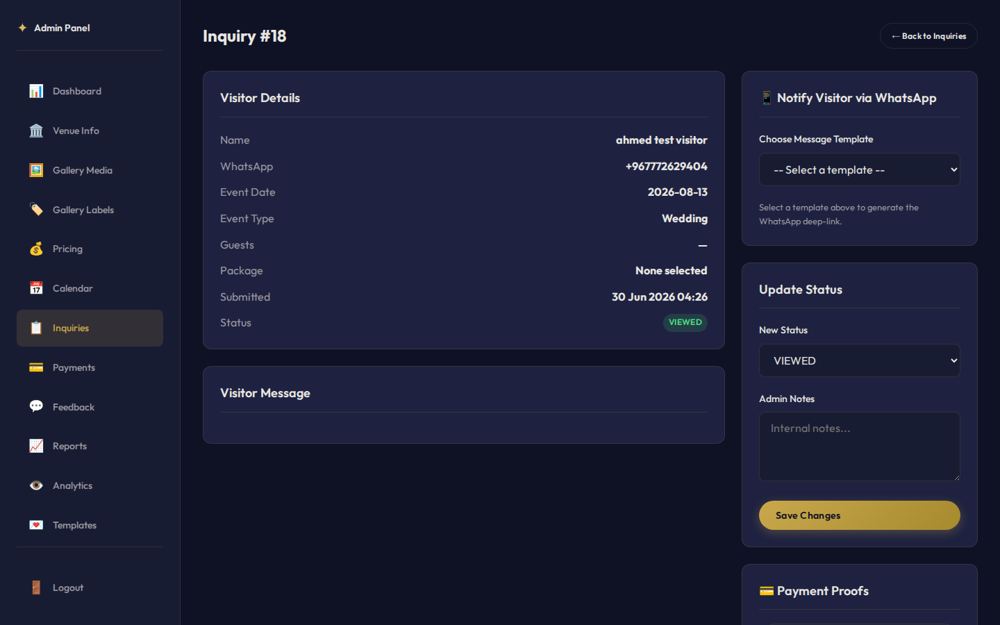 Figure 5.2 (a)</td><td align="center">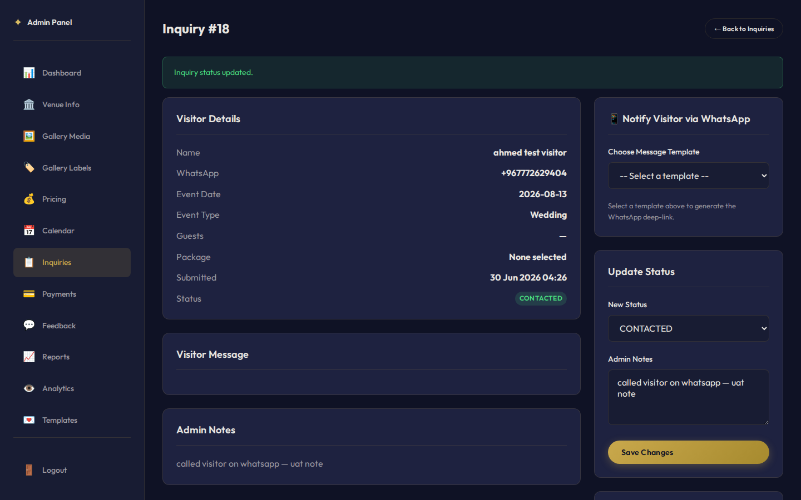 Figure 5.2 (b)</td></tr>
</table>

---

### 6.0 View Traffic Analytics

**STD reference:** TC_A_010

| No | Action | Expected Result | Result | Comment |
|----|--------|------------------|--------|---------|
| 6.2 | 1. Open `/admin/analytics`. 2. Wait for the response from `/admin/analytics/ai-insight`. 3. Verify the page load sequence. | 1. The dashboard renders immediately, and the AI panel shows a loading indicator. (Figure 6.2 (a)) 2. Bullet-point advice appears, or a graceful error message is shown if the API key is unavailable. (Figure 6.2 (b)) 3. The initial dashboard render is not blocked by the AI request. | **Pass** | |

**Screenshots**

*Test case 6.2*

<table>
<tr><td align="center">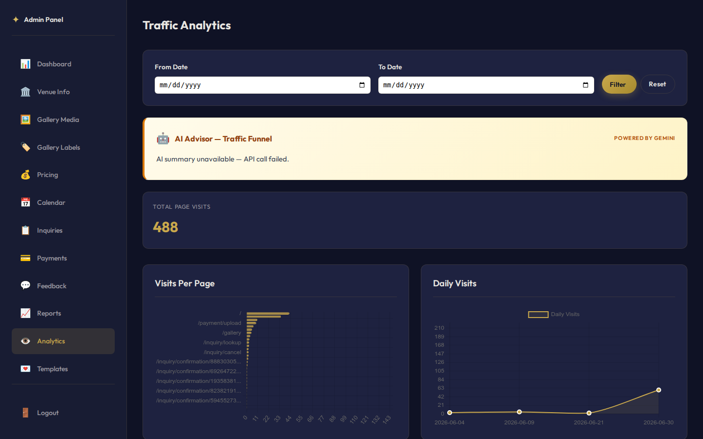 Figure 6.2 (a)</td><!-- TODO: Replace with an accurate capture of the AI panel loading indicator. --><td align="center">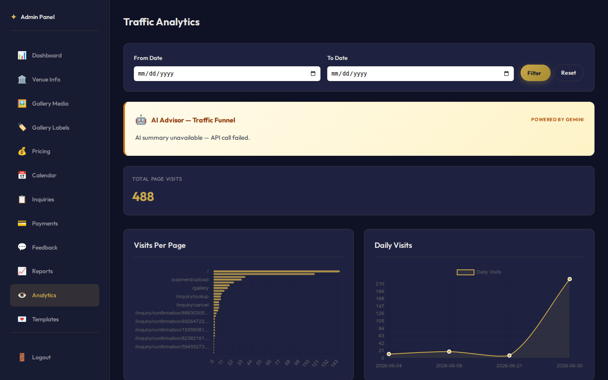 Figure 6.2 (b)</td><!-- TODO: Replace with an accurate capture of the AI panel response. --></tr>
</table>

---

### 7.0 Manage Payment Status

**STD reference:** TC_A_013

| No | Action | Expected Result | Result | Comment |
|----|--------|------------------|--------|---------|
| 7.1 | 1. Open a pending payment proof in `/admin/payments/{id}`. 2. Set the proof status to **Verified** and save. | 1. The receipt image is visible. (Figure 7.1 (a)) 2. The proof status changes to **Verified**, the related inquiry status changes to **Confirmed**, and the slot status changes to **Booked**. (Figure 7.1 (b)) | **Pass** | |
| 7.2 | 1. Set the proof status to **Rejected** and save. | 1. The proof status changes to **Rejected**; the inquiry status is unaffected, and no slot is booked. (Figure 7.2 (a)) | **Pass** | |

**Screenshots**

*Test case 7.1*

<table>
<tr><td align="center">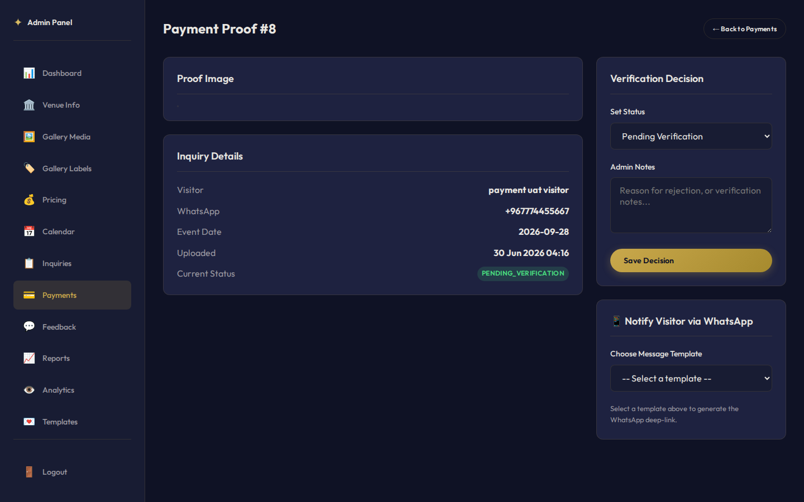 Figure 7.1 (a)</td><!-- TODO: Replace with an accurate capture of the payment proof detail view. --><td align="center">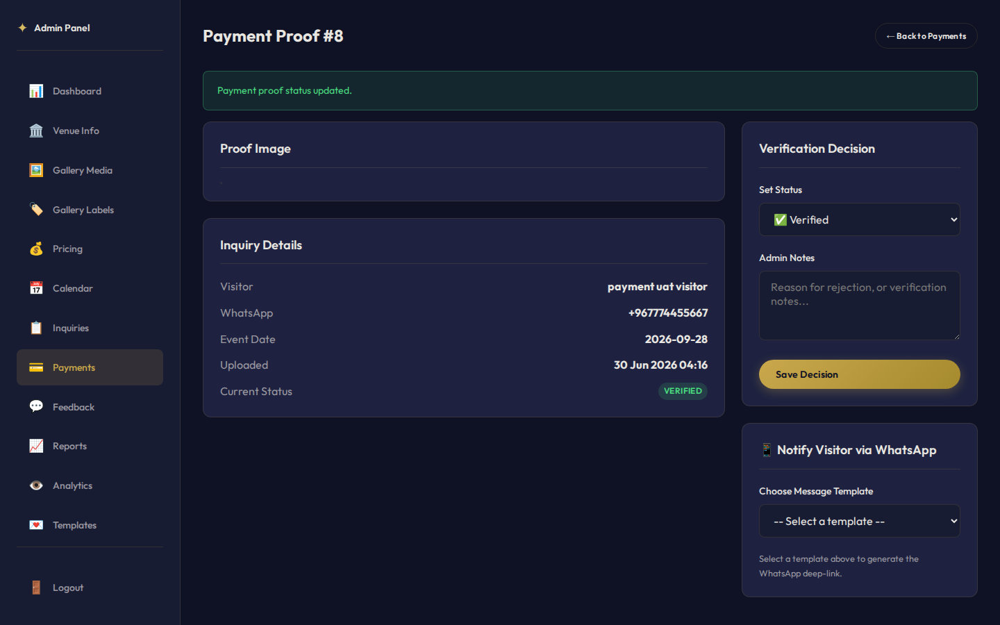 Figure 7.1 (b)</td><!-- TODO: Replace with an accurate capture of the verified status cascading to the inquiry and slot. --></tr>
</table>

*Test case 7.2*

<table>
<tr><td align="center">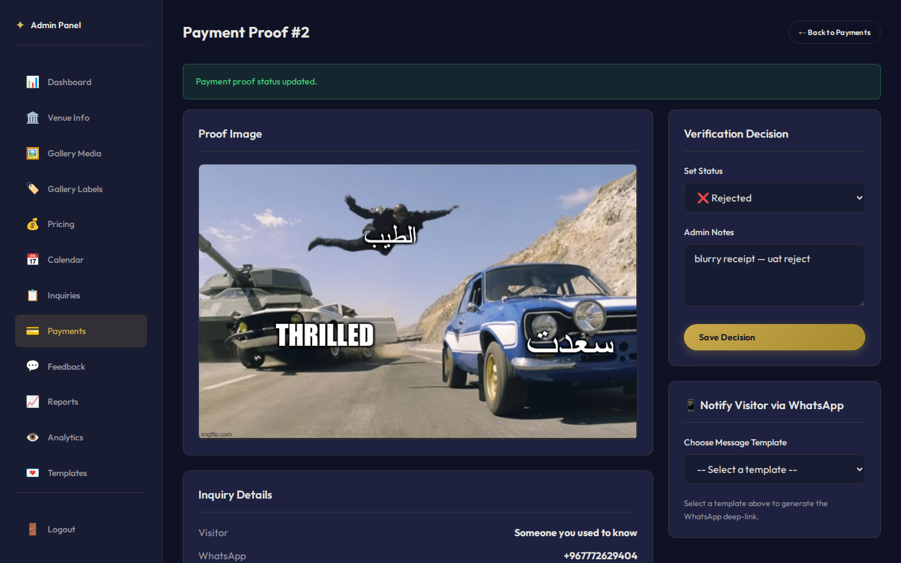 Figure 7.2 (a)</td><!-- TODO: Replace with an accurate capture of the rejected proof status. --></tr>
</table>

---

### 8.0 View / Generate Reports

**STD reference:** TC_A_014

| No | Action | Expected Result | Result | Comment |
|----|--------|------------------|--------|---------|
| 8.1 | 1. Open `/admin/reports`. 2. Apply a date-range filter. 3. Apply a date range with no matching records. | 1. Summary counts and pie/bar charts (inquiry status, payment status, feedback ratings) are displayed. (Figure 8.1 (a)) 2. The figures and charts update to reflect the filtered period. (Figure 8.1 (b)) 3. A zero/empty state is shown without error. (Figure 8.1 (c)) | **Pass** | |
| 8.2 | 1. Open `/admin/reports` with a date range applied. 2. Wait for the response from `/admin/reports/ai-insight`. | 1. The AI panel shows a loading indicator after the page loads. (Figure 8.2 (a)) 2. Three bullet points referencing the report figures are displayed (Figure 8.2 (b)), or a graceful error is shown if the API key is unavailable (Figure 8.2 (c)). | **Pass** | |

**Screenshots**

*Test case 8.1*

<table>
<tr><td align="center"> Figure 8.1 (a)</td><td align="center">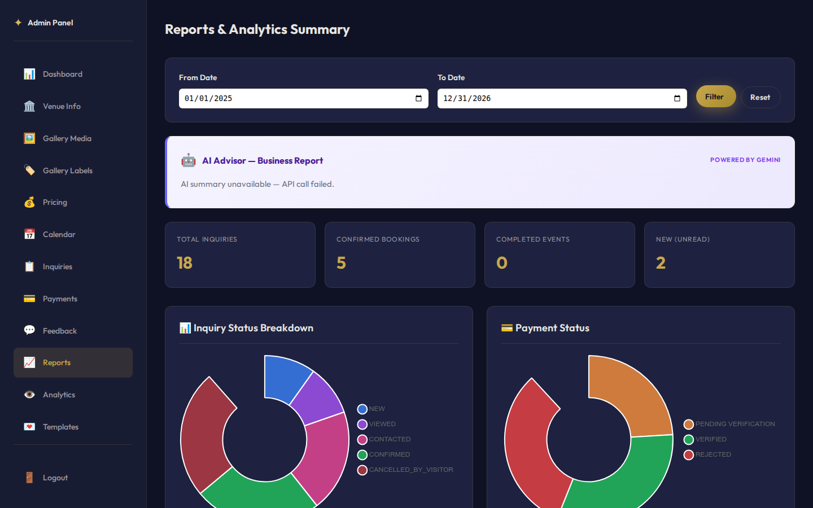 Figure 8.1 (b)</td><!-- TODO: The filter was applied but the screenshot shows no visible difference in results — recapture with a filter that produces a clear change. --><td align="center">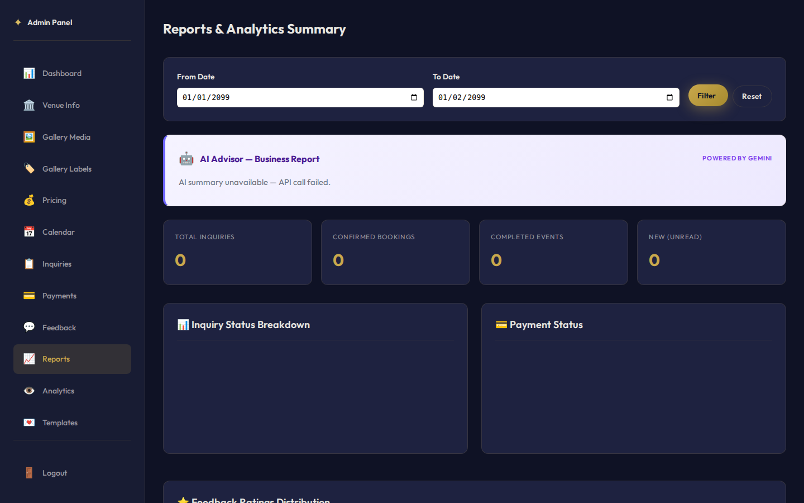 Figure 8.1 (c)</td></tr>
</table>

*Test case 8.2*

<table>
<tr><td align="center">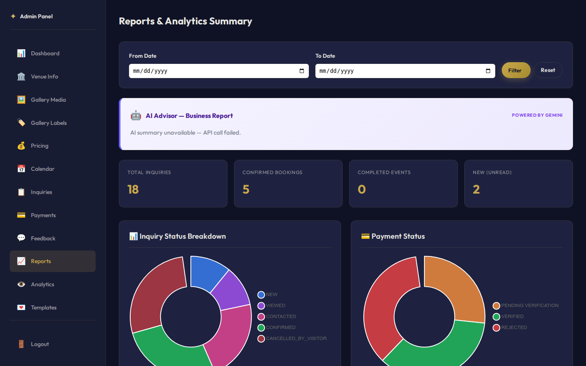 Figure 8.2 (a)</td><!-- TODO: Confirm this still accurately shows the AI panel loading indicator. --><td align="center"> Figure 8.2 (b)</td><!-- TODO: Capture the AI advisor returning bullet-point insight (success case). --><td align="center">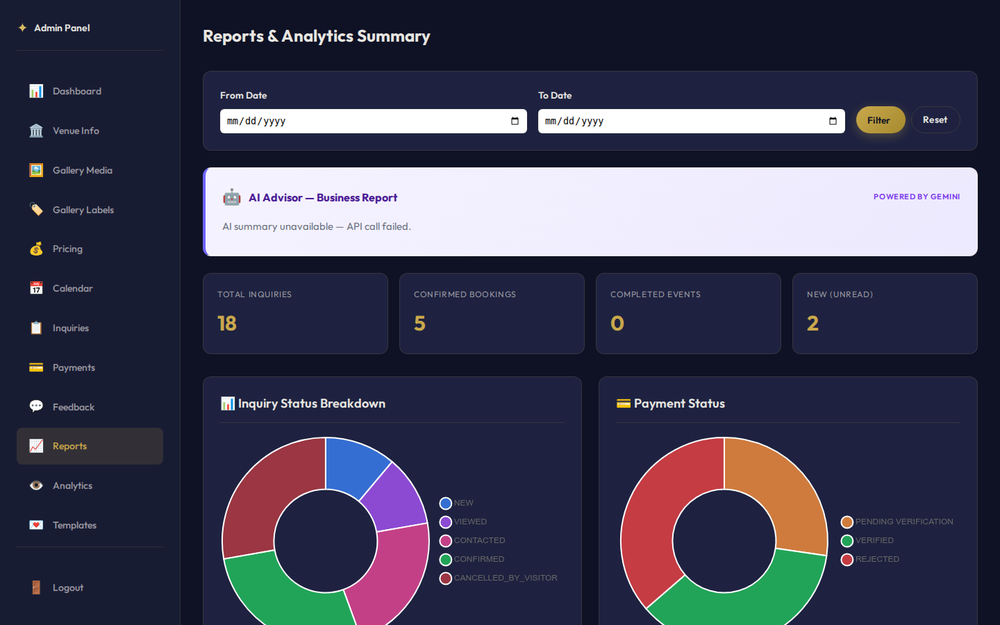 Figure 8.2 (c)</td></tr>
</table>

---

### 9.0 Manage Feedback

**STD reference:** TC_A_015

| No | Action | Expected Result | Result | Comment |
|----|--------|------------------|--------|---------|
| 9.1 | 1. Open `/admin/feedback` and select an unreviewed entry. 2. Open the detail view, mark the entry as reviewed, add a note, and save. | 1. The list displays a snippet and review status for each entry. 2. `isReviewed` is set to true, the note is saved, and the list is updated accordingly. (Figure 9.1 (a)) | **Pass** | |
| 9.2 | 1. Open `/admin/feedback` and observe the AI panel. 2. Review the AI response. | 1. The panel loads asynchronously via `/admin/feedback/ai-insight`. 2. Complaints and highlights are presented with actionable bullet points (Figure 9.2 (b)), or a graceful error is shown if the AI service is unavailable (Figure 9.2 (a)). | **Pass** | |

**Screenshots**

*Test case 9.1*

<table>
<tr><td align="center">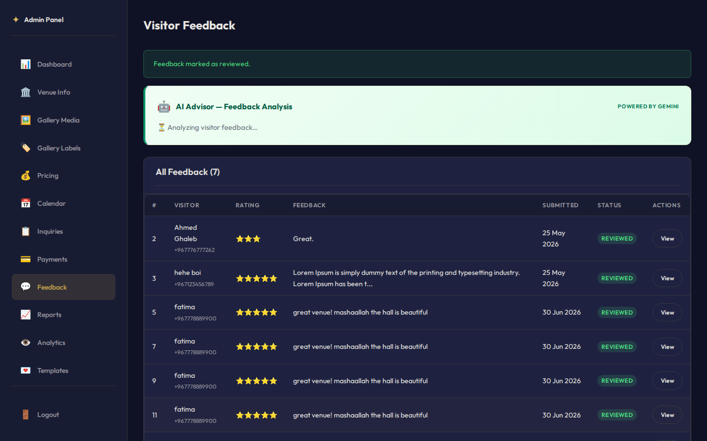 Figure 9.1 (a)</td></tr>
</table>

*Test case 9.2*

<table>
<tr><td align="center">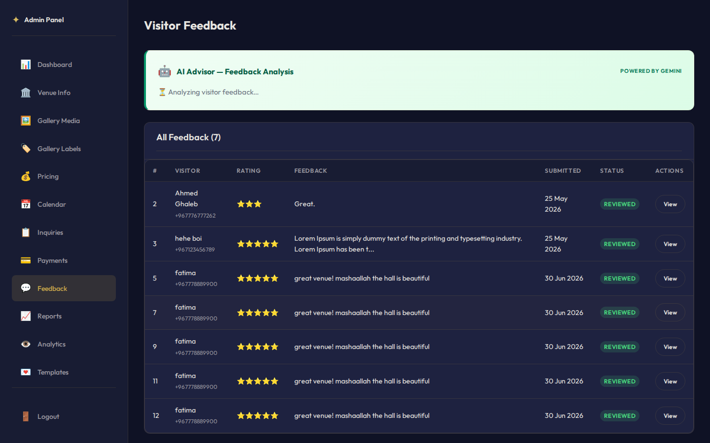 Figure 9.2 (a)</td><td align="center"> Figure 9.2 (b)</td><!-- TODO: Capture the AI advisor returning actionable bullet points (success case). --></tr>
</table>

---

### 10.0 Manage WhatsApp Notification Templates

**STD reference:** TC_A_016

| No | Action | Expected Result | Result | Comment |
|----|--------|------------------|--------|---------|
| 10.1 | 1. Open `/admin/templates`. 2. Create a new template and save it. 3. On an inquiry detail page, select the new template from the drop-down. | 1. A list of seeded templates is displayed (e.g. INQUIRY_RECEIVED, PAYMENT_VERIFIED). (Figure 10.1 (a)) 2. The new template appears in the list and is persisted to the database. (Figure 10.1 (b)) 3. The message preview resolves the placeholders correctly, and a WhatsApp deep link is generated client-side. (Figure 10.1 (c)) | **Pass** | |
| 10.2 | 1. Delete a custom template and confirm the action. 2. Verify the remaining seeded templates. | 1. The template is removed from the list and the database. (Figure 10.2 (a)) 2. The default templates remain in place unless explicitly deleted. (Figure 10.2 (b)) | **Pass** | |

**Screenshots**

*Test case 10.1*

<table>
<tr><td align="center">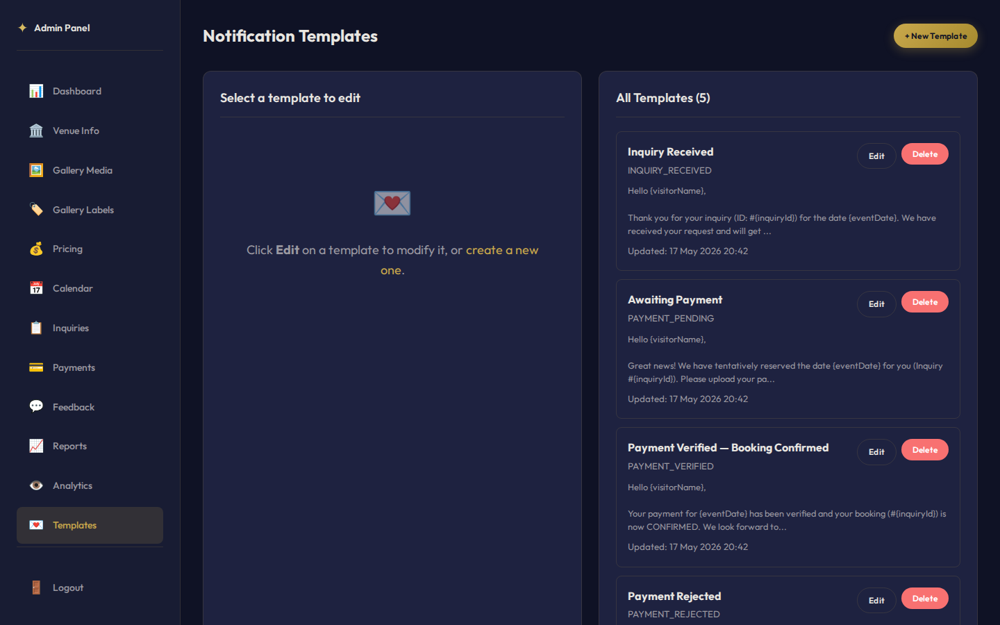 Figure 10.1 (a)</td><!-- TODO: Replace with an accurate capture of the seeded template list. --><td align="center">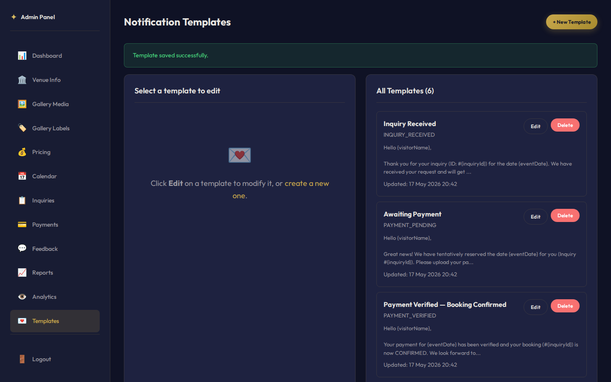 Figure 10.1 (b)</td><!-- TODO: Replace with an accurate capture of the newly created template. --><td align="center">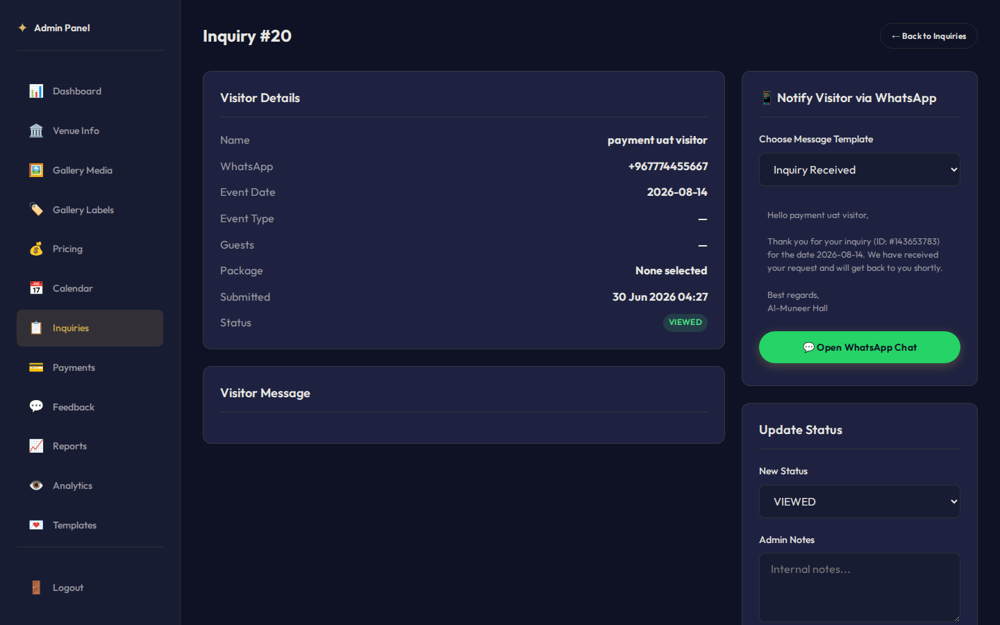 Figure 10.1 (c)</td><!-- TODO: Replace with an accurate capture of the resolved template preview. --></tr>
</table>

*Test case 10.2*

<table>
<tr><td align="center"> Figure 10.2 (a)</td><!-- TODO: Replace with an accurate capture of the template deletion. --><td align="center">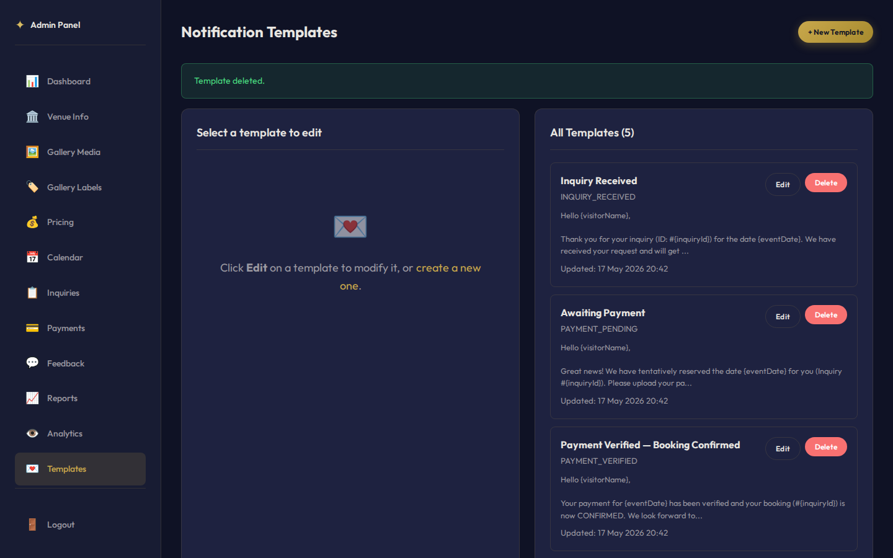 Figure 10.2 (b)</td><!-- TODO: Replace with an accurate capture of the remaining seeded templates. --></tr>
</table>

---

## Appendix — Full Case Index

| Case ID | Result | Comment |
|---------|--------|---------|
| TC_A_000_01 | Pass | |
| TC_A_000_02 | Pass | |
| TC_A_006_01 | Pass | |
| TC_A_006_02 | Pass | |
| TC_A_007_01 | Pass | |
| TC_A_007_02 | Pass | |
| TC_A_007_03 | Pass | |
| TC_A_008_01 | Pass | |
| TC_A_008_02 | Pass | |
| TC_A_009_01 | Pass | |
| TC_A_009_02 | Pass | |
| TC_A_010_01 | Pass | |
| TC_A_010_02 | Pass | |
| TC_A_013_01 | Pass | |
| TC_A_013_02 | Pass | |
| TC_A_014_01 | Pass | |
| TC_A_014_02 | Pass | |
| TC_A_015_01 | Pass | |
| TC_A_015_02 | Pass | |
| TC_A_016_01 | Pass | |
| TC_A_016_02 | Pass | |
| TC_V_001_01 | Pass | |
| TC_V_001_02 | Pass | |
| TC_V_002_01 | Pass | |
| TC_V_002_02 | Pass | |
| TC_V_003_01 | Pass | |
| TC_V_003_02 | Pass | |
| TC_V_004_01 | Pass | |
| TC_V_004_02 | Pass | |
| TC_V_005_01 | Pass | |
| TC_V_005_02 | Pass | |
| TC_V_005_03 | Pass | |
| TC_V_005_04 | Pass | |
| TC_V_005_05 | Pass | |
| TC_V_011_01 | Pass | |
| TC_V_011_02 | Pass | |
| TC_V_012_01 | Pass | |
| TC_V_012_02 | Pass | |

---

*End of UAT Document*
