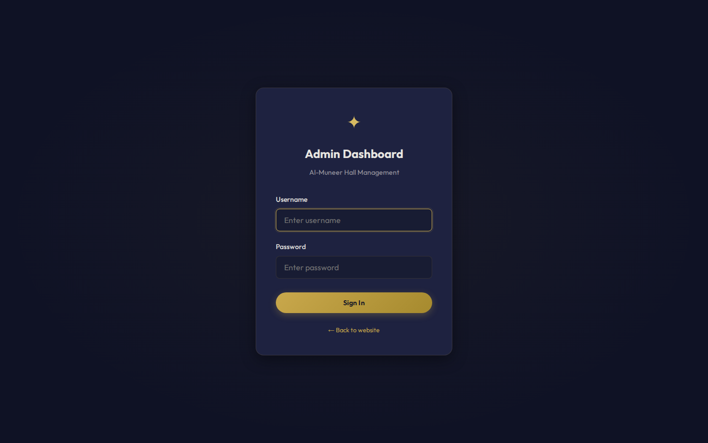
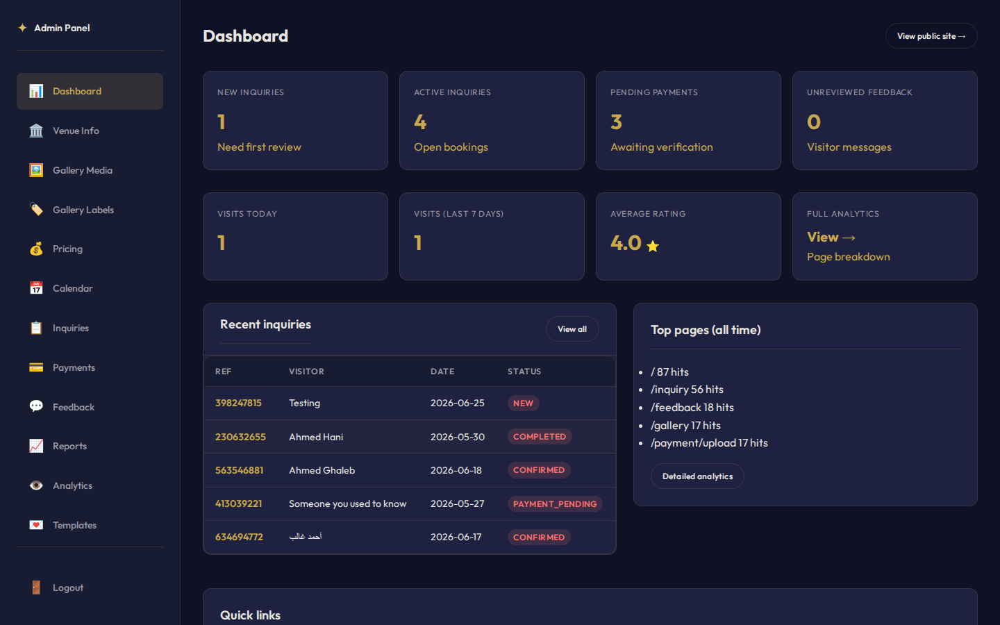
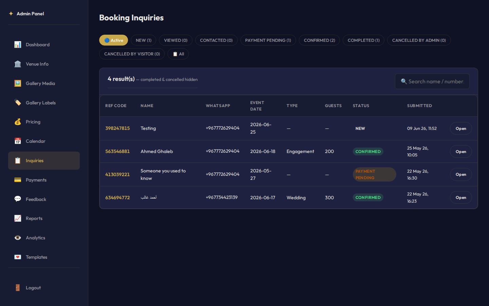
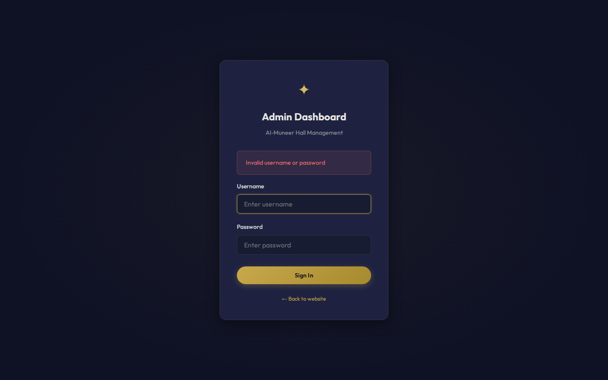
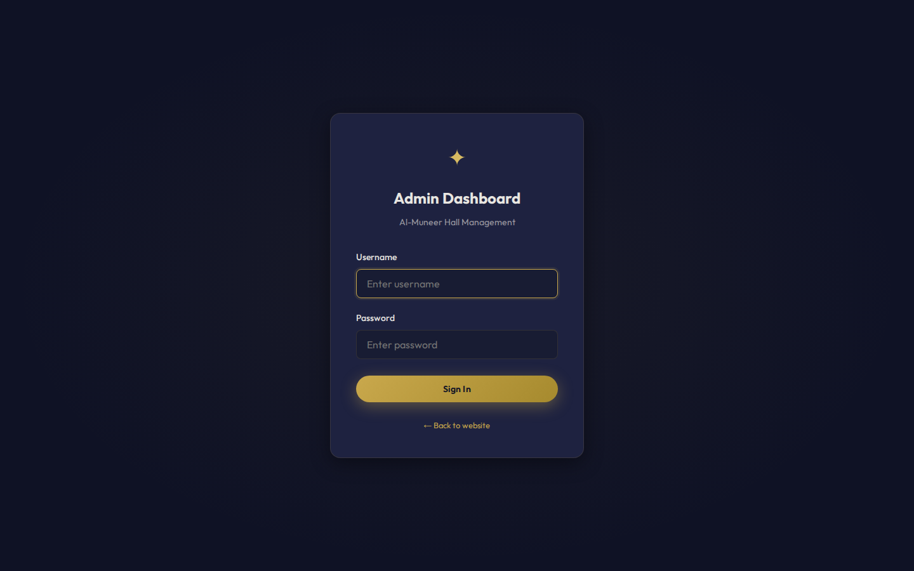
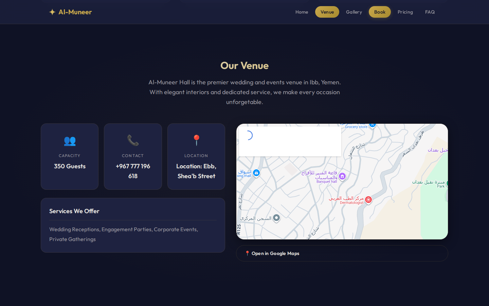
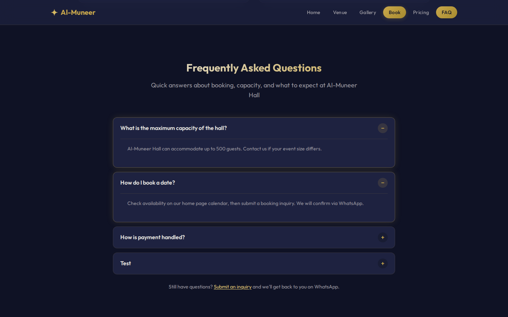
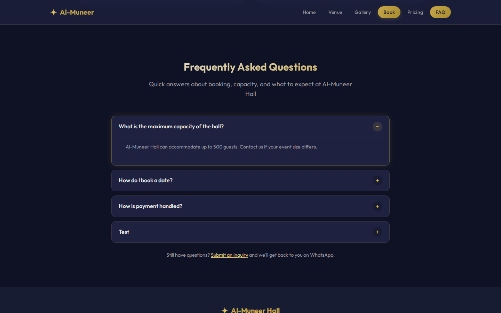
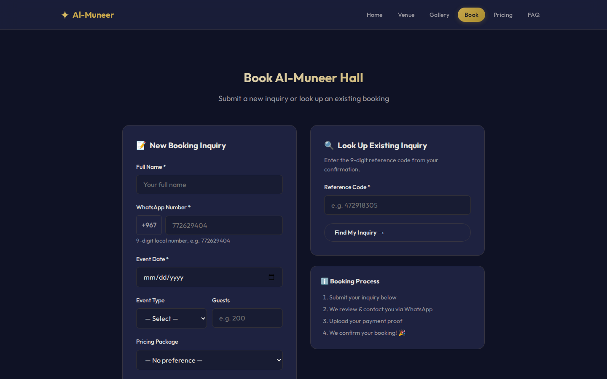
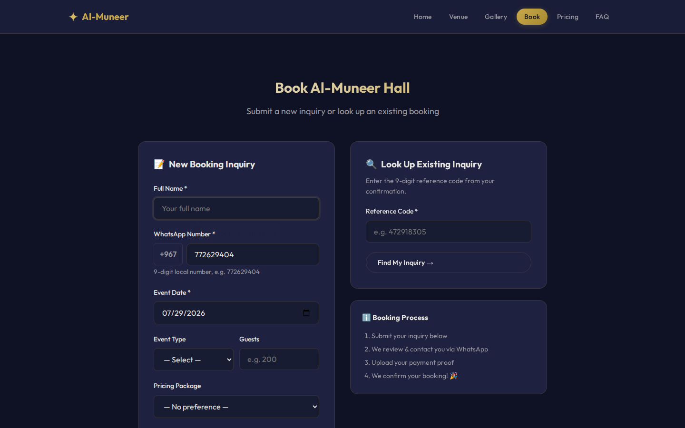

# Al-Muneer Portal — Demo Test Execution Report

**Source:** `appendix: STD.md`  
**Environment:** Local (`http://localhost:8080`)  
**Executed:** 2026-06-29 19:35 UTC  
**Tool:** Playwright (Chromium) — automated browser execution

## Summary

| Metric | Value |
|--------|-------|
| Cases executed | 4 |
| Passed | 4 |
| Failed | 0 |

> This is a **demonstration** run covering a small subset of STD test cases.

## ✅ TC_A_000_01: Verify successful admin login with valid credentials

**Status:** PASS

| Step | Action | Expected | Actual | Result | Screenshot |
|------|--------|----------|--------|--------|------------|
| 1 | Navigate to /admin/login | Login form displayed | Login form visible | PASS |  |
| 2 | Enter valid credentials; submit | Redirect to /admin/dashboard; dashboard loads | URL=http://localhost:8080/admin/dashboard, title=Dashboard | PASS |  |
| 3 | Access /admin/inquiries | Inquiry management page loads (not redirected to login) | URL=http://localhost:8080/admin/inquiries, title=Booking Inquiries | PASS |  |

## ✅ TC_A_000_02: Verify failed login with invalid credentials

**Status:** PASS

| Step | Action | Expected | Actual | Result | Screenshot |
|------|--------|----------|--------|--------|------------|
| 1 | Navigate to /admin/login | Login form displayed | Login form visible | PASS |  |
| 2 | Enter valid username with wrong password; submit | Error message shown; remains on login page | URL=http://localhost:8080/admin/login, error='Invalid username or password' | PASS |  |
| 3 | Navigate to /admin/dashboard without logging in | Redirected to /admin/login | URL=http://localhost:8080/admin/login | PASS |  |

## ✅ TC_V_001_01: Verify venue section and FAQ accordion on home page

**Status:** PASS

| Step | Action | Expected | Actual | Result | Screenshot |
|------|--------|----------|--------|--------|------------|
| 1 | Open / | Home page loads | Hero section visible | PASS |  |
| 2 | Scroll to #venue (click Venue in nav) | Description, capacity, contact, location, services, map embed, Open in Google Maps link | venue visible=True, maps link=True | PASS |  |
| 3 | Scroll to #faq (click FAQ in nav) | FAQ section visible with question summaries | FAQ visible=True, items=4 | PASS |  |
| 4 | Click a FAQ question | Answer expands in accordion | Open FAQ items=2 | PASS |  |
| 5 | Open /faq in address bar | Redirects to /#faq | URL=http://localhost:8080/#faq | PASS |  |

## ✅ TC_V_005_02: Verify validation for missing required fields

**Status:** PASS

| Step | Action | Expected | Actual | Result | Screenshot |
|------|--------|----------|--------|--------|------------|
| 0 | Open /inquiry | Inquiry form displayed | Form visible | PASS |  |
| 1 | Leave Full Name empty; submit | Browser HTML5 validation prevents submit | Submit blocked by validation | PASS |  |
| 2 | Fill name; leave WhatsApp empty; submit | Submit blocked; required-field indication | Submit blocked by validation | PASS |  |
